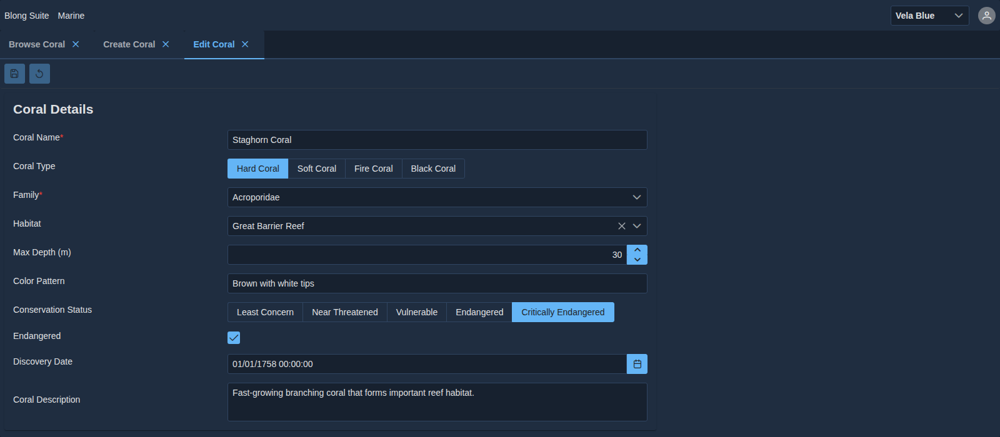
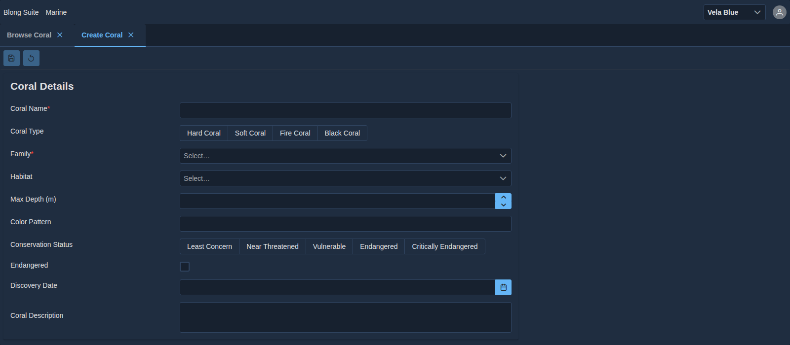

# Editor Features

The `Editor` component is the most important and complex feature of the blong-browser framework. It
combines a schema-driven form, a configurable toolbar, a rich layout system, and a set of advanced
interaction patterns into a single composable component that covers the majority of entity editing
use cases.

This document is a **feature guide**: one section per capability, each with the goal it serves, the
props and schema keys that drive it, and — where one exists — the Storybook story that shows it
running. The interactive examples live in the `Editor/…` story group under
`core/blong-browser/src/components/Editor/stories/`. The pictures on this page come from the
`demo/blong-marine` Coral entity and are captured by `demo/blong-marine/test/docs.play.ts`.

The stories are runnable: `cd demo/blong-marine && npm run storybook` serves them on port 6007 (the
conventions are in the [Storybook pattern](../patterns/blong-browser.md#storybook-pattern)).

The Editor with a record loaded — a tabbed portal, the toolbar, and a form whose widgets are all
derived from the model's schema: a text field, a select-button group, dropdowns, a number spinner, a
checkbox, a date picker and a textarea, with the required fields marked from the schema's own rules.

For implementation reference see `core/blong-browser/src/components/Editor/`. For usage patterns see
[Modular UI](../patterns/blong-browser.md).

---

## 1. Load / Save Lifecycle

The Editor manages the complete load-edit-save cycle for a single entity.

**Goal:** Given an action name for loading and an action name for saving, the Editor handles all the
async plumbing — showing skeletons while loading, tracking dirty state, enabling/disabling the Save
button, and handling server-side validation errors.

Key props:

- `loadAction` — method name whose result populates the form
- `loadParams` — static params for the load action
- `saveAction` — method name called on submit
- `value` — static initial value (skips `loadAction`)
- `onSave` — callback fired after a successful save

The same Editor in its New state, before anything has been loaded or typed. The toolbar's Save and
Reset buttons are present but disabled, which is the dirty-state plumbing this section describes:

---

## 2. Toolbar

The Editor renders a PrimeReact `Toolbar` above and/or below the form.

**Goal:** Provide standard Save / Reset / Edit toggle buttons with correct enable/disable states
derived from form dirty state, plus extensible left and right button slots for realm-specific
actions.

Key behaviours:

- In **read mode** with `editable: true`: Edit (pencil) button
- In **edit mode**: Save and Reset buttons (disabled when form is untouched)
- `toolbar` prop — additional buttons on the left side
- `toolbarRight` prop — additional buttons on the right side
- `designable` — adds a cog button that activates design mode
- Save button shows a popover with server validation error summary

The `Editor` and `Editor/TableToolbar` stories cover the toolbar states: the Edit button in read
mode, the Save / Reset pair in both enabled and untouched states, and the extra left and right
button slots.

---

## 3. Validation

**Goal:** Provide immediate, precise feedback when the user makes an error — both from client-side
rules derived from the JSON Schema and from errors returned by the server on save.

Sub-features:

- **Client-side required** — fields marked `required: true` in the schema show inline errors on
  submit without a server round-trip
- **Server-side field errors** — `{validation: [{field, message}]}` in the server response pushes
  errors into react-hook-form; each error appears inline beneath its field
- **Server error summary** — `error.print` string shown in an OverlayPanel anchored to the Save
  button

The `Editor/Validation` story exercises both halves: submitting an empty required field shows the
client-side rule, and a failing save shows a `{validation: [{field, message}]}` response pushed back
under the offending field with `error.print` in the popover.

---

## 4. Cards and Layouts

**Goal:** Organise fields into named groups (cards) and arrange those groups on the page in a
configurable layout — without writing layout-specific JSX.

### Cards

A **card** is a named group of fields rendered as a labelled container inside a PrimeFlex grid
column. Cards are defined in `ICardConfig`:

- `label` — card heading
- `widgets` or `fields` — ordered list of field names from the schema
- `className` — PrimeFlex column class (e.g. `'col-12 md:col-6'`)
- `permission` — hide the card when the user lacks this permission
- `hidden` — render fields as hidden inputs, visible in layout only
- `collapsible` — add a collapse toggle to the card header
- `watch` + `match` — conditional visibility based on form field values (see Master-Detail and
  Polymorphic Cards below)

### Layout Types

| Type      | Config shape                     | Description                                            |
| --------- | -------------------------------- | ------------------------------------------------------ |
| **Flat**  | an array of rows                 | Column array; stacked arrays place cards side by side  |
| **Tabs**  | `{items: [...]}`                 | Horizontal tab bar; each tab shows a set of cards      |
| **Steps** | `{type: 'steps', items: [...]}`  | Wizard-style; last step's Next button submits the form |
| **Split** | `{type: 'split', panels: [...]}` | A panel beside the content — the sidebar layouts       |

The layout type is derived rather than declared twice: a bare array is flat, `type: 'split'` selects
the split layout, and an object carrying `items` is a tab or step layout depending on its `type`.

Tabs and split panels support component injection — an item can carry a full React component (e.g.
an `Explorer`) instead of a list of cards.

Each layout has a story: `Editor/TabbedLayout`, `Editor/ThumbIndexLayout` (tab orientation),
`Editor/Explorer` (the split layout, with an `Explorer` injected into a panel),
`Editor/ResponsiveLayout` and `Editor/PortalComponent`.

---

## 5. Schema-Driven Widget Resolution

**Goal:** Automatically select the correct input widget for each field from the JSON Schema type,
format, and `widget.type` property — so that no widget configuration is needed for standard fields.

The built-in registry (`core/blong-browser/src/widgets/index.ts`) maps a widget type to a component,
and a suite can add its own through `registry.register()`. The registered types are:

- **Text and numbers** — `input`, `text` / `textArea`, `number`, `integer`, `bigint`, `currency`,
  `percent`, `password`, `mask`
- **Dates and times** — `date`, `time`, `dateTime`, `dateRange`
- **Choice** — `boolean` / `checkbox`, `select`, `dropdown`, `dropdownTree`, `autocomplete`,
  `chips`, `multiSelect`, `multiSelectPanel`, `multiSelectTree`, `selectTable`,
  `multiSelectTreeTable`
- **Structured** — `table` (an editable DataTable), `navigator`, `json`, `component`
- **Files** — `file`, `image`, `imageUpload`

`resolveWidgetType()` in `Card.tsx` picks one. The order is narrower than "`format` first":

1. an explicit `widget.type`
2. `format` — `date`, `date-time` / `dateTime`, `time`
3. `type === 'boolean'` → `boolean`
4. `widget.dropdown` → `dropdown`; otherwise `widget.options` → `select`
5. a field name ending in `Description` → `textArea`
6. `type` — `integer`, `number`, `bigint`
7. `anyOf` — resolved from the first non-`null` branch
8. otherwise `input`

Custom widgets (via the `editors` prop) allow realm-specific input components that receive `Input`,
`Label`, and `ErrorLabel` helper props; the `Editor/CustomEditors` story shows one.

---

## 6. Loading States

**Goal:** Provide visual feedback during data loading without layout shifts, so the user understands
something is happening and does not interact with stale data.

While the `loadAction` is pending, each field renders an animated `<Skeleton>` placeholder at the
same size as the real input. The toolbar is disabled during loading.

No picture of this state has been captured yet. The skeleton is rendered for as long as `loadAction`
is pending, and the toolbar is disabled for the same period.

---

## 7. Design Mode

**Goal:** Allow authorised users (e.g. system administrators) to rearrange the field layout, change
widget types, and toggle field visibility at runtime — without a code deployment or development
effort.

Design mode is activated by the cog button in the toolbar (`designable={true}`). While active:

- Cards and fields become draggable (dnd-kit, through `design/useDesignable.ts`)
- A `PropertyEditor` side panel shows and edits the properties of the selected element
- `DesignAddCardButton` and `DesignAddFieldButton` add new elements
- `DesignToolbar` carries save, undo and redo — the provider keeps a history of config revisions
- `saveConfig()` hands the edited config to an `onSave` callback supplied by the host
- `Editor.stories.tsx` enters design mode through `initialDesignMode`

The persistence is the host's job, and **nothing is persisted today**: `Editor` wraps its content in
`DesignModeProvider` without an `onSave`, so `saveConfig()` returns immediately and the edits live
only in the provider's state for the lifetime of the page.

No walkthrough has been captured yet; `Editor/Explorer` is the story that runs design mode over a
real layout.

---

## 8. Master-Detail

**Goal:** Edit the selected row of an inline table directly in a detail card, without opening a
separate page, for compact relational editing workflows.

A detail card sets `watch: '$.selected.tableName'`. Widget names in the detail card use the
`$.edit.tableName.fieldName` path convention. Changes update the in-memory row array; the parent
form's Save button persists the whole structure.

Polymorphic variant: multiple detail cards each with a `match` condition on the selected row — only
the matching card is shown at a time.

See the `Editor/MasterDetail` story, and `Editor/MasterDetailPolymorphic` for the `match` variant.

---

## 9. Cascaded Dropdowns

**Goal:** Filter a child dropdown's options based on the selected value of a parent dropdown,
enabling hierarchical selection (e.g. continent → country → city) without any custom event handling.

A child dropdown widget declares `widget.parent: 'parentFieldName'`. When the parent value changes,
the child dropdown filters its options to entries whose `parent` property matches the new parent
value.

See the `Editor/CascadedDropdowns` story.

---

## 10. Cascaded Tables

**Goal:** Filter a child table's rows based on the selected row of a parent table, enabling
parent-child list views in a single page.

The child table widget declares `widget.parent: '$.selected.parentTable'` and
`widget.master: {childKey: 'parentKey'}`. Rows in the child table are filtered to those matching the
selected parent row.

See `Editor/CascadedTables`, and `Editor/CascadedTablesVariant` for the three-level case.

---

## 11. Polymorphic Layout (typeField)

**Goal:** Switch the active editor layout automatically when a discriminator field changes (e.g.
switching between `'personal'` and `'corporate'` layouts when the `customerType` field changes).

The `typeField` prop on the Editor watches a specific field; when its value changes, the Editor
selects the matching layout key (e.g. `editPersonal`, `editCorporate`).

**Status:** not implemented. `typeField` is not a prop of the Editor — the `Editor/TypeField` story
is a stub that shows the target data shape (a static type field over a tabbed layout) and says so in
its own header comment. What exists today is the mechanism the feature would build on: an explicit
`layout` key, chosen by the caller, with `{mode}{Layout}` fallbacks.

---

## 12. Static and Dynamic Pivot

**Goal:** Pre-populate an editable table with a fixed set of rows derived from either static
reference data (static pivot) or a live dropdown list (dynamic pivot), so users edit per-row values
rather than managing the row list itself.

Examples: a permissions matrix (one row per permission), a weekday schedule (one row per day).

- **Static pivot** — `pivot.examples` provides the seed rows
- **Dynamic pivot** — `pivot.dropdown` names a dropdown list whose entries seed the rows;
  `pivot.join` maps the seed key to the row key field

See the `Editor/Pivot` story, which shows both halves — a weekday schedule built from
`pivot.examples`, and a permissions matrix whose rows come from `pivot.dropdown`.

---

## 13. File Upload

**Goal:** Let a user pick a file — an image, a document — inside the form, with a preview where a
picture makes sense.

What exists is the widget half, in `core/blong-browser/src/widgets/`:

- `file` — `FileWidget`, a basic PrimeReact `FileUpload` with `customUpload`. `accept` and `maxSize`
  (default 5 MB) come from `widget`, and the chosen `File` is handed to the form through `onChange`.
- `image` / `imageUpload` — `ImageWidget` / `ImageUploadWidget`, `accept="image/*"`, `maxSize`
  default 2 MB, a preview through PrimeReact `Image`, and `widget.basePath` to prefix a stored
  relative path. The upload variant accepts either a URL string or an array of `File` objects.

**Not implemented: the transport.** There is no `multipart/form-data` path anywhere in the
repository, and no realm uses a `file` or `image` field yet, so a chosen `File` simply rides along
in the form value — what the receiving action does with it is the realm's decision. A form-aware
upload step is planned, not present.

---

## 14. Event Bus Integration

**Goal:** Allow external code (analytics, logging, toasts) to observe form interactions without
prop-drilling.

`blongEvents` (`core/blong-browser/src/lib/eventBus.ts`) is a typed singleton: `on(event, listener)`
returns an unsubscribe function, and the dispatch wrapper emits `action:before`, `action:success`
and `action:error` with `{method, params}` plus `{result}` or `{error}`. The Storybook
`withDispatch` decorator uses this to show success toasts after mutations, and the `Editor/Events`
story subscribes to all three.
