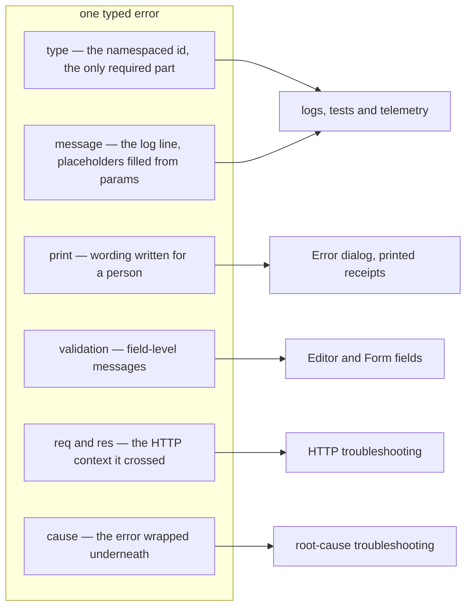

# Typed Errors

The framework expects all errors generated within it to have some additional properties, on top of
the [standard ones](https://nodejs.org/docs/latest/api/errors.html). The only mandatory property is
the `type`, which is why we call these `typed errors`. Here is the list of properties:

- `type`: Namespaced string, that identifies the type of error. The namespace is usually the name of
  the realm, adapter or other subsystem of the framework.
- `print`: A user-friendly message, that is suitable for showing in the UI or other medium (printed
  receipt, etc.)
- `validation`: Object, that contains properties with more details about the validation error, when
  the error corresponds to a validation error.
- `message`: The message that goes in the logs and is suitable for troubleshooting
- `params`: Object, that contains properties with more details about the error. The params are
  merged in placeholders in the message.
- `req`: When the error corresponds to a HTTP request, this object contains the following properties
  of the request: `httpVersion`, `url`, `method`
- `res`: When the error corresponds to a HTTP response, this object contains the following
  properties of the response: `httpVersion`, `statusCode`
- `stack`: The stack trace of the error, which is useful for troubleshooting
- `cause`: Object describing a nested error, which can have the same properties as the parent error

These properties exist because one error has several audiences, and each of them reads only the part
that is useful to it:

To ensure all errors are typed, the framework provides some patterns to define and use such errors.
For more info read about the [error pattern](../patterns/error.md).
