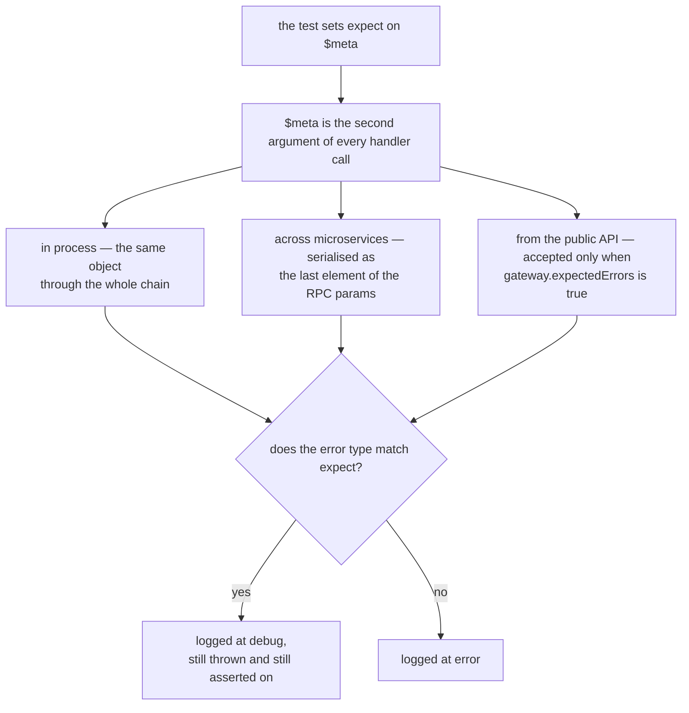

# Expected Errors

When writing automated tests it is common to assert that a call **should fail** with a specific
error type — for example, verifying that submitting an invalid zone to the parking handler raises
`parking.invalidZone`.

The **expected errors** feature lets test code declare up-front which error types are intentional,
so that the framework can:

1. **Suppress noisy error logs** — errors that were explicitly expected are logged at `debug` level
   instead of `error` level, keeping the error stream clean so that genuinely unexpected failures
   are easier to spot.
2. **Preserve error propagation** — the error still propagates normally to the caller; expected
   errors are not swallowed, only demoted in the log.
3. **Propagate across service boundaries** — the expectation travels with the request `$meta`
   through every layer of the call chain, including internal RPC hops between microservices.

## How It Works

Expected errors are declared on the `$meta` object by setting the `expect` field before making a
call:

```typescript
// single type — the most common case
await handler.parkingTest({zone: 'red'}, {...$meta, expect: 'parking.invalidZone'});

// multiple types — any of the listed types is considered expected
await handler.parkingTest(
    {zone: 'red'},
    {...$meta, expect: ['parking.invalidZone', 'parking.rateLimitExceeded']},
);

// wildcard prefix — matches any error whose type starts with 'parking.'
await handler.parkingTest({zone: 'red'}, {...$meta, expect: 'parking.*'});
```

The `expect` field is defined as `string | string[]` on `IMeta`, where each entry is either an exact
error `type` value or a `prefix.*` wildcard.

What matters is that the declaration travels with the call rather than staying with the caller, so
the decision is taken once, where the error is raised, and not once per boundary it crosses:



## Propagation

`$meta` is the second parameter of every handler call and flows through the entire dispatch chain
without modification. Because `expect` is part of `$meta`, it reaches every adapter and handler
involved in processing the request, including those running in separate microservice pods.

For internal RPC calls (microservice-to-microservice), `$meta` is serialized as the last element of
the `params` array and deserialized on the receiving end by `RpcServer`, so `expect` is always
available to handlers and adapters on the remote side.

For external calls entering through the public gateway, the `expect` field can be passed in the
JSON-RPC request body alongside `id`, `method`, and `params`. This is only accepted when the gateway
has `expectedErrors: true` in its configuration (see [Activation](#activation) below).

## Activation

The feature is controlled by the `expectedErrors` flag in the gateway configuration:

```typescript
// suite server.ts
config: {
    dev: {
        gateway: {
            expectedErrors: true,   // enables expected-errors handling in dev
        },
    },
}
```

When `expectedErrors` is `false` (the default) the gateway ignores any `expect` field that clients
send in request bodies, so the feature has no effect in production environments where this flag is
not set.

Test handlers that set `$meta.expect` programmatically are not affected by the gateway flag — the
flag only controls whether the **public API** accepts the `expect` field from external callers.

## Log Behaviour

| Situation                          | Log level |
| ---------------------------------- | --------- |
| Error type matches `expect`        | `debug`   |
| Error type does not match `expect` | `error`   |
| `expect` not set                   | `error`   |

## When the failure is the assertion

The feature earns its keep when a test asserts a _matrix_ of outcomes rather than one call. The ACL
matrices in `realm/blong-party` probe `party.person.get` for every viewer and every record, so a
feature that reads "Amy cannot read Cam" _is_ a refused call — several hundred of them per run. Left
undeclared, the party suite wrote **467 error-level entries** for its green run, and the entries a
reader actually needed were lost among them. Declaring the refusals the cells expect took that to
zero, without weakening a single assertion — the refusals are still thrown, still asserted on and
still visible at `debug` (see [Log Behaviour](#log-behaviour)).

Three things have to line up for that to work, and each was a gap worth knowing about:

- **The error must be typed.** Matching is on `error.type`, so a plain `Error` with a status code
  can never be declared. The RBAC refusal ("Authorization denied: method … not allowed") was exactly
  that; it now carries `gateway.notAllowed`, which is also what makes the refusal describable in a
  feature file.
- **The declaration must survive the transport.** Through the public API the field arrives in the
  JSON-RPC body, so the body schema has to declare it — otherwise validation strips it before the
  route resolves it, and the gateway behaves as if nothing had been declared.
- **Both halves must honour it.** A refusal raised in a hook (authentication, RBAC) never reaches
  the route handler that resolves `expect` for `$meta`, so the gateway's error handler reads the
  declaration from the request body as well; the adapters demote on `$meta.expect` directly.

A refused call is still thrown, still asserted on and still visible at `debug`; only its level
changes. That is the point: the error stream should name the failures nobody asked for.

## Matching Rules

| `expect` value           | Matches                                                 |
| ------------------------ | ------------------------------------------------------- |
| `'foo.bar'`              | Exactly `foo.bar`                                       |
| `['foo.bar', 'foo.baz']` | `foo.bar` or `foo.baz`                                  |
| `'foo.*'`                | Any type whose string representation starts with `foo.` |

## Usage in Tests

The most common usage is inside a test handler using `assert.rejects`:

```typescript
import {handler, type IAssert, type IMeta} from '@feasibleone/blong';

export default handler(({handler: {parkingTest}}) => ({
    testParkingInvalidZone: async (assert: IAssert, $meta: IMeta) =>
        assert.rejects(
            parkingTest({zone: 'red'}, {...$meta, expect: 'parking.invalidZone'}),
            {type: 'parking.invalidZone'},
            'should reject with parking.invalidZone',
        ),
}));
```

## Security Consideration

Allowing external callers to set `expectedErrors` from the public API means they can selectively
suppress error-level log entries for chosen error types. This is safe in test environments but
should never be enabled in production. Always keep `gateway.expectedErrors` absent or `false` in
your `prod` intent configuration.
