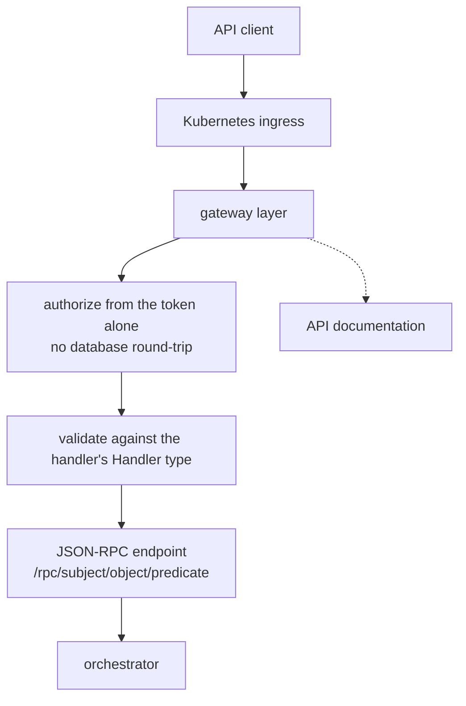

# Gateway

The gateway, also known as the "API Gateway", is the public facing interface of the server. It
exposes the functionality as a set of JSON-RPC endpoints by default, and REST endpoints can also be
exposed.

The gateway is defined as a layer and plays a role when:

- serving the API
- serving the API documentation
- exposing the above through a Kubernetes ingress

For more information read about the [validation pattern](../patterns/validation.md).
