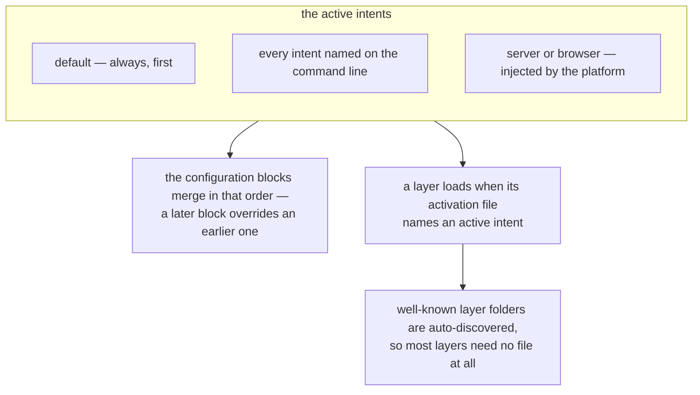

# Intents

**Intents** are named signals passed as positional CLI arguments to the `blong` command. They tell
the framework which configuration blocks, layers, and features to activate for the current process
run.

```bash
blong                    # default intents: dev + microservice + integration
blong integration        # only the integration intent
blong ./server.ts db     # load a specific file with the db intent
```

The framework always merges the `default` configuration block first; every active intent then
contributes its own block on top. A single code base can therefore behave as a development server,
an integration-test runner, a microservice, or a database seeder — purely by changing the intents on
the command line. An intent has two effects, and both follow from the same list:



## Well-Known Intents

| Intent         | Primary effect                                                                                                                                                                                              | Process lifetime                                             |
| -------------- | ----------------------------------------------------------------------------------------------------------------------------------------------------------------------------------------------------------- | ------------------------------------------------------------ |
| `dev`          | Resolution on, `systemDebug` exposes `/api/sys/*`, gateway debug and development keys, verbose log cache and cluster transport                                                                              | Long-running                                                 |
| `prod`         | Production endpoints, strict config                                                                                                                                                                         | Long-running                                                 |
| `integration`  | Enables test layer and watch/test mode                                                                                                                                                                      | Long-running; reruns tests on change; exits when `CI` is set |
| `microservice` | Activates the layers needed to run a realm as a standalone microservice                                                                                                                                     | Long-running                                                 |
| `db`           | Database creation / seeding                                                                                                                                                                                 | **Short-lived** — exits when done                            |
| `upgrade`      | Brings an existing database up to date: schema sync plus production seeds, without dropping columns or loading test seeds. Realm-declared — the block lives in the database adapter, not in the framework   | **Short-lived** — exits when done                            |
| `cli`          | Serves nothing: gateway, RPC server, API gateway, rest-fs, system debug and MCP are all off, watching is off, and every dispatch resolves in-process                                                        | **Short-lived** — exits after its work                       |
| `playwright`   | Marker: the Playwright runner owns the process lifetime, so the platform must outlive the test command                                                                                                      | Long-running until the runner stops it                       |
| `debug`        | Nothing by itself: the framework has no `debug` block. The introspection endpoints come from `dev` (`systemDebug`) and stack traces in errors from the gateway's `debug` flag under `dev` and `integration` | No effect on lifetime                                        |

The `cli` intent is what a realm CLI runs on — see the [realm CLI pattern](../patterns/cli.md) for
how to build one and what the framework provides.

## Default Intents

When no intents are specified, the framework uses `dev + microservice + integration`, and adds `ci`
when the process runs on CI. The default set is designed to give developers an immediate,
full-featured feedback loop: file changes are hot-reloaded and integration tests rerun
automatically, fulfilling the framework's goal of minimising development effort.

Restarting the process on a file change is not what `dev` does — the framework reloads in process.
`blong-watch` is the separate entry point that runs the framework under `node --watch`, and it takes
the same intents.

## Layer Names as Intents

Well-known layer folder names (`adapter`, `orchestrator`, `gateway`, `sim`, `test`, …) double as
intent names in `layer.server.ts` / `layer.browser.ts` files. Specifying `integration: true` in a
layer activation file means "load this layer when the `integration` intent is present". See
[Layer](./layer.md) for the auto-discovery defaults.

## Platform Intents

The `server` and `browser` intents are injected automatically by the framework and are never passed
on the command line: the server platform adds `server` to the intent list and the browser platform
adds `browser`, so a layer activation file can vary per platform. A third one, `ci`, is appended by
the framework whenever the process runs on CI, which is why a captured run has colours off and
Allure reporting on without a package asking for either.

## Exclusion Groups

Some intents are mutually exclusive in practice (e.g. `dev` and `prod`), and combining them is a
mistake. The framework does not detect it: exclusion groups were designed but are not implemented,
so nothing validates the combination or warns about it. Passing `dev` with `prod` merges both
blocks, in the order given, and the later one wins where they overlap.

For a detailed design rationale, see the [Intents rationale](../rationale/intents.md).
