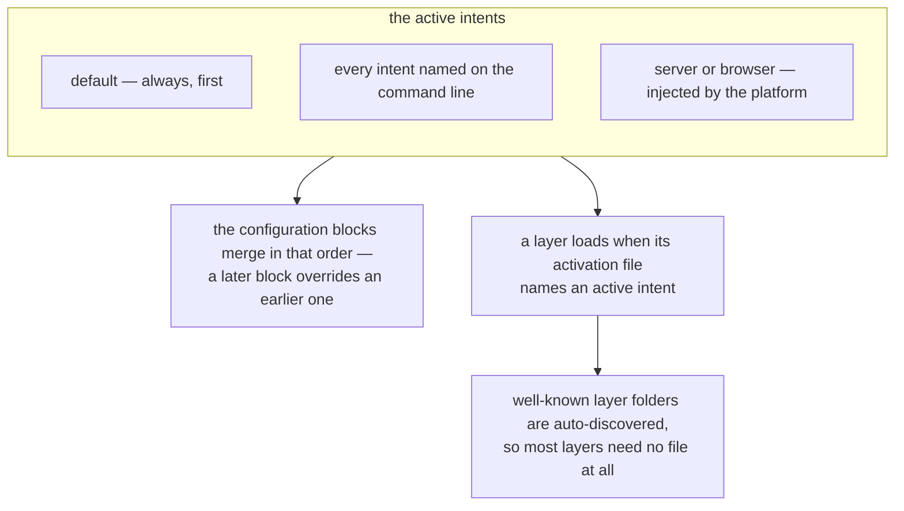

# Intents

**Intents** are named signals passed as positional CLI arguments to the `blong` command. They tell
the framework which configuration blocks, layers, and features to activate for the current process
run.

```bash
blong                    # default intents: dev + microservice + integration
blong integration        # only the integration intent
blong ./server.ts upgrade # load a specific file with the upgrade intent
```

The framework always merges the `default` configuration block first; every active intent then
contributes its own block on top. A single code base can therefore behave as a development server,
an integration-test runner, a microservice, or a database seeder — purely by changing the intents on
the command line. An intent has two effects, and both follow from the same list:



## Well-Known Intents

The table says what an intent is _for_ and how long the process lives; what it turns on — every
config key, layer and listener — is the reference list in the **`blong-intent` skill**, which is the
the one to edit when a block changes, so the summary here cannot drift from it.

| Intent         | Purpose                                                        | Process lifetime                                             |
| -------------- | -------------------------------------------------------------- | ------------------------------------------------------------ |
| `dev`          | develop: a developer's defaults for a run somebody is watching | Long-running                                                 |
| `microservice` | run the realm: the layers that make it work                    | Long-running                                                 |
| `integration`  | test it: the layers a test needs, plus watch/test mode         | Long-running; reruns tests on change; exits when `CI` is set |
| `release`      | be deployed: the one block uat, staging and production share   | Long-running                                                 |
| `k8s`          | plan a suite: write its deployment tree instead of serving     | **Short-lived** — exits after its work                       |
| `upgrade`      | bring a database up to date: schema sync plus production seeds | **Short-lived** — exits when done                            |
| `cli`          | answer a command: serve nothing, dispatch in-process           | **Short-lived** — exits after its work                       |
| `playwright`   | hand the lifetime to the runner                                | Long-running until the runner stops it                       |
| `debug`        | ask for detail, where the environment can give it              | No effect on lifetime                                        |

Two of these ask for something the _environment_ may also supply, which is why their purpose is
phrased as a request rather than a list: `debug` has no block of its own, and `ci` is appended by
the framework whenever the process runs on CI.

The `cli` intent is what a realm CLI runs on — see the [realm CLI pattern](../patterns/cli.md) for
how to build one and what the framework provides.

### What each of the three layer intents means

`default`, `microservice` and `integration` are the only names the layer table
(`core/blong-lib/layers.ts`) uses, and each answers a different question:

- `microservice` — does this process _run_ the realm? Its adapters, orchestrators, listeners and the
  error layer a handler throws through. A development server, a standalone service, a realm CLI.
- `integration` — does this process _test_ it? The simulators, the tap machinery and the browser
  test layers, on top of the layers above.
- `default` — nothing decides: the plumbing every process carries (`api`, `init`, `meta`).

**`release` names no layer.** A deployed process is activated by the flags its plan wrote into its
container args — one `--<realm>.<layer>` per selector the deployment was split on — so each pod runs
that split rather than every layer of every realm it carries. `microservice` in a _deployment_ would
activate all of them, which is why the generated command lines do not carry it (see
[Kustomize](../patterns/kustomize.md)).

### Nothing implies anything

Each intent declares exactly what it needs, and no intent is read as another:

- `microservice` activates **layers** — for the realms the process already has.
- `dev` and `integration` activate the **realms** their runs need, plus the helper layers that come
  with them.
- `k8s` activates every realm a suite declares, because the tree it writes _is_ that set of realms.
- `release` activates neither. A deployed process loads the realms and layers its own
  `--<realm>.<layer>` flags name, so a pod carries only what it serves and starts fast.

What follows is that a command line says which of the two a run wants, and an intent that would need
another's effect says so itself: `blong dev microservice` for a realm with a developer's defaults,
`blong <entry> upgrade microservice` for a step that brings a database up to date. It is also why
there is no implication to learn — a `cli` run or an `upgrade` step may need a subset of the layers
a full microservice does, and only the entry that starts it knows which.

## Default Intents

When no intents are specified, the framework uses `dev + microservice + integration`, and adds `ci`
when the process runs on CI. The default set is designed to give developers an immediate,
full-featured feedback loop: file changes are hot-reloaded and integration tests rerun
automatically, fulfilling the framework's goal of minimising development effort.

Restarting the process on a file change is not what `dev` does — the framework reloads in process.
`blong-watch` is the separate entry point that runs the framework under `node --watch`, and it takes
the same intents.

## Layer Names as Intents

Well-known layer folder names (`adapter`, `orchestrator`, `gateway`, `sim`, `test`, …) double as
intent names in `layer.server.ts` / `layer.browser.ts` files. Specifying `integration: true` in a
layer activation file means "load this layer when the `integration` intent is present". See
[Layer](./layer.md) for the auto-discovery defaults.

## Platform Intents

The `server` and `browser` intents are injected automatically by the framework and are never passed
on the command line: the server platform adds `server` to the intent list and the browser platform
adds `browser`, so a layer activation file can vary per platform. A third one, `ci`, is appended by
the framework whenever the process runs on CI, which is why a captured run has colours off and
Allure reporting on without a package asking for either.

## Exclusion Groups

Some intents are mutually exclusive in practice, and combining two of them is a mistake the
framework refuses: the entry that owns them declares the group, and a run whose intents include two
members of one group stops before a single configuration block is merged.

```typescript
import {server} from '@feasibleone/blong';

export default server(() => ({
    url: import.meta.url,
    intentsExclusionGroups: [
        ['dev', 'release'], // must not combine
        ['migrate', 'seed'], // run one at a time
    ],
    config: {default: {}},
}));
```

What the declaration cannot do is guess: an intent pair no suite names is not checked, and those two
blocks still merge in the order given — the later one wins where they overlap, so the process is
neither the one nor the other and no line of log says which it became. Declare the group where the
mistake would be made, which is the suite that would be started with both.

For a detailed design rationale, see the [Intents rationale](../rationale/intents.md).
