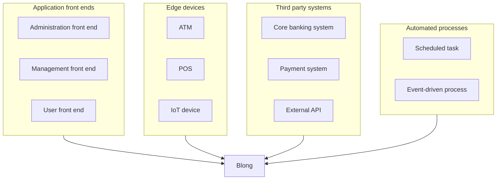
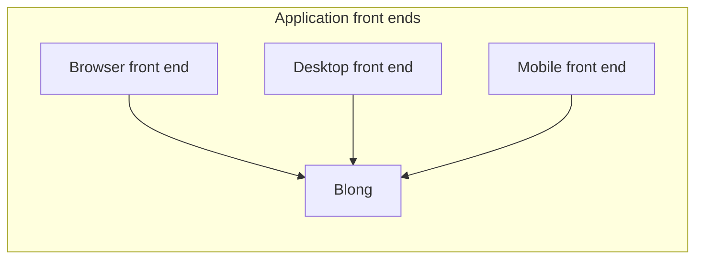
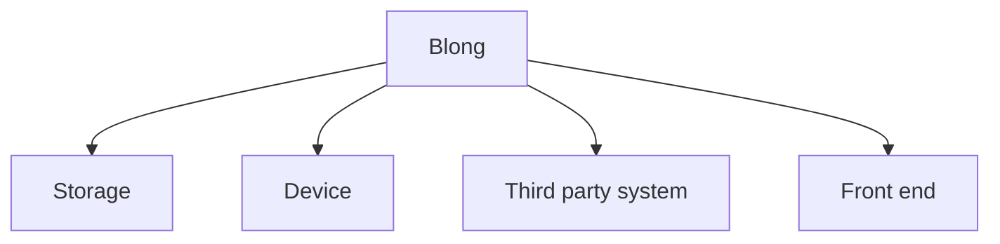

# Interactions

The framework provides concepts for varying interactions. The interactions
define specific paths within the [architecture](./architecture.md).

## Origin

To distinguish between the various interactions, the framework uses the following terms,
based on where the interaction originates:

- **Application front ends**, which run as mobile, desktop or browser applications:
  - **Administration front end**: a front end application, that is used by the technical
    users to manage the system.
  - **Management front end**: a front end application, that is used by the business
    users to manage the system.
  - **User front end**: a front end application, that is used by the end users to interact with the system.
- **Edge devices**, which run as software on the edge devices, for example:
  - **ATM**: software running on an ATM machine.
  - **POS**: software running on a Point of Sale terminal.
  - **IoT device**: software running on an Internet of Things device, for example a smart meter.
- **Third party systems**, which run as software in the third party systems, for example:
  - **Core banking system**: software running in a core banking system.
  - **Payment system**: software running in a payment system, for example SWIFT or SEPA (Single Euro Payments Area).
  - **External API**: software running in an external API, for example a credit scoring API.
- **Automated processes**, which run as software in the automated processes, for example:
  - **Scheduled task**: software running as a scheduled task, for example a daily data sync.
  - **Event-driven process**: software running as an event-driven process, for example a process that reacts to a
    specific event in the system.

The following interactions are grouping the application front ends, regardless for the use case:

- **Browser front end**: the interaction with the system happens through a browser-based application.
- **Desktop front end**: the interaction with the system happens through a desktop application.
- **Mobile front end**: the interaction with the system happens through a mobile application.

## Termination

The interactions can also be grouped by the termination point of the interaction, for example:

- **Storage** - the interaction terminates in a storage system, for example a database or a file system.
- **Device** - the interaction terminates in an edge device, for example an ATM, a POS terminal or an IoT device.
- **Third party system** - the interaction terminates in a third party system, for example a core banking system
  or a payment system.
- **Front end** - the interaction terminates in a front end application, for example a browser-based application
  or a desktop application.

