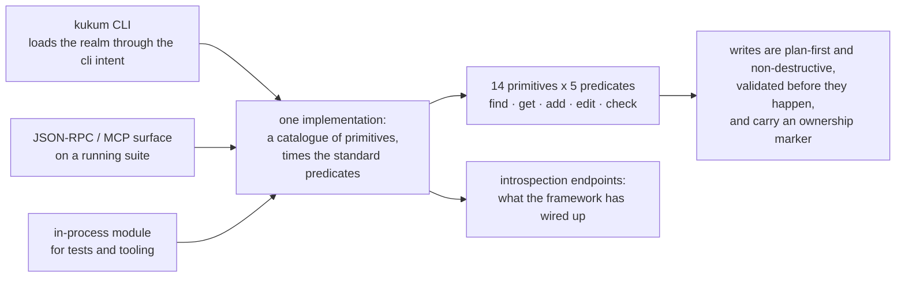

# Kukum

**Kukum is the framework's own scaffolding API.** It exposes the file recipes that live in the
skills as callable endpoints — `kukum.handler.add`, `kukum.schema.add`, `kukum.realm.add` — and adds
introspection endpoints that report what the framework currently has wired up.

It has three entry points over one implementation: a `kukum` CLI, a JSON-RPC/MCP surface on a
running suite, and an in-process module for tests and tooling.

The key behaviours:

- **Everything is derived from one catalogue.** Fourteen [primitive](../patterns/kukum.md)
  descriptors, each naming the skill that owns its prose, times five standard predicates (`find`,
  `get`, `add`, `edit`, `check`). Adding a primitive adds five routes and no new plumbing.
- **`add` is plan-first and non-destructive by default.** It composes with machine-generated shared
  files so a second entity does not drop the first, and refuses hand-written files unless forced.
- **It validates before it writes.** Subject, object and predicate names are checked against
  `_shared/conventions.md`, and a descriptor may only write into the layers it declares.
- **Generated files are self-describing.** They carry an ownership marker and may carry
  `@kukum-instructions` for the next agent, readable back through `source get`.
- **The CLI is not a reimplementation.** It loads the realm through the `cli` intent and dispatches
  through the same handler map the RPC surface serves.

See the [pattern guide](../patterns/kukum.md) for the endpoint reference and the maintenance
recipes, and the [rationale](../rationale/kukum.md) for why the API is shaped this way.
