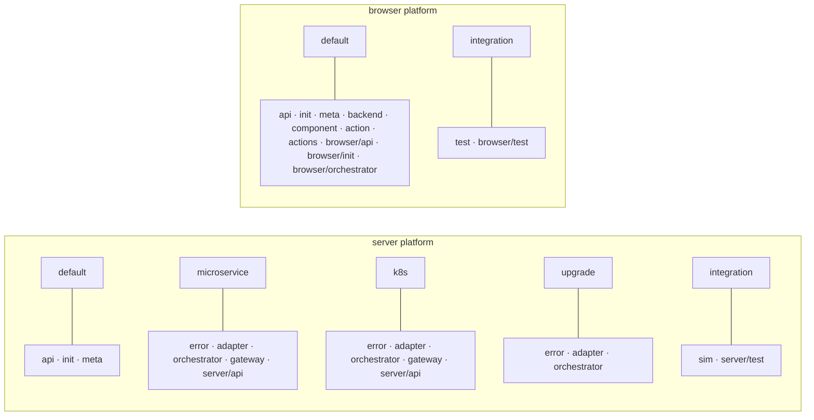

# Layer

Layers are named groups of handlers. The names of layers can be arbitrary (though must be valid
identifiers), but it is recommended to use single lowercase words.

## Recommended Layer Names

### Server-Side Layers

The following server-side layer folder names are **auto-discovered** by the framework — no
`layer.server.ts` file is required:

- `error` - domain-specific error definitions. Activated by `microservice` and by `k8s`, the intents
  that run a realm and plan its deployment, so any process that dispatches the realm's handlers has
  them.

- [adapter](./adapter.md) - the part of the functionality that implements functions related directly
  to communicating with external systems, often handling network protocols. This often relates
  directly with the `Data integrity logic`. Examples include handling communication with SQL, HTTP,
  FTP, mail and other servers or devices.

- [orchestrator](./orchestrator.md) - the part of the functionality that coordinates the work
  between adapters. This is often the place where the `business process` is implemented.

- [gateway](./gateway.md) - the part of the functionality related to the API gateway. It includes
  functions related to API documentation, validations, route handlers, etc. Usually it includes
  almost no `business logic`.

- `sim` - simulated external backends used during integration testing only.

- `server/test` - server-side tap tests (see [test](../patterns/test.md)).

- `api`, `init`, `meta` - registered by default on the server.

### Browser-Side Layers

The following browser-side layer folder names are **auto-discovered** — no `layer.browser.ts` is
required:

- `backend` - this layer resides in the browser app and holds the adapter that talks to the server.

- `component` - this layer resides in the browser app and is used to implement specific React
  components for the UI.

- `test` - top-level `test/` is a browser layer holding Playwright tests (`*.play.ts`),
  auto-activated under the `integration` intent. Browser-side tap tests live in `browser/test/`.

## Auto-Discovery and Activation Defaults

Well-known folder names are automatically detected and activated in the correct environment. Custom
folder names require a `layer.server.ts` or `layer.browser.ts` file.

<!-- BEGIN LAYER ACTIVATION -->

**Which intent turns a layer on.** Rendered from `WELL_KNOWN_LAYERS` in `core/blong-lib/layers.ts` —
the table the loader itself reads, so this block cannot tell a different story from the runtime.
Read the diagram per intent, and the table per folder.



A layer missing for a platform is simply not auto-discovered there. `default` means the layer loads
regardless of intents, and every other name is an intent that must be active. `cli` appears in no
entry here: a command names the layers it needs itself, in the `cli` block of the realm whose
handlers it     dispatches (D-436).

| Folder                 | Server active in           | Browser active in |
| ---------------------- | -------------------------- | ----------------- |
| `api`                  | default                    | default           |
| `init`                 | default                    | default           |
| `meta`                 | default                    | default           |
| `backend`              | —                          | default           |
| `component`            | —                          | default           |
| `action`               | —                          | default           |
| `actions`              | —                          | default           |
| `browser/api`          | —                          | default           |
| `browser/init`         | —                          | default           |
| `browser/orchestrator` | —                          | default           |
| `error`                | microservice, k8s, upgrade | —                 |
| `adapter`              | microservice, k8s, upgrade | —                 |
| `orchestrator`         | microservice, k8s, upgrade | —                 |
| `gateway`              | microservice, k8s          | —                 |
| `server/api`           | microservice, k8s          | —                 |
| `sim`                  | integration                | —                 |
| `server/test`          | integration                | —                 |
| `test`                 | —                          | integration       |
| `browser/test`         | —                          | integration       |

<!-- END LAYER ACTIVATION -->

## Dev-Only Handler Groups (`.dev` suffix)

A handler-group folder whose name ends in `.dev` (e.g. `gateway/vision.dev/`,
`orchestrator/vision.dev/`) is loaded **only under the `dev` intent**. Under any other intent (e.g.
`release`), the folder is skipped entirely, so its validations, handlers and orchestrator namespaces
are not registered.

This is the general convention for making specific handler groups dev-only, mirroring the
`adapter/dbTest` pattern (which is scoped to the db adapter's import regex). It works for any layer
folder:

```text
gateway/
├── subject/            # loaded in every environment
└── vision.dev/         # loaded only under `dev` (demo metered API)
orchestrator/
├── subject/            # loaded in every environment
└── vision.dev/         # loaded only under `dev` (namespace: 'vision')
```

The `.dev` suffix is purely a loading gate — it does **not** change names. Gateway validations are
keyed by their function name (`visionCompute` → `vision.compute`) and orchestrator namespaces are
declared explicitly in their `init.ts` (`{namespace: 'vision'}`), so a `.dev` folder keeps the same
routes and namespaces as its non-`.dev` equivalent.

## Co-Located Configuration

Layers are **self-contained** — each layer file defines its own configuration and validation,
co-located with its implementation. There is no need to maintain activation config in the parent
`server.ts`. A realm's `server.ts` is only needed when configuration is shared across multiple
layers.

```ts
// adapter/db.ts — config and validation are part of the layer definition
import {adapter} from '@feasibleone/blong';

export default adapter(blong => ({
    extends: 'adapter.knex',
    validation: blong.type.Object({
        namespace: blong.type.String(),
        imports: blong.type.String(),
    }),
    activation: {
        default: {
            namespace: 'db/$subject',
            imports: '$subject.db',
        },
    },
}));
```

## Custom Layers

For folder names that are not in the well-known list above, add a `layer.server.ts` or
`layer.browser.ts` to declare when the layer should be active:

```ts
// myCustomLayer/layer.server.ts
import {layer} from '@feasibleone/blong';

export default layer({
    default: true, // active in every process, whatever the intents
    microservice: true, // also active when the realm is *run* — a development server, a standalone service
});
```

For the full implementation patterns, including handler group naming, folder structure, and
activation options, see the [Layer patterns](../patterns/layer.md) page.
