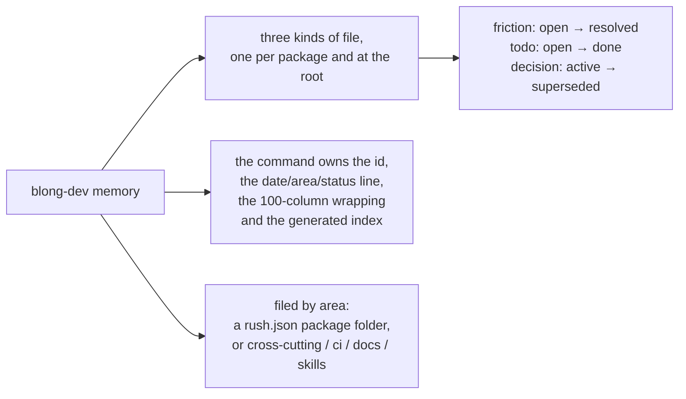

# Memory files

The repository keeps three kinds of working note — **frictions**, **todos** and **decisions** — as
markdown files under `.github/memory/`, one file per kind at the repository root and one per
package:

| Kind     | File          | Statuses               | Holds                                                                     |
| -------- | ------------- | ---------------------- | ------------------------------------------------------------------------- |
| Friction | `friction.md` | `open`, `resolved`     | something that took unexpected effort, and the lesson that came out of it |
| Todo     | `todo.md`     | `open`, `done`         | work that is deferred, unfinished or spotted and not done                 |
| Decision | `decision.md` | `active`, `superseded` | a choice that was made, with the reasoning the code does not show         |

Everything goes through `blong-dev memory` — the files are never written by hand, because the same
command owns the ids, the date/area/status line, the 100-column wrapping and the generated index.
Each entry has a stable id (`F-014`, `T-003`, `D-081`), so a note can cite another one without a
line number that rots.

Entries are filed by **area**: a package folder from `rush.json` (`core/blong-browser`) or one of
the reserved cross-cutting labels `cross-cutting`, `ci`, `docs`, `skills`. A package's entries live
in that package's own file; the root file keeps only what concerns the workspace as a whole.

- [Pattern guide](../patterns/memory) — the commands, the entry shape, the checks.
- [Rationale](../rationale/memory) — why the notes are files with ids instead of prose and a
  tracker.

