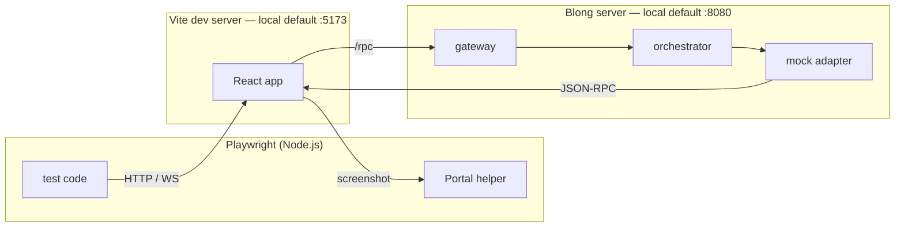

# Full-Stack Testing with Playwright

Full-stack testing verifies the entire application stack — from the browser UI through the React
component layer, JSON-RPC transport, server-side handlers, and back — in a single test run. Blong
integrates Playwright for this purpose, providing reusable fixtures and test helpers that work with
any blong suite.

## Why Full-Stack Tests?

Unit tests (vitest) verify components in isolation. Storybook interaction tests verify component
behaviour with mocked data. Full-stack Playwright tests fill the remaining gap:

| Test type         | Scope                          | Speed  | Confidence |
| ----------------- | ------------------------------ | ------ | ---------- |
| Unit (vitest)     | Single component/hook          | Fast   | Low        |
| Storybook         | Component + mock data          | Medium | Medium     |
| **Playwright**    | **Browser → Server → DB mock** | Slower | **High**   |
| Integration (tap) | Server API only                | Medium | Medium     |

Playwright tests catch issues that other test types cannot:

- Login flow and JWT token handling
- Menu generation from model specs
- Form validation end-to-end (client + server)
- Tab lifecycle (open, dirty state, close)
- Data round-trip (create → browse → edit → verify)

## How It Works



The test runner controls a real browser. The Vite dev server serves the React application and
proxies `/rpc` calls to the blong server. The blong server runs with mock adapters that provide
deterministic fixture data.

## Element Identification

Tests must identify UI elements without depending on visible text (which changes with i18n
translations). The strategy, in priority order:

1. **HTML `name` attribute** — all form inputs carry a `name` derived from the schema field path
   (e.g. `coral.coralName`). Use `input[name="coral.coralName"]` or `textarea[name="..."]`.

2. **HTML `id` attribute** — PrimeReact widgets that don't set `name` (Dropdown, Checkbox,
   Calendar/Date) use `inputId` which renders as `id`. **IDs use hyphens** where `name` uses dots:
   `coral.familyId` → `id="coral-familyId"`.

3. **Semantic HTML roles** — `button[type="submit"]`, `form`, `a[href]`.

4. **`data-testid`** — used only where no semantic identifier exists:
    - Toolbar buttons: `editor-save`, `editor-edit`, `editor-cancel`, `editor-refresh`
    - Portal menu items: `portal-menu-{method}` (semantic triple with dots→dashes)
    - Portal menu groups: `portal-menu-{subject}`
    - Login submit: `login-submit`
    - Table cells: `{tableId}-{rowIndex}-{field}`, e.g. `coral-0-coralName`
    - Dropdown widgets: `data-testid` on wrapper div (e.g. `coral-familyId`, uses hyphens)
    - Table search input: `browse-search`

### Dots vs Hyphens

The form system uses two naming conventions:

- **`name` attribute**: dots for hierarchy (`coral.coralName`, `coral.familyId`)
- **`id` and `data-testid`**: hyphens (`coral-coralName`, `coral-familyId`)

This split exists because dots are problematic in CSS ID selectors (`#coral.familyId` is parsed as
`#coral` with class `.familyId`). The model form system converts dots to hyphens when generating
widget IDs. The `fillFields()` helper in `blong-browser/playwright/model` handles this conversion
automatically.

## Widget Type Auto-Detection

The `fillFields()` helper auto-detects widget types from `blong-*` CSS classes in the DOM. This
means test code only needs to provide field names and plain values — no explicit
`{widget: 'select', value: '...'}` objects required. The helper walks up from the element with the
matching `id` or `data-testid` until it finds a `blong-*` class:

| CSS class              | Widget type |
| ---------------------- | ----------- |
| `blong-input`          | text        |
| `blong-textarea`       | textarea    |
| `blong-number`         | number      |
| `blong-dropdown`       | dropdown    |
| `blong-select-wrapper` | select      |
| `blong-boolean`        | checkbox    |
| `blong-date`           | date        |

Explicit `{widget: ..., value: ...}` objects are still supported as an override.

## Configurable Permissions

The `portal` fixture does **not** grant permissions by default (`blongPermissions` defaults to
`false`). Suites that need full CRUD access must opt in per test file or describe block with
`test.use({blongPermissions: true})`.

## Expected Browser Messages

The fixture echoes every console error, console warning and uncaught exception the page produces to
the runner's output — prefixed `[browser]` — and keeps the same lines in `portal.browserErrors`. A
spec that provokes one of them on purpose declares it, so the run does not print a line the spec
asked for as if it were news:

```typescript
test.use({blongExpectedBrowserErrors: ['rpc/blong/flow/find', 'Authorization denied']});
```

The message is still collected and still attached to the failure a broken page reports; only the
echo is dropped. Patterns are substrings, not regular expressions — a fixture option crosses
Playwright's worker boundary, where a `RegExp` arrives as an empty object — and each is matched
against the whole recorded line, so a browser message that names no URL in its own text can still be
matched by one. The option belongs to the spec that caused the line rather than to a global ignore
list: "this spec expects this" is a claim a reviewer can check.

An uncaught page error is not a candidate: the fixture fails the spec over it, so declaring the
message would hide the failure rather than quiet the log.

## Shared Configuration

The `defineBlongConfig()` helper from `@feasibleone/blong-browser/playwright/config` provides
sensible defaults (test directory, viewport, reporters, the `webServer` pair). Suite-level
`playwright.config.ts` files stay minimal:

```typescript
import {defineBlongConfig} from '@feasibleone/blong-browser/playwright/config';
export default defineBlongConfig();
```

The `webServer` entries start both the blong server and the Vite dev server. They are always
configured — what `process.env.CI` changes is the commands and whether an already-running server is
reused: locally the backend runs under `blong-watch` and an existing server is kept
(`reuseExistingServer: true`), while CI runs the servers itself and forces a fresh Vite. The ports
are the suite's own: 8080 and 5173 by default, or a pair derived from the package's position in
`rush.json` in CI, where the backend port is `9000 + <project index>`, the frontend `backend + 100`,
and both can be overridden with `PLAYWRIGHT_BACKEND_PORT` / `PLAYWRIGHT_FRONTEND_PORT`.

## Handling Stateful Mock Data

Mock adapters keep fixture data in memory. When a create test adds a record, it persists across test
runs (as long as the server stays running). This creates a challenge for edit tests: if the record
already contains the same values from a previous run, react-hook-form doesn't mark the form as dirty
and the Save button stays disabled.

The `createAndEditModel()` helper solves this with a **dirty cycle**: text/textarea fields first get
a random suffix and are saved (forcing a dirty state); other widgets (date/select/dropdown/ number)
keep their value because the `editFields` values already differ from the loaded record, so a single
save suffices. It then fills the actual edit values (which differ from the suffixed values, so the
form is dirty again). This ensures the edit test works regardless of prior server state. A `search`
option lets the edit test filter the browse table to a specific (e.g. test-created) row before
opening it, so it never edits seeded data.

Similarly, the `waitForFormData()` method on the Portal helper waits for API data to populate form
inputs before filling fields, preventing race conditions.

## Static keys for hot reload survival

When the gateway has no key material configured it generates a key pair per process (`Gateway.ts`:
`{generate: {alg: 'ES384', crv: 'P-384', use: 'sig'}}`). That is the right default for a deployment
and the wrong one for a development loop: the server hot-reloads after a code change, the key
changes with it, and every browser session becomes invalid — which is what makes a test suite
re-login in the middle of a run for no reason the author can see.

The `dev` intent therefore supplies a static pair from `core/blong-gogo/src/devKeys.ts` (`ES384` to
sign, `ECDH-ES+A256KW` to encrypt). The keys are committed and deliberately not secret; their job is
that two processes started from the same checkout agree, so a session survives a restart and a token
minted by `blong grant` is a token the running gateway accepts. A deployment replaces them by
configuring `gateway.sign` / `gateway.encrypt` — an rc file is the usual channel — and the module is
never consulted when either is set.

Nothing in a suite's `server.ts` needs to mention keys: this is why a Playwright session survives a
hot reload without anyone configuring anything.

## Screenshot-First Assertions

Tests prefer `toHaveScreenshot()` over targeted assertions:

- Screenshots catch visual regressions (layout breaks, CSS issues, missing icons)
- They serve as living documentation of the expected UI
- Updating baselines is a single command: `node --run playwright:update`
- Targeted assertions (`toBeVisible`, `toHaveValue`) are used sparingly for critical state

## Reusable Test Infrastructure

The test infrastructure is split into layers:

- **`@feasibleone/blong-browser/playwright`** — the `portal` fixture handles login automatically and
  provides a `Portal` helper class with methods for menu navigation, form interaction, save, and
  table operations.

- **`@feasibleone/blong-browser/playwright/config`** — `defineBlongConfig()` provides shared
  Playwright configuration with sensible defaults, including `webServer` entries for CI.

- **`@feasibleone/blong-browser/playwright/model`** — generic CRUD test generators (`browseModel`,
  `createAndEditModel`) that work with any model spec. Pass the subject, object, and field map — the
  helper generates complete browse/create/edit test scenarios.

- **`blong-dev playwright`** — CLI wrapper that resolves the Playwright binary and forwards
  arguments.

## Relationship to Other Test Types

Full-stack Playwright tests complement, not replace, other testing approaches:

- **Storybook tests** remain the primary tool for component-level visual testing
- **tap/vitest** remain the primary tool for logic and API testing
- **Playwright** tests verify the integration of all layers working together

Use Playwright for critical user journeys (login, CRUD, navigation). Use Storybook for component
variations and edge cases. Use tap for server-side business logic.
