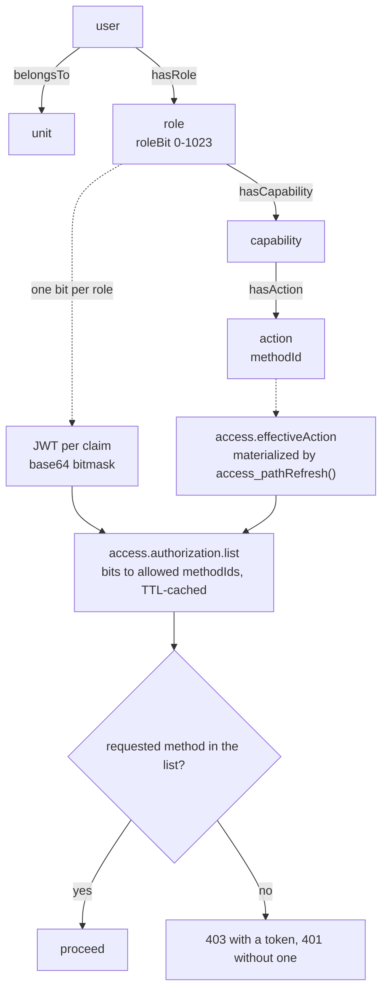

# RBAC (Role-Based Access Control)

Blong answers "may this caller invoke this method?" from a graph of resources — a user holds roles,
a role grants capabilities, a capability groups actions — and each role is one **bit** in the signed
token the caller presents. The gateway therefore authorizes every request from the token alone: no
database round-trip on the hot path, and no realm needs to know another realm's method names.

## Key behaviours

- **Roles are bits.** A role carries a unique `roleBit` (0–1023), allocated when the role is created
  as `MAX(roleBit) + 1` and immutable afterwards — an edit that tries to change it is refused. The
  JWT's `per` claim is a base64 bitmask of the caller's roles. "Never reused" holds for every bit
  except the highest one in use: allocation is `MAX + 1`, so deleting the role that owns the current
  maximum hands that bit to the next role created.
- **The graph is materialized.** `CALL access_pathRefresh()` rebuilds three path types in
  `core.path` — `access.effectiveRole`, `access.effectiveAction` and `access.effectiveScope` — from
  two views (`access_effectiveRolePath`, `access_effectiveActionPath`) plus a recursive `isPartOf`
  walk for the third. Where they are read matters, and the shorter claim was wrong: the gateway's
  authorization hook queries `core_triple` directly (`hasCapability`/`hasAction`) rather than
  `core_path`; the materialized paths are read at **login** (to build the `per` bitmask) and by
  `access.session.verify`.
- **Units join in.** A user may hold a role directly (`hasRole`) or through a unit (`belongsTo`).
- **The gate is a single hook.** `access.authorization.list` expands the bits into allowed action
  methodIds and the gateway compares the requested method against that list — 403 with a valid
  token, 401 without one or with an invalid one. "No database round-trip on the hot path" is true
  while the cache is warm: the expansion is cached per caller for 30 seconds (overridable per call)
  beside a token-to-credentials cache, and a miss does query the database.
- **Logging in is itself a permission.** The `accessLogin` action must be in the caller's effective
  actions, or the session gate refuses to establish or renew a session.

See the [RBAC pattern](../patterns/rbac.md) for how to seed, grant and verify it, and the
[RBAC rationale](../rationale/rbac.md) for why a role is a bit. The nodes and edges themselves are
described in [the resource graph](resource-graph.md). The `blong-access` README documents the
tables, handlers and configuration defaults; the [sessions](sessions.md) concept covers the session
gate that reuses this graph.
