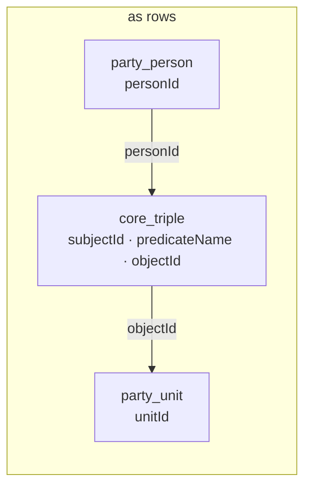
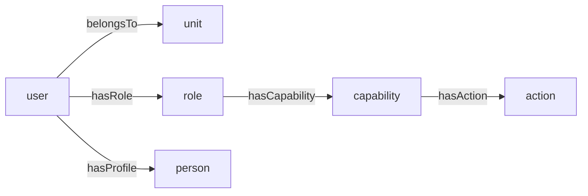

# The Resource Graph

Blong stores entities in tables and the relationships between them in one graph. A person, an
organisation, a unit, a role, a user and a stored procedure's action are all **resources**: a row in
`core_resource` with a name and a type. A relationship between two of them is a **triple**: a row in
`core_triple` naming a subject, a predicate and an object.

That is the whole substrate. Reusable realms — `blong-party` for people and organisations,
`blong-access` for roles and permissions — are lenses over it rather than separate stores beside it.

## The tables

| Table           | Columns                                              | Key                                                       |
| --------------- | ---------------------------------------------------- | --------------------------------------------------------- |
| `core.resource` | `resourceId` (uuid), `resourceName`, `typeId`        | PK `resourceId`; FK `typeId` → `core.type`                |
| `core.type`     | `typeId` (increment), `typeAlias`                    | PK `typeId`; **unique** `typeAlias` (e.g. `party.person`) |
| `core.triple`   | `subjectId`, `predicateName`, `objectId`             | PK all three; both endpoints FK → `core.resource`         |
| `core.path`     | `originId`, `destinationId`, `pathType`, `pathDepth` | PK `(originId, destinationId, pathType)`                  |

Two of these deserve a second look. `core_triple` has no `tripleId`: the edge is identified by what
it asserts, so inserting the same edge twice is a no-op rather than a duplicate, and a self-join
four times over one table answers "which actions can this user reach" — with no table per pair of
endpoints. And `core.path` is not a second graph: it is a materialised answer, recomputed by
`CALL access_pathRefresh()`, so a deep traversal is paid on write instead of on every read.

## A relationship is an edge, not a resource

This is the one place where the vocabulary is worth being precise, because it is easy to get wrong
in both directions. The **endpoints** of a relationship are resources; the relationship itself is an
edge row. So when `party_unit` holds the unit and `party_person` holds the person, the membership is
neither a column nor a join table — it is one row:



The person's table has an `organizationId`-shaped column in neither direction, and that is the
point: adding a second membership, a scope, or a role does not add a column, a table, or a
migration. The same three columns hold `belongsTo`, `isPartOf`, `hasRole`, `hasCapability`,
`hasAction`, `hasScope` and `hasProfile`, and the predicate names them.

## Identity lives in one place

A resource-backed table's primary key is a foreign key to `core_resource.resourceId`, so the entity
row and the resource are the same identity rather than two rows that can drift. The two operations
that need more than a row insert are handlers in `blong-core`, not generic CRUD:

- **`core.resource.ensure`** finds or creates a resource by `(typeAlias, resourceName)` and then
  inserts the entity row if it is absent. If a resource exists without its entity row — a state the
  name would otherwise reserve forever — it heals it rather than minting a second resource.
- **`core.triple.merge`** inserts a set of edges and ignores the ones already present, optionally
  refreshing the path tables afterwards.

That pair is what makes repeated seeding idempotent, and it is worth stating what it does **not**
give you: `(typeAlias, resourceName)` is a _logical_ identity, not a unique constraint —
`resourceName` carries a non-unique index. A writer that goes around `merge`/`ensure` can leave two
resources with the same name in one type, and a generic `add` that was given no name mints one named
after the column (`${subject}.${object}.${column}`), which is where such rows come from in a
development database. Identity holds as long as writes go through the operations that respect it.

## Party types are tables, not sub-entities

`blong-party` declares `person`, `organization` and `unit` as three resource-backed tables, each
with its own primary key (`personId`, `organizationId`, `unitId`) pointing at `core.resource`, each
with its own `resourceName` column (`lastName`, `legalName`, `unitName`). There is no `party_type`
column and no discriminator: the **type alias** in `core.type` is what distinguishes them, which is
why a query for all parties is a union over types rather than a filter on a column.

The realm's real sub-entities are different: `party.contact`, `party.address` and `party.identifier`
have their own auto-increment keys and an FK column `partyResourceId` to `core.resource` — they are
attached _to_ a party and are not resources themselves. Two shapes, chosen by whether the thing
needs an identity of its own.

## Lenses over the same graph

A lens is a query, and three of them ship today:



- **Party** reads the hierarchy: `belongsTo` for membership, `isPartOf` for the unit tree, and
  `hasProfile` for the person behind an account.
- **Access (RBAC)** walks user → role → capability → action, directly or through a unit, and
  materialises the answer as `access.effectiveRole`, `access.effectiveAction` and
  `access.effectiveScope` in `core_path`.
- **The record-level ACL** adds the other direction: `access_acl` is a table whose `principalId`,
  `actionId` and `targetId` are all resources, so a rule can sit on any of them, and its implicit
  half is a `hasScope` edge in the same graph.

So the access-control story is not built beside the graph, and it is not built entirely _in_ it
either: role, capability, action and user are real tables with real columns, `access_acl` is a real
table, and only the grants between them are edges. What the graph buys is that the four-node chain a
permission check walks is data — which is why a role works the same whether the caller holds it
directly or through the unit they belong to, and why the ACL can narrow any resource without a new
table per guarded entity.

## Querying it

An edge lookup is a `find` with as many of the three key columns as you know:

```jsonc
// the units under an organisation — unit --belongsTo--> organisation
{"method": "core.triple.find", "predicateName": "belongsTo", "objectId": "<organization resourceId>"}

// everything this resource points at, and everything pointing at it
{"method": "core.triple.find", "subjectId": "<resourceId>"}
{"method": "core.triple.find", "objectId": "<resourceId>"}
```

A materialised path is a `find` on `core.path` with `originId` and `pathType`, returning
`{originId, destinationId, pathType, pathDepth}` — the caller's effective actions, or the ancestors
of a unit, in one indexed lookup rather than a recursive walk. The predicates are the join: nothing
in the query names a domain table, which is why the same shape answers a party question and an
authorization question.

Two tables in `blong-core` complete the schema without being part of a working path yet:
`core.property` and `core.translation` are declared, and no realm, handler, model or test reads or
writes them. Treat them as reserved rather than as an API.

## See also

- [RBAC](rbac.md) and the [RBAC pattern](../patterns/rbac.md) — the permission lens.
- [Record-level ACL](acl.md) and the [ACL pattern](../patterns/acl.md) — the narrowing lens.
- [Realms](realm.md) — how a realm contributes its own tables to the same graph.
- [Semantic triples in naming](naming.md) — the other sense of "triple" in this codebase: a handler
  named `subjectObjectPredicate`.
