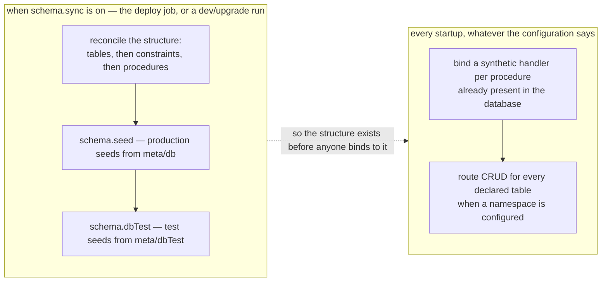

# Declarative Schema Management (knex adapter)

The built-in `adapter.knex` includes a **declarative schema management** feature that lets a realm
declare its database tables, constraints, stored procedures, and seed data as plain TypeScript and
YAML configuration. There are no migration files, no ordering problem between them, and no
hand-written `CREATE TABLE` or `ALTER TABLE`: the only SQL anyone writes is a stored procedure's
body, which is a procedure rather than structure. The definition lives where the table is used — in
the realm that owns it — instead of in a directory numbered by the order someone had to invent.

The feature has two concerns, and what separates them is the configuration rather than a separate
program:

Both lanes are the same `ready()` hook on the `adapter.db` group. Nothing in the code decides
"deployment or application" — the merged configuration does, and the `default`, `prod`,
`microservice` and `ci` intents simply do not declare a `schema` block while `dev` and `upgrade` do.
That is what makes a development run self-healing and a production pod structural no-op, and it is
worth stating plainly because it is a claim about configuration rather than about a code path.

## Schema sync (when `schema.sync` is on)

When `schema.sync` is enabled the adapter reconciles the database structure against the declared
configuration. The intended use is a dedicated short-lived deployment job, so that the structure
exists before an application binds to it — but the hook itself runs whenever the configuration asks
for it, which in the `dev` intent means on every startup:

1. **Creates or alters tables** from [TypeBox](https://github.com/sinclairzx81/typebox) `TObject`
   schemas — new tables are created; new columns in existing tables are added; columns can
   optionally be dropped when removed from the schema.
2. **Applies table constraints** (composite primary keys, unique constraints, foreign keys, indexes)
   in a second pass after all tables exist. Constraints are declared via the `constraints` property
   on the `type.Object()` options. The sync is idempotent — already-present constraints are skipped.
3. **Creates stored procedures** from `.sql` source files discovered in configured folders (or from
   inline SQL strings for backward compatibility). Procedures are only re-created when their body
   differs from what is already in the database, so repeated runs are cheap.

## Seed data (after sync, when the configuration asks for it)

When `schema.seed` is enabled, the adapter processes **production seed data** from YAML/JSON files
in the `meta/db/` folder. When `schema.dbTest` is also enabled (typically in `dev` intent), it
additionally processes **test seed data** from `meta/dbTest/` folder. Seeds are dispatched as method
calls against the adapter's handler dispatch, so they go through the same validation and business
logic as normal API calls.

## Handler binding (every startup)

Regardless of `schema.sync`, on every adapter startup:

1. **Binds synthetic handlers** for every stored procedure found in the database — no handler file
   needed. These are attached to the adapter as own properties, which is also what `super.<name>`
   reaches in an override. Procedures are called through the standard framework dispatch mechanism
   by their camelCase name (e.g. `sqlItemListActive`).
2. **Routes CRUD** for every declared table when a `namespace` is configured. Nine methods — `get`,
   `find`, `add`, `edit`, `remove`, `merge` and the bulk `insert`, `update`, `delete` — are
   reachable by the `<namespace>.<table>.<method>` convention with no handler files. They are served
   by the adapter's generic `exec`, not by a handler attached per table, which is why overriding one
   means writing that one handler and delegating to `super.exec`.

Procedures whose SQL name starts with `_` are treated as **private** DB helpers: they are synced to
the database but **not** bound as API handlers.

See the [pattern guide](../patterns/schema-sync.md) for full configuration examples, the TypeBox →
SQL type mapping table, constraint declaration patterns, seed data conventions, and override
patterns. See the [rationale](../rationale/schema-sync.md) for why this approach was chosen over
migration-file alternatives.
