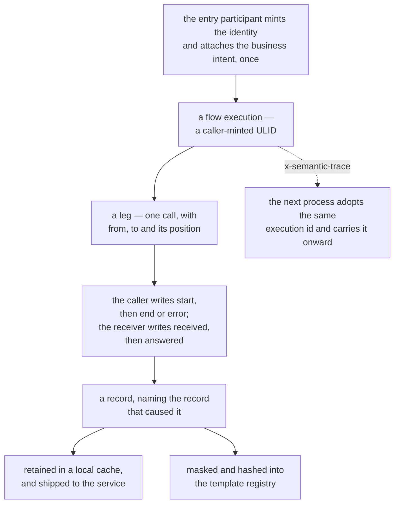

# Semantic Log

**Semantic logging** keeps one readable line on stdout and gives **every record a locally-minted
id**, so a human or an agent can reach the full detail on demand instead of grepping. It lives in
`core/semantic-log/`.

It goes beyond ordinary logging in six ways.

- **Identity comes from structure, not text.** Timestamps, ids, IP addresses, numbers and home paths
  are masked, and the masked message is hashed — so two occurrences of one code path share one
  **template** however much their values differ. The **template registry**, not the stream of
  records, is the durable artifact.
- **Causal lineage and intent travel with the request.** A **trace** id follows one request across
  services; a **flow execution** id names exactly one execution of a named process, and the flow's
  progress through its steps is recorded as it goes; each record points at the record that caused
  it. Business intent is attached once, at the entry point, and inherited below it. A **leg** names
  one **call** inside an execution — an id the source code declares, the participant the caller
  expects to answer, and the call's position in the execution — so a record answers "which call was
  this?" and a diagram drawn from records can label every arrow with something greppable.
- **Anomalies are distinguished by kind.** A first-seen template is **novelty**, a familiar template
  at an unfamiliar rate a **rate-shift**, and a flow whose shape has moved **drift** — three events,
  not one score, because they call for three different responses.
- **Verbose detail is held back until it is wanted.** Detail a call did not need to transmit is
  retained and released onto the record that reports the failure, so the happy path stays quiet and
  the failure explains itself.
- **One fact, several audiences.** The same stored entry is projected into operational, diagnostic
  or compliance views when it is read, rather than emitted three times.
- **The logic says what it was doing, not only that it happened.** A **progress point** is reported
  from the code itself — a `checkpoint` names a moment, a `decide` branch names the choice taken and
  the candidates it weighed — and travels with the next record in its scope, so the diagram can draw
  the moments as notes and the alternatives as `alt` blocks
  ([R26, R27](../rationale/semantic-log.md)).

The cluster service is optional. An emitter writes readable lines and retains every record in a
local cache with no service anywhere, and ships the same records to one when configured. It keeps
**two** things durably — the template registry and the calls observed per flow kind — and treats
records as evidence it holds for a while rather than a corpus it keeps: what it can _search_ is the
templates and the few records per template it is currently holding, so "find me the record that
looked like this" is a question about now, not about history.

**A reader sees it as pages.** `core/blong-realm` is the framework realm that asks the service what
it observed and draws the answer: the flows and the diagram of one execution, the templates,
free-text search, the recent change digest, and the incidents merged across the services that saw
them. The realm owns no data — it is a reader with a page per read, which is also why a page showing
nothing is a statement about the service rather than the page.

- How to use it: [pattern guide](../patterns/semantic-log.md)
- Demonstration flows, leg by leg: [flow walkthrough](../patterns/semantic-log-flows.md)
- Why it is built this way: [rationale](../rationale/semantic-log.md)

## What is recorded, and how it is switched on

A **call** is recorded on a channel of its own, beside the level log rather than part of it: a
call's two ends are not louder or quieter than anything else, they are either wanted for a whole
flow or they are not. `log.calls` writes them — `start`/`end`/`error` from the caller, `received`
and `answered` from the receiver — and the observed-flow ledger is built from nothing else.

Three switches, in the order they are consulted:

- **A grant, for one request.** `blong grant calls --ttl=15m` mints a short-lived signed token; the
  client sends it as `x-blong-grant`, the gateway verifies it at its earliest hook and turns it into
  the capability the flow is served under. The token never travels past the gateway, downstream
  processes need no key, and an expired, tampered or unknown token is a request with no capabilities
  rather than a rejected request.
- **The configuration.** `log.calls.enabled` (on unless `false`) and `log.calls.off`, which names
  the entry methods whose flows are too frequent to record — the opt-out for a high-throughput flow,
  matched against the name the flow was minted with (`payment` or `payment.*` for a namespace).
- **The flow's own decision, inherited.** Whichever of the two answered, the answer travels with the
  identity, in the `cap` field of `x-semantic-trace` (`cap=calls.-payloads`), so a flow is recorded
  whole or not at all, in every process that sees it. A capability that arrived from a client is
  stripped at the gateway: a capability decides what a process may cost itself, so it is not
  something an outside caller gets to set.

**Storing is not showing.** The records reach the retention cache and the cluster service by
default, and stdout only when `log.calls.stdout` was asked for — which is what keeps a development
run readable while its diagrams still have something to draw. A process that records no calls pays a
scope read per call and nothing else: nothing is assembled, rendered or retained for a flow that
opted out.

## Who a record speaks for

A leg is recorded by **both** of its ends, and the two ends say different things. The caller writes
the declaration, which names where the call went and which flow caused it; the receiver writes the
receipt and the answer, which name the leg and nothing else — "who did I expect to answer" is the
caller's statement, and inventing a second one would be the receiver guessing. That asymmetry is
what lets a reader tell the ends apart in one process or in many — and the field that carries it is
the **phase** each record was written in (`start`/`end`/`error` from the caller, `received`/
`answered` from the receiver), because a receiver adopts the identity the caller sent and the target
on it is therefore the caller's statement about both of them.

What a handler announces while it runs — `$meta.checkpoint` for a milestone, `$meta.decide` for a
branch — is staged in the scope around the handler, and the records of a call are written by the
framework _around_ that scope, before the handler starts and after it returns. So a handler's work
has no record of its own to be written on; the receiver reads it once the handler is done and writes
it on the **answer**. That is what the `answered` phase is for, and it is why a milestone is drawn
over the participant that announced it rather than over the caller that declared the call.

Reading it works only if the collection was installed first. The boxes it reads are entered with
`enterWith`, which reaches the current context and what follows it — never a frame that is already
suspended. A handler that waits for something (an inner call, a promise) before it announces
anything resumes in a context whose boxes were created after the receiver's own continuation was
bound, so the receiver installs them before it runs the handler, not after. A handler with no wait
before its first checkpoint hides this entirely, which is how the gap survived a unit test and
showed up only when a real handler went over the wire (T-136).
