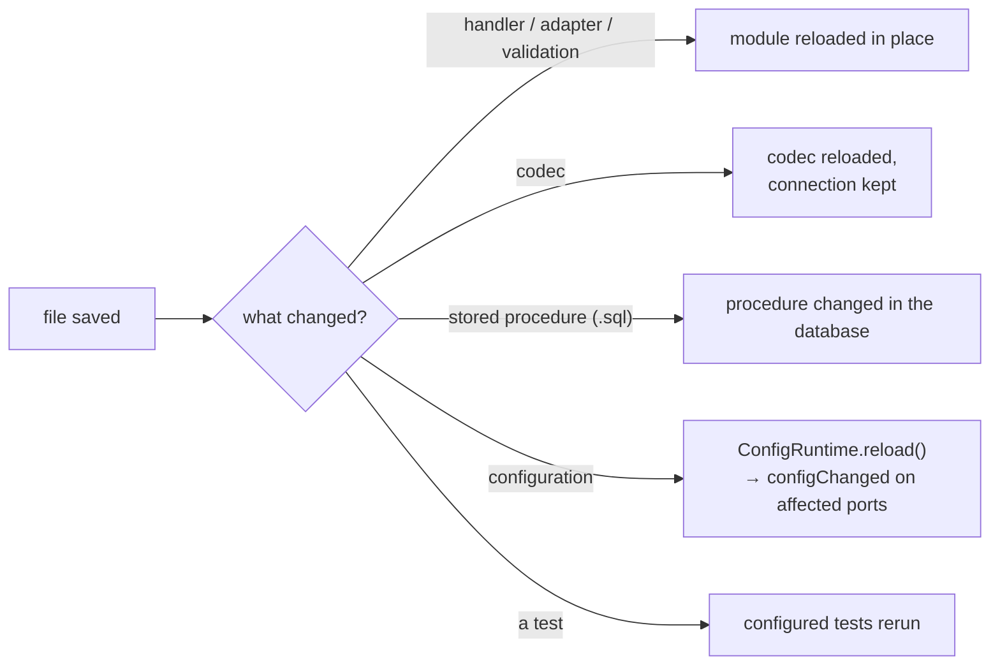

# Watch

Watch mode, or server-side hot reload, is a central part of the framework. "Watch" mode has become a
mandatory feature of every self-respecting tool, including node.js, so the following features are
official goals of Blong:

- Changing a TypeScript file that implements a method handler, adapter or validation will
  immediately load the change
- Changing a codec will reload it automatically, without dropping the connection
- Changing a SQL file that implements a stored procedure will immediately change the procedure in
  the database
- Changing a configuration reloads it immediately
- Changing a test or any of the above reruns the configured tests

What each change reloads, and what it costs:

A configuration change reaches the ports it affects rather than restarting the process — see the
[config hot reload rationale](../rationale/config-hot-reload.md) for how the diff is produced and
which ports are stopped and started instead.
