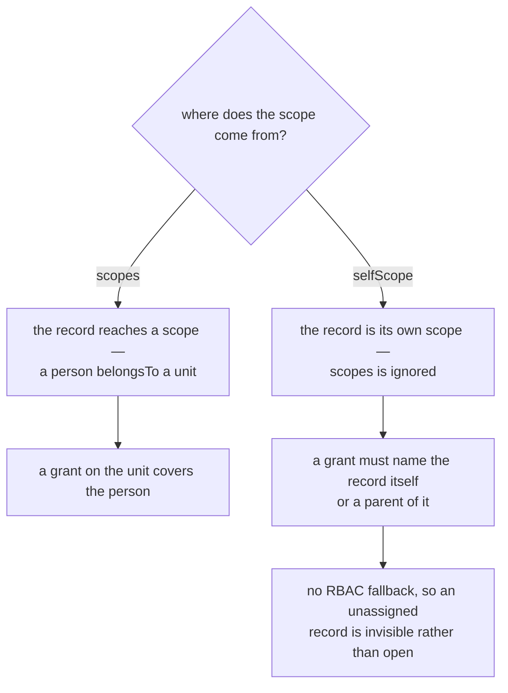
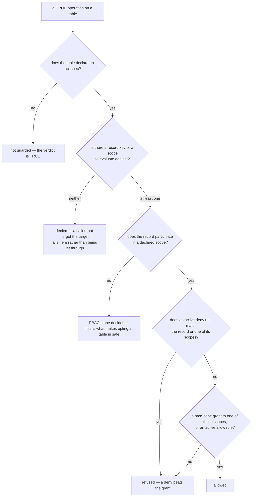
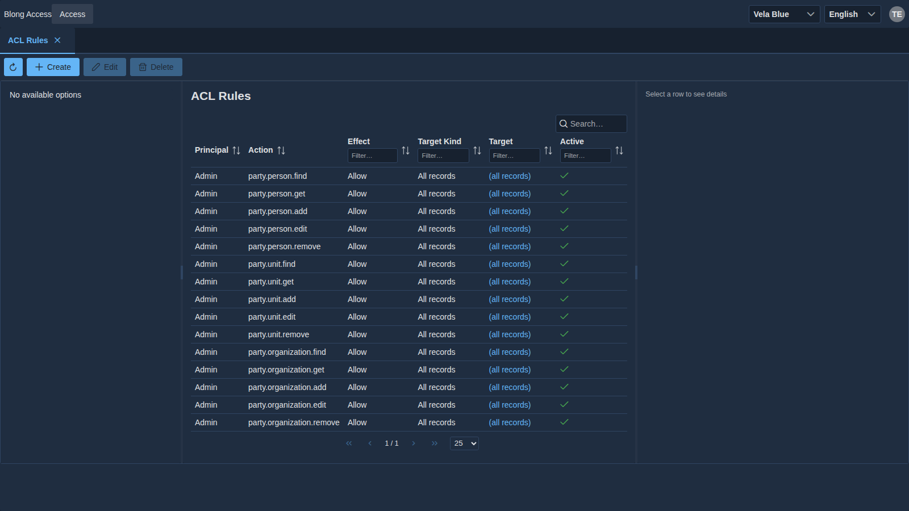
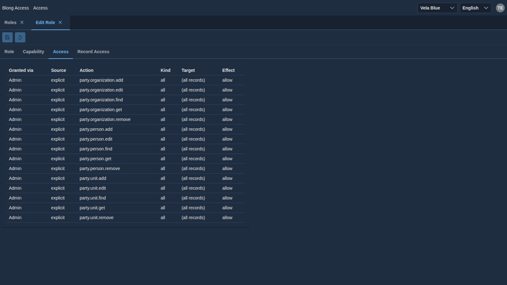

# ACL

Putting the record-level ACL on a table, writing rules and verifying them. The `blong-access` README
documents the rule table and the ACL pages; the [ACL concept](../concepts/acl.md) describes the
model and the [rationale](../rationale/acl.md) explains the decisions.

## 1. Opt a table in

```ts
// realm/<realm>/meta/db/db.ts
'party.person': {
    order: 300,
    resource: {nameColumn: 'lastName'},
    acl: {mode: 'scoped', scopes: ['belongsTo'], addScope: {predicate: 'belongsTo'}},
},
```

| Field                | Type                           | Default | Effect                                                                                                         |
| -------------------- | ------------------------------ | ------- | -------------------------------------------------------------------------------------------------------------- |
| `mode`               | `none` / `scoped` / `explicit` | `none`  | `none` leaves the table unguarded; `scoped` lets a grant name a scope; `explicit` counts per-record rules only |
| `scopes`             | `string[]`                     | —       | predicates leading from the record to its scope (`belongsTo`, `isPartOf`)                                      |
| `selfScope`          | `boolean`                      | `false` | the record _is_ its own scope; `scopes` is ignored and there is no RBAC fallback                               |
| `addScope.column`    | `string`                       | —       | column on the submitted row that names the scope a new record is created in                                    |
| `addScope.predicate` | `string`                       | —       | scope edge submitted with a new record (`belongsTo`)                                                           |

A table declaring `acl` also needs the scope hierarchy to be in the graph — the grants are edges, so
`party.person --belongsTo--> party.unit` must exist before a grant on the unit can cover the person.

## 2. Pick the scope shape

| Shape           | Declaration             | Use when                                                                                                               |
| --------------- | ----------------------- | ---------------------------------------------------------------------------------------------------------------------- |
| record → scope  | `scopes: ['belongsTo']` | the record belongs to a scope (a person to a unit, an invoice to an organization)                                      |
| record is scope | `selfScope: true`       | the hierarchy points _at_ the record: a unit belongs to an organization, and the organization itself has no scope edge |

The two shapes differ in where the hierarchy points, and that decides what a grant can cover:



`selfScope` has **no RBAC fallback**: an organization is visible only to a caller whose grant names
it or a parent organization. That is what makes an unassigned organization invisible rather than
open.

## 3. What gets enforced

The verdict is one expression, evaluated in SQL as part of the query — so the answer and the row set
can never disagree:



| Operation                 | Behaviour                                                     | Error                    |
| ------------------------- | ------------------------------------------------------------- | ------------------------ |
| `get`                     | a denied record reads as missing                              | `acl.notFound` (404)     |
| `edit` / `remove`         | refused before anything is written                            | `acl.denied` (403)       |
| `find`                    | filtered inside the query, before paging                      | —                        |
| `add`                     | checked against the scope named by `addScope`                 | `acl.scopeDenied` (403)  |
| `{subject}.dropdown.list` | filtered like any other read                                  | —                        |
| `access.session.verify`   | re-validates the action live and requires the record or scope | `acl.notPermitted` (403) |
| `remove`                  | releases the rules that name the record first                 | —                        |

Handlers that never touch a guarded table are unaffected; a guarded table's own handlers get all of
the above without writing a single check.

## 4. Write the rules

**From the UI.** _ACL Rules_ (`access.acl`) is the explicit rule table: principal, action, target
kind, target, effect and active, with the names joined for display. The shared seed alone fills it —
`Admin` is allowed every guarded action on every record, while `Manager` is denied
`party.person.find` on one scope — so the wildcard and the deny are visible side by side:



On a role or user, the **Access** tab lists the _effective_ rules with the source of each decision —
the same rules seen from the principal's side:



The **Record Access** matrix edits scope × verb as tri-state cells — clicking a cell cycles allow →
deny → no rule, and a "no rule" cell removes the rule, which is how an implicit grant is narrowed
back.

**From seeds.** The authorization merge accepts both halves:

```yaml
# implicit organizational grants (the hasScope edge)
scope:
    - {role: Admin, scope: Head Office, scopeType: unit}
    - {user: testAdmin, scope: Global Bank Corp, scopeType: organization}

# explicit rules — a wildcard target matches every record
acl:
    - {
          principal: Admin,
          principalType: role,
          target: '*',
          effect: allow,
          actions: party.person.edit,
      }
    - {
          principal: testUser,
          principalType: user,
          target: Jane Smith,
          targetType: person,
          targetKind: record,
          effect: deny,
          action: party.person.get,
      }
```

| Field                         | Meaning                                                                           |
| ----------------------------- | --------------------------------------------------------------------------------- |
| `principal` / `principalType` | who the rule is for — `user`, `role` or `unit` (or a `typeAlias`)                 |
| `action` / `actions`          | the guarded action(s) by name (`party.person.edit`, or a comma-separated list)    |
| `target` / `targetType`       | the record or scope; `'*'` means every record                                     |
| `targetKind`                  | `record` (default), `scope`, or `all` for the wildcard target                     |
| `effect`                      | `allow` (default) or `deny`; a deny wins over an allow on a record inside a scope |

A rule's action must be the _same identity_ as the guarded method: the runtime matches action names
with the dots removed, so `party.person.edit` and `partyPersonEdit` are one action, and a rule
pointing at a differently named duplicate would never apply.

**From handlers.** `access.acl.add` / `.edit` / `.remove` write single rules; the matrix on the role
and user pages is reconciled from the same helpers.

## 5. Ask inside a handler

```ts
export default handler(({handler: {accessAclAssert}}) => ({
    async invoiceInvoiceApprove(params: {invoiceId: string}, $meta: IMeta) {
        // Throws acl.notFound / acl.denied / acl.scopeDenied / acl.notPermitted.
        // `guarded: false` in the verdict means the entity opts out — proceed.
        await accessAclAssert({recordId: params.invoiceId, predicate: 'edit'}, $meta);
        // … proceed
    },
}));
```

`access.acl.assert` shares the SQL with the generic CRUD, so a manual check and the automatic one
can never disagree. `this.aclCheck({recordId}, $meta)` returns the same verdict from the adapter
side without throwing.

## 6. Custom deletes

A custom `remove` must delete the rules that name the record **before** deleting the record.
`access_acl` holds foreign keys to `core_resource`, so a delete that removes the entity row first
and then fails on a rule leaves a resource-only ghost — and because a resource is matched by name,
that entity can never be created again under its own name. The runtime's generic `remove` already
releases the rules, so a custom one only has to do the same when it bypasses the generic path.

## 7. Test it

- **Grant, then assert every path**: a denied record is filtered out of `find`, reads as
  `acl.notFound` on `get`, is refused on `edit` with `acl.denied`, and an `add` outside the scope
  fails with `acl.scopeDenied` — each call passing `$meta.expect: ['<error>']` and asserting the
  thrown error's `type`.
- **Prove the write, not just the read**: write a rule through the UI path (the matrix), read it
  back through the record's `get`, and then prove a write that the rule denies is actually refused —
  that is the round trip `realm/blong-party`'s ACL flow performs.
- **Guard against leftovers**: a role that owns rules cannot be deleted until they are released, so
  a test that creates rules should end by clearing them (or deleting the record through the
  runtime).

### The access matrix

For a whole hierarchy, one Data Table says more than a list of assertions. `realm/blong-party`
writes the org chart in the first column of the table, one column per person, and reads each cell as
the verdict of a real `party.person.get` through the gateway:

```text
| viewer        | Amy | Ben | Cam | Fay | notes                      |
| ├── Axis HQ   | ·   | ·   | ·   | ·   | North and South are inside |
| │   ├── Amy   | ✅  | ✅  | ❌  | ❌  | implicit grant on North    |
| │   ├── Ben   | ✅  | ✅  | ❌  | ❌  | implicit grant on North    |
| │   └── Cam   | ✅  | ❌  | ✅  | ❌  | in scope; Ben denied       |
|     └── Fay   | 🚫  | 🚫  | 🚫  | 🚫  | no `party.person.get`      |
```

`✅` is allowed, `❌` denied (`acl.notFound`), `🚫` refused by RBAC (403) and `·` a structural row
that is not a viewer. The probe has to go through the gateway — RBAC is a gateway preHandler, so an
in-process call answers `acl.notFound` where the gateway answers 403, and the RBAC row would be
invisible. See `browser/test/feature/aclMatrix.ts` in `realm/blong-party`, the `aclMatrix` helper
beside it and the [cucumber pattern](./cucumber.md) for the Data Table step.

Two records in that fixture exist only for the [hole](../concepts/acl.md#the-same-cases-as-a-matrix)
the decision matrix describes — a record that takes part in no scope, where the guard short-circuits
to `ALLOW`. `Hal` is a person in **no unit** (`verdict = unscoped ? ALLOW : guarded`), and `Ivy`
holds a role that denies every record while being scoped like `matrixAxis` (so the deny has a grant
to beat). Their columns and rows say three things that are hard to see any other way:

```text
| viewer | Amy | Ben | Cam | Dee | Fay | Gil | Hal | Ivy |
| Amy    | ✅  | ✅  | ❌  | ❌  | ❌  | ❌  | ✅  | ✅  |   the deny that names Hal is ignored
| Ivy    | ❌  | ❌  | ❌  | ❌  | ❌  | ❌  | ✅  | ❌  |   deny all — and the hole on Hal alone
```

Any viewer that holds the read sees `Hal` (his column is the same for all of them, whatever their
grant), a `record` deny naming him does nothing, and a wildcard deny does not close the hole either.
`Ivy` also denies herself, because her own record is inside the scope her rule covers — which is
what a deny means.

### The service-account matrix

An organization or unit can be the caller: `access.user.merge` attaches an `access_user` profile to
the resource itself (so the profile's `userId` IS its `resourceId`), sets a `clientId`, and
`access.credential.add` writes its `clientSecret`. The account then authenticates with the OAuth
`client_credentials` grant — no session — and the minted token's `sub` is that resource id, so the
same narrowing applies. `realm/blong-party` asserts three more tables this way, one per guarded
shape (persons, units, organizations):

```text
| viewer        | Amy | Ben | Cam | Dee | Fay | Gil | notes                                   |
| Axis          | ❌  | ❌  | ❌  | ❌  | ❌  | ❌  | grant ↦ Axis: no person scope holds one |
| ├── Axis HQ   | ✅  | ✅  | ✅  | ❌  | ✅  | ❌  | grant ↦ Axis HQ (and inherits Axis)     |
| │   ├── North | ✅  | ✅  | ❌  | ❌  | ❌  | ❌  | grant ↦ North (and inherits Axis)       |
| │   └── South | ❌  | ❌  | ✅  | ❌  | ✅  | ❌  | grant ↦ South (and inherits Axis)       |
| Beta          | 🚫  | 🚫  | 🚫  | 🚫  | 🚫  | 🚫  | no read capability                      |
| └── East      | ❌  | ❌  | ❌  | ✅  | ❌  | ✅  | grant ↦ East                            |
```

Two properties of the model show up here, because `belongsTo` is the inheritance edge in both
directions:

- a **unit inherits the roles** of the organization it belongs to (`access.effectiveRole`, its
  second branch), and the actor's principals include the units it belongs to and their ancestors —
  so an account under a granted organization passes the gateway's action check even when its own
  role grants no read, and a `🚫` row needs an account with no granted ancestor;
- a grant that names a **unit** covers the persons in it, not the unit record: a unit declares only
  `belongsTo` as its scope predicate (its `isPartOf` parent is not a scope), so a unit record's
  scope set is the organization it belongs to plus that organization's ancestors — which is why the
  unit and organization tables are mostly `❌`, and only a grant naming the organization (or a
  parent of it) reaches them.

### The application matrix

A third kind of caller is an OAuth application. `gateway.application.merge` (a `dbTest` handler in
`realm/blong-gateway`) creates the resource and a client secret, `gateway.subscription.merge`
subscribes it to a bundle — and a bundle IS an `access.role` — so the application's authorization is
its bundle's scope, the same narrowing a user's role gets. It authenticates with the
`client_credentials` grant (no session), and `realm/blong-party` asserts the same three tables per
application:

```text
| viewer      | Amy | Ben | Cam | Dee | Fay | Gil | notes                                    |
| axis-app    | ❌  | ❌  | ❌  | ❌  | ❌  | ❌  | bundle ↦ Axis: no person scope holds one  |
| axis-hq-app | ✅  | ❌  | ✅  | ❌  | ✅  | ❌  | bundle ↦ Axis HQ; Ben carries a deny rule |
| north-app   | ✅  | ✅  | ❌  | ❌  | ❌  | ❌  | bundle ↦ North                            |
| south-app   | ❌  | ❌  | ✅  | ❌  | ✅  | ❌  | bundle ↦ South                            |
| beta-app    | ❌  | ❌  | ❌  | ❌  | ❌  | ❌  | bundle ↦ Beta                             |
| east-app    | ❌  | ❌  | ❌  | ✅  | ❌  | ✅  | bundle ↦ East                             |
| any-app     | ✅  | ✅  | ✅  | ✅  | ✅  | ✅  | allow rule on every record                |
| none-app    | 🚫  | 🚫  | 🚫  | 🚫  | 🚫  | 🚫  | no subscription: no capability            |
```

The contrast with the accounts above is the point: an application is **not in the org chart**, so it
inherits nothing. `north-app` reads North's persons and no others, where the North _account_ also
reads everything the organization it belongs to covers. This is also the table where a unit-scoped
grant shows its limit twice: `axis-hq-app` reads the persons of Axis HQ, and no unit record at all —
a unit bundle cannot read the unit it is named after. The fixture is
`browser/test/feature/aclMatrixApplication.ts` in `realm/blong-party`, with
`browser/test/test/testAclMatrixApplication.ts` beside it.

### The rules matrix — the table that declares no `acl` at all

The matrices above narrow because their tables declare an `acl`. The clearest way to say what that
declaration costs is a matrix over a table that does not have one, holding the records that do the
narrowing. `access.acl` is seeded in this suite and declares nothing, so it reads `accessAclFind` —
whose rows carry the joined `targetName`, which is what a column can name:

```text
| viewer | Ben | Hal | (all records) | notes                                            |
| Amy    | ✅  | ✅  | ✅            | the deny on Hal is readable by its target too     |
| Ben    | ✅  | ✅  | ✅            | the rule that takes Ben back is readable by Ben   |
| Ivy    | ✅  | ✅  | ✅            | her deny names party.person.get, not this table   |
| Cam    | ✅  | ✅  | ✅            | her record exemption is public                    |
| Fay    | 🚫  | 🚫  | 🚫            | matrixNone: no access.acl.get (the only refusal)  |
| Dee    | ✅  | ✅  | ✅            |                                                  |
| Gil    | ✅  | ✅  | ✅            | the wildcard allow is not what admits this read   |
```

Two details the shape teaches. A column is the _record a rule targets_ (`Ben`, `Hal`, the sentinel
the wildcard rules share, which the ACL page labels `(all records)`) — a role's `scope` is a grant
on the role, not a rule target, so `North` and `Axis HQ` are not columns. And the table is named by
a joined field the `ACCESS_ACL` table does not hold, so the target resolves the name **in code**, on
the rows the find returned, rather than through `filterBy`: a virtual name is not a column a `WHERE`
clause can reach (the access realm's own Browse page searches `description` for that reason). That
is the `nameColumn` alternative on `IAclMatrixTarget`.

### The explicit-mode matrix

`party.consent` is the table that declares `acl: {mode: 'explicit'}` and **no `scopes`**, which
makes it the deny-by-default shape: no `hasScope` grant is consulted, and no scope set is built, so
only a `record`-targeted or `all`-targeted allow can admit a row. Its fixture is two rules — one
record allow for `matrixNorth`, one scope allow for `matrixAxis` that has nothing to match — plus
the wildcard allow `matrixAll` already carries:

```text
| viewer | Amy marketing | Beta research | Cam study | notes                                      |
| Amy    | ✅            | ❌            | ❌        | matrixNorth admits that one record         |
| Ben    | ✅            | ❌            | ❌        | the same role, so the same one record      |
| Ivy    | ✅            | ❌            | ❌        |                                           |
| Cam    | ❌            | ❌            | ❌        | her allow names a scope: no scope set here |
| Fay    | 🚫            | 🚫            | 🚫        | matrixNone: no party.consent.get          |
| Dee    | ❌            | ❌            | ❌        | owns a consent, still may not read it      |
| Gil    | ✅            | ✅            | ✅        | the wildcard allow reaches every row       |
```

The rows are the same seven viewers as the person matrix and the columns are the three seeded
consents (`20-aclMatrix-partyHierarchyMerge.yaml`), each owned by a person through the declared
`belongsTo` edge — `Dee` owns `Beta research` and still reads nothing, which is what deny-by-default
means once the implicit grant is switched off. The `scope` rule is not "ignored because the mode is
explicit": it matches nothing because the table declares no `scopes`, so `aclCheckSql` never builds
a scope set for it to reach. Declaring `scopes: ['belongsTo']` would give that rule something to
match (a consent's scope set is its owner) without changing the mode.

### What has no matrix

`add` and `addScope` are asserted by the server-side flow rather than by a matrix, and deliberately:
a matrix probes a record, so a write row would have to _create_ a record per cell — a table that
writes as it reads, and a fixture that grows with every cell. The in-process flow (`adapter/test/…`
in `realm/blong-party`, group `test.acl.flow`) drives `party.person.add` with a submitted
`belongsTo` edge instead and asserts the scope the guard resolved from the payload. The same
reasoning applies to anything else whose probe is a mutation: assert it where the state is already
under test, and keep the matrix for reads.

### Asserting the fixture the matrix is built from

An outcome table says nothing about _why_ a cell is what it is, and its expectations encode a model
of the fixture — which is exactly where a mistake hides. Each matrix therefore opens with a
`Background` that asserts the records the access is derived from, so the file reads on its own:

```gherkin
Background:
  Given the ACL org chart is
    | record      | kind | belongsTo | isPartOf | notes                           |
    | Axis        | org  |           |          | the granted organization        |
    | ├── Axis HQ | unit | Axis      |          | North and South are isPartOf it |
    | │   ├── Amy | person | North   |          |                                 |
    …
  And the ACL users are
    | record | kind | hasRole     | notes                           |
    | amy    | user | matrixNorth | Amy is the person, amy the user |
    …
  And the ACL grants are
    | principal   | kind | hasScope | hasCapability              |
    | matrixNorth | role | North    | loginCapability,matrixView |
    …
  And the ACL rules are
    | principal  | kind | effect | actions          | target |
    | matrixAxis | role | deny   | party.person.get | Ben    |
    | matrixAll  | role | allow  | matrixView       | *      |
```

The shape is the point: **every column is one predicate** (`belongsTo`, `isPartOf`, `hasRole`,
`hasScope`, `hasCapability`, plus `clientId` for a service account), so a cell is a claim about the
graph rather than a comment, and one engine asserts all of it. `party.fixture.get` reads the facts
back by name (`adapter/dbTest/partyFixtureGet.ts` in `realm/blong-party`), the `aclFixture` library
compares them (`browser/test/test/aclFixture.ts`), and an `actions` cell may name a capability whose
actions the rule covers. A cell states **every** target of that subject and predicate, so an edge
the fixture does not declare fails the table instead of passing unnoticed — which is how a stale
leftover capability from an earlier iteration of the fixture was found.

Two conventions make the tables readable. A user is named after its person in lower case (`Amy` the
person, `amy` the user) — two records, and the case tells them apart. And the `Background` is
asserted once per feature but runs before every scenario, so the service-account and application
features do not repeat their fixture three times.

Two things about the exposure are worth knowing before adding a read of your own. The generic CRUD
methods are reachable over RPC because the table has a **model** in `meta/model/` (`model(...)`
registers subject, object and the predicate set) — declaring the table in `meta/db/db.ts` creates it
without an API, and a table without a model answers `404 Not Found` however the call is made. And
the method name must be three words — `methodParts` (`core/blong-gogo/src/lib.ts`) splits subject,
object and predicate out of the handler name and glues a fourth word onto the predicate
(`partyAclFixtureGet` → `party.acl.fixtureGet`).

The harness that resolves the columns is a caller like any other, so a new matrix needs **both**
levels of read for `testAdmin`: the action in its capability (`matrixHarnessRead`), and — on a table
that declares an `acl` — a record-level allow, because RBAC and the record level are separate
questions. Give the harness _user_ its own rule rather than appending a second action to the role's
wildcard allow: the seed merge appends to an existing rule's action list, so a role-targeted rule
would quietly rewrite a list that belongs to the access realm (and the rules table would then
rightly fail, since a fixture cell states every action a rule carries).

### Reading a red run

A matrix is a table of refusals, so a green run writes an error-level entry per `❌` and `🚫` cell
unless the probe says otherwise. Every probe therefore declares what it is prepared for —
`expect: ['acl.notFound', 'gateway.notAllowed']`, and `gateway.notAllowed` alone for the fixture
read — which is what keeps the suite's error stream empty: `realm/blong-party` went from 467 entries
per run to none, and the entries that remain are the failures nobody asked for. See
[expected errors](../concepts/expected-errors.md) for the matching rules and the three things that
have to line up for a declaration to be honoured through the gateway.

When a cell does not match, the step asserts once with the redrawn table as its message: the table
is framed and padded, the offending cell reads `expected≠actual`, and every mismatch is also named —
row, column, both values — underneath. That report is a contract, so it is tested: the
`test.acl.diagnostics` feature (group `test.acl.diagnostics` in `realm/blong-party`) drives the real
helpers with a deliberately wrong table and asserts that each mismatch is marked in the cell it
belongs to, and that a table with nothing wrong reports nothing. Change the marker and that feature
fails, which is the point.

## 8. Troubleshooting

| Symptom                                            | Likely cause                                                                                                                                                          |
| -------------------------------------------------- | --------------------------------------------------------------------------------------------------------------------------------------------------------------------- |
| A rule seems to have no effect                     | its action resource is a different resource with the same dot-stripped name — write rules through the matrix, which resolves the action the same way the runtime does |
| Everything is visible after enabling the guard     | the records are in no scope: check the `scopes` predicates and that the `access.effectiveScope` path was refreshed                                                    |
| An organization's records are always hidden        | `selfScope` has no RBAC fallback: the caller needs a grant naming the organization or a parent                                                                        |
| The matrix lists rows you did not expect           | its rows are every graph resource of the listed types — filter the Scope column                                                                                       |
| A column reports no record id, or a table is empty | the harness cannot read the table: add the action to `matrixHarnessRead` **and**, on a guarded table, a record-level allow naming the harness user                    |
| A rule's `actions` cell fails with a longer list   | the seed merge appends to an existing rule — a role-targeted rule lands on the access realm's own wildcard allow; target the harness user instead                     |
