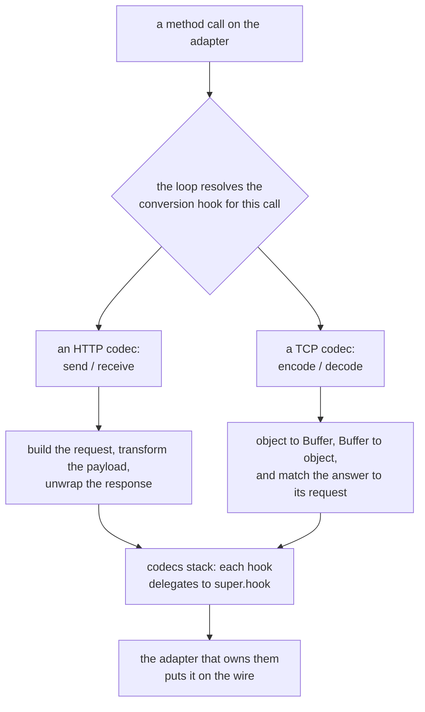
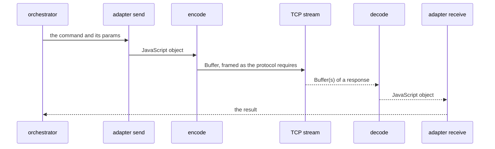

# Codec

Use codecs to implement protocols on top of lower-level ones.

A codec is a handler group that an adapter lists in its `imports`. It implements one of the
conversion hooks the adapter loop resolves around every method call, so it sees each call go out and
each answer come back without the caller knowing it is there:



Because each hook is looked up on the adapter's `imported` prototype chain, a codec delegates to the
one beneath it with `super.send` / `super.receive` (or `super.encode` / `super.decode`), so several
codecs can sit in one adapter and each layer is free to do only its own part. The hook is also
resolved by specificity, not only by name: a codec may implement `send`, or a narrower
`<prefix>Send` that the loop only reaches for the calls it matches — which is how the OpenAPI codec
below stays out of the way of every operation that is not in its API definitions.

## Which codec uses which hook

The three HTTP codecs that ship with the framework are all handler groups under
`core/blong-gogo/src/codec/adapter/`, and they show the two styles of hook side by side:

| Codec           | Files                                                                            | Hooks it implements                                                                                                                                                                                                                                                                                                                                                                                         |
| --------------- | -------------------------------------------------------------------------------- | ----------------------------------------------------------------------------------------------------------------------------------------------------------------------------------------------------------------------------------------------------------------------------------------------------------------------------------------------------------------------------------------------------------- |
| `codec.jsonrpc` | `jsonrpc/send.ts`, `jsonrpc/receive.ts`, `errors.ts`                             | `send` builds the request — `path` from the method (`/rpc/subject/object/predicate`), a JSON-RPC 2.0 body, an `id` only for `mtid: 'request'`, and `expect` / `timeout` carried from `$meta`. `receive` turns `body.error` into a thrown typed error and a non-2xx status into an HTTP error.                                                                                                               |
| `codec.openapi` | `openapi/load.ts`, `openapi/request.ts`, `openapi/ready.ts`, `openapi/errors.ts` | `ready` merges the namespace definitions and builds one request handler per operation; `requestSend` dispatches by `methodId($meta.method)` and passes everything else straight through; `responseReceive` takes the body.                                                                                                                                                                                  |
| `codec.mle`     | `mle/ready.ts`                                                                   | `ready` loads or generates the key pair; `send` refreshes the token first, adds the `Authorization` header and encrypts; `receive` decrypts `error` and `result`; `errorReceive` drops the token on a 401. The pre-auth login calls use their own senders (`loginTokenCreateRequestSend`, `loginTokenRefreshRequestSend`, …) that encrypt with the handshake keys, because those callers hold no token yet. |

`codec.mle` is why the stack exists at all: every realm and suite that fronts the browser lists
`imports: ['codec.jsonrpc', 'codec.mle']` (`core/blong-browser/adapter/backend.ts`,
`realm/blong-test/browser.ts`), and the encryption layer must come after the one that gives the call
its JSON-RPC shape.

## Configuration

Codecs are configured by including their configuration in the adapter's configuration, while using
their identifier (`codec.xxx`) as a key name. For example:

```js
export default realm(() => ({
    dev: {
        http: {
            'codec.openapi': {
                namespace: {},
            },
        },
    },
}));
```

## HTTP codecs

The HTTP codecs can be imported in the HTTP adapter, to implement specific functionality. They are
implemented as a pair of `send` and `receive` handlers.

The framework includes the following commonly used HTTP codecs:

### OpenAPI

Import `codec.openapi` to enable easy calling of an external API, when it has OpenAPI or Swagger
definition available. This usually happens at the server, when integrating with third party systems.
The adapter can be called using an `operationId` from the API definition, prefixed with the
namespace. Then this codec will determine the required HTTP method, path, headers and body for the
request, based on the API definition. If `operationId` is not defined in the API, then it can be
configured by merging an additional definition that specifies `operationId` for each HTTP method and
path.

This codec has the following configuration:

```yaml
namespace: # API definitions per namespace
    time: # Namespace for the definitions
        - some/path/world-time.yaml # OpenAPI/Swagger definition files
        - some/path/world-time.operations.yaml
    k8s: # Namespace for the definitions
        - http://k8s.com/k8s-apps.json # OpenAPI/Swagger definition URLs
        - http://k8s.com/k8s-discovery.json
        - http://k8s.com/k8s-version.json
```

### JSON-RPC

The `codec.jsonrpc` can be imported in the HTTP adapter, to enable easy calling of the framework's
JSON-RPC based APIs. This is usually done in the front end, but can be also used for other cases,
like server to server calls. This codec will automatically determine the path for the called method,
pass the parameters in the request body and process the response by returning the result or the
error of the call.

### Message Level Encryption

The `codec.mle` can be imported in the HTTP adapter, to enable message level encryption when
communicating with the framework's server. This codec must be put after `codec.jsonrpc` in the
`imports` array.

## TCP codecs

The TCP codecs can be imported in the TCP adapter, to implement specific protocols. They are
implemented as a pair of `encode` and `decode` handlers: `encode` turns the JavaScript object the
adapter was called with into the Buffer the protocol expects, and `decode` turns the frames that
come back into JavaScript objects. Because these protocols commonly multiplex, the pair also owns
matching a response to the request that caused it.



**No protocol-specific TCP codec ships as a reusable package today.** The working example to follow
is the Payshield adapter in `test/framework/ctp/adapter/payshield/` — `encode.ts` and `decode.ts`
over a bit-syntax header, plus `payshieldSim.ts` to stand in for the HSM — which is a framework test
package rather than a supported codec: it is what this mechanism looks like when a real wire format
is put through it.

ISO8583, SMPP and APTRA/NDC have no implementation in the repository. Treat them as the protocol
_motivations_ for the mechanism, not as codices you can import: writing one means writing the
`encode`/`decode` pair for the wire format, and the Payshield pair is the shape to copy.
