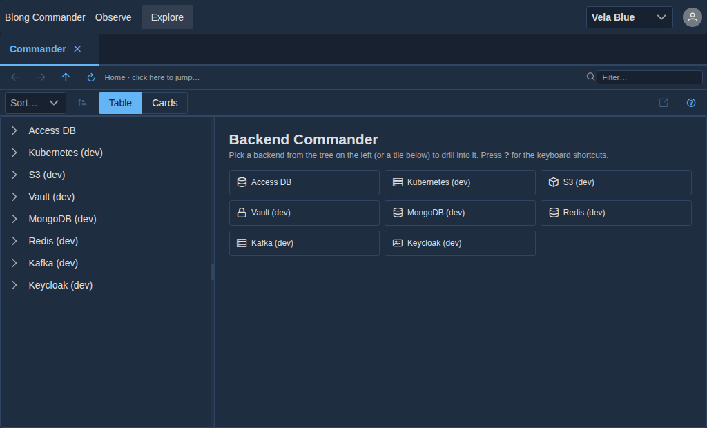
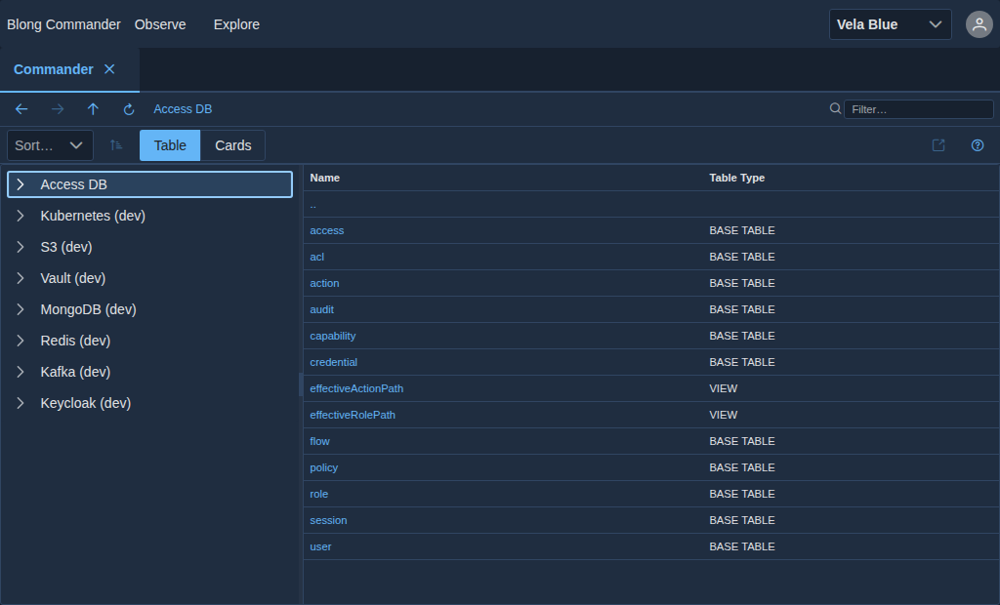

# Commander: one explorer for every backend

Data stores are boring in the same way and different in the same ways: each has a hierarchy, a list
of things at each level, a detail view, and its own client library. Writing a screen per backend
means writing the same four screens six times, and the sixth one is where the keyboard handling
regresses.

`realm/blong-commander` describes a backend as a **source** and lets one explorer render it. A
source is a namespace of triples — its `name` is the subject of every method it contributes — so
adding a backend is a configuration entry and, when the connection needs one, a small `*Dev`
adapter. There is no per-backend React.





## The source descriptor

```typescript
export interface ICommanderLevel {
    label: string;
    list?: {method: string; params?: object}; // the list triple for this level
    open?: {method: string; params?: object}; // the detail triple, when the level has one
    permission?: string; // the action a caller needs to see this level
    viewer?: string; // which viewer renders a node of this level
    model?: ...; // declared, unused — see "What is not wired"
}

export interface ICommanderSource {
    name: string; // lowercase instance namespace — the subject of every triple
    label: string;
    icon?: string;
    permission?: string;
    levels: ICommanderLevel[];
}
```

The descriptors are a plain exported array — `config/sources.ts` — and the handlers read it as
`(config).sources ?? defaultSources`, resolve the level by index, and dispatch the level's `list`
method with `params` from the parent node. That is the whole abstraction: **a hierarchy of levels
whose list and detail are existing triples**. Nothing in the explorer knows what the backend is.

| Source         | Backing implementation                                | Notes                                                          |
| -------------- | ----------------------------------------------------- | -------------------------------------------------------------- |
| `access-db`    | the shared `srv.db` adapter, through the access realm | the SQL source; no dedicated adapter                           |
| `k8s-dev`      | `adapter.k8sDev` → `adapter.k8s`                      | namespaces → categories → resources → item viewer              |
| `s3-dev`       | `adapter.s3Dev` → `adapter.s3`                        | buckets → objects; `forcePathStyle` for MinIO                  |
| `vault-dev`    | `adapter.vaultDev` → `adapter.vault`                  | mounts → secrets → secret viewer                               |
| `mongo-dev`    | `adapter.mongoDev` → `adapter.mongodb`                | databases → collections → documents                            |
| `redis-dev`    | `adapter.redisDev` → `adapter.redis`                  | database index → keys                                          |
| `kafka-dev`    | `adapter.kafkaDev` → `adapter.kafka`                  | topics → messages, in `mode: 'admin'` (metadata, not a stream) |
| `keycloak-dev` | `adapter.keycloakDev` → `adapter.keycloak`            | realms → users                                                 |

### The `*Dev` adapters are local wiring, not a dev-only intent

Each `*Dev` adapter is a thin extension of the real adapter that supplies a local endpoint, local
credentials and the settings a local backend needs — Kafka's JSON codec and short session timeouts,
S3's path-style URLs. They declare `activation.default`, **not** `activation.dev`, and the framework
merges the `default` block in every intent: a production deployment that loaded this realm with its
own configuration would get these localhost endpoints unless it overrode them. The intended reading
is "dev-wired instance of the adapter", and a deployment supplies its own — the adapter is the unit
of reuse, and the realm's own `index.ts` decides which sources are listed.

## The explorer

The shell lives in **`blong-browser`** (`components/Commander/`), not in the realm: the realm
contributes the descriptors, the handlers and a page that fetches them, and the component renders
whatever it is given.

- **The tree** is built from the source list, one root per source; a click resolves the level by
  position in the path.
- **The list** posts `{source, level, parent}` to `commander.branch.list`, which resolves the
  level's `list` triple and calls it. The handler flattens heterogeneous rows (a Kubernetes object
  and a SQL row are both objects) so one table can show either.
- **What a level shows is declarable**, not only what its backend answers: `include` (a whitelist)
  and `exclude` (a blacklist) hold regexes matched against the value the level displays —
  `labelField`, else `keyField` — and the same handler applies them before it orders the rows. The
  Kubernetes source uses it to show only the namespaces Kubernetes itself owns, because a cluster
  also lists whatever its own work created there and that set differs from cluster to cluster, so an
  unfiltered level made the tree read the cluster rather than the source. An absent or empty list
  means every row the backend answered with.
- **The filter** is client-side over the flattened row, and the columns are derived from the data —
  scalar fields only. Nothing per-backend is configured for a table to appear.
- **Opening a node** is opt-in per level: a level with an `open` triple fetches the detail, a level
  without one shows its list row.
- **Viewers** are keyed by _resource type_, not by backend: `resolveViewer` picks one from the
  node's metadata out of a registry that ships `json`, `keyValue`, `file`, `image`, `table`,
  `document`, `secret`, `yaml`, `message` and pod-log viewers. A new backend reusing an existing
  shape gets its viewer for free.

### Read-only, deliberately

There is **no write path**: no `edit`, `update`, `save`, `delete` or `create` handler exists
anywhere in the realm, and `commander.node.action` implements the read/navigation verbs (`copyPath`,
`open`, `refresh`). The explorer lists, filters, drills and views. Treat any statement that it edits
a backend as wrong — an admin tool that can mutate a production Kubernetes object or a Vault secret
needs an authorization story this realm does not attempt.

## The observed-branch list

`docs/observedBranchList.md` is a **generated** artefact: a mermaid sequence diagram of
`commander.branch.list`'s own dispatch — the handler's checkpoints at its side, the outgoing leg to
the access realm at the other. It is not a source and not a hand-written document; it is registered
in `docs/blong/docs-artifacts.json` and regenerated with the command recorded there. It is a good
example of the opposite of what it looks like: not "a non-CRUD source", but _an orchestrator being
drawn_, which is why the diagram has an `alt` branch for the shape the inner call returned.

## What is not wired

Four things are declared but unused, and knowing them saves an afternoon:

- **`commander.node.viewer` and `commander.node.action` are not called by the browser.** They are
  registered and gateway-validated, so they are reachable over RPC, but the shipped page uses
  `commander.source.list`, `commander.branch.list` and `commander.node.get` only.
- **The `commander.sources` configuration override is not provided by any config**, so the handlers
  always fall back to the hardcoded array. Overriding the source list from a suite therefore does
  not work yet, despite the comment in `commanderDispatch.ts`.
- **`ICommanderLevel.model` is used by no source** and the page passes no `models` prop, so the
  model-driven branch of the viewer resolution cannot fire in the shipped page.
- **Three of the eight sources have no `open`** — Kubernetes items, Kafka messages and Keycloak
  users render their list row rather than fetched detail.

## Authorization

Sources and levels carry a `permission`, and `commander.source.list` prunes the tree by the caller's
effective actions before returning it — a source a caller cannot use is not a source they see. The
grants live with the realm: `meta/dbTest/commander-accessAuthorizationMerge.yaml` gives the Admin
role one action per source and level, and the level gating is fine-grained (`s3Dev.object.list`
gates one level while the source stays visible, and the k8s namespace gates a whole tree).

## Adding a source

1. Add an `ICommanderSource` entry to `config/sources.ts`: the `name` is the triple subject, and
   each level names the `list` method it dispatches.
2. If the connection needs one, add a `*Dev` adapter extending the real adapter, with
   `activation.default` supplying the local endpoint — and say in the header that a deployment
   overrides it.
3. Add the viewer if the resource shape is new, keyed by type in `blong-browser`'s viewer registry.
4. Grant the actions in `meta/dbTest/commander-accessAuthorizationMerge.yaml` (and the production
   seed).
5. Add a test that drills one branch and asserts a known row, the way `test/explore.play.ts` does.

`test/docs.play.ts` is the worked example of photographing the result: it opens the page, asserts
the eight sources and a known row, and writes the two images above when `BLONG_CAPTURE_DOCS=1` is
set.
