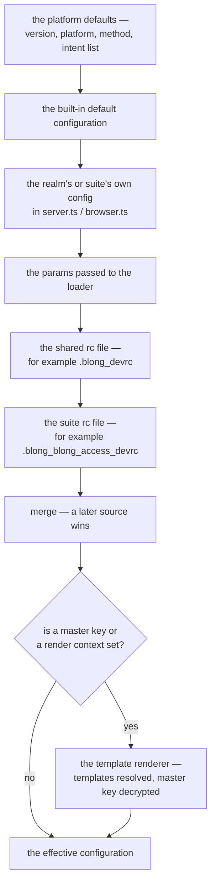

# Configuration

Blong comes with a flexible configuration mechanism, which allows the configuration to be specified
in multiple places, such as:

- the source code of each [realm](./realm)
- configuration files
- environment variables
- command line parameters

The configuration coming from these places is merged to get the effective one. The order is fixed,
and a later source overrides an earlier one:



Environment variables are not a general merge layer in that chain: `BLONG_PLATFORM`, `BLONG_METHOD`
and `BLONG_ENV` select the platform, the method and the intent list, and `BLONG_MASTER_KEY` switches
on the template render. A component that needs a secret reads its own key instead — the gateway
reads `GATEWAY_SIGN_KEY` and `GATEWAY_ENCRYPT_KEY` when no key is configured.

## Environments and use cases

The configuration is usually split into several parts, which are activated based on the environment
and the use case. There are some established names for the intents:

- `default`: the base configuration, active for all cases
- `dev`: active in the development environment
- `prod`: active in the user acceptance test and production environments
- `test`: active during automated tests
- `db`: active during database creation
- `realm`: active when focusing the development on a single realm

## Source code configuration

The configuration coming from the source code has the purpose to define some defaults for the
appropriate use cases and environments.

### Adapter

To configure the adapter, use one of the possible configuration places:

In the same realm where the adapter is defined, define defaults and per environment configuration

```js
// realmname/server.ts
import {realm} from '@feasibleone/blong';

export default realm(blong => ({
    config: {
        default: {
            adaptername: {
                // base configuration
                // usually namespace and imports are specified here
            },
        },
        dev: {
            adaptername: {
                // dev env overrides
            },
        },
    },
}));
```

In the global configuration, override the defaults using:

```yaml
realmname:
    adaptername:
        # global overrides
```

### Orchestrator

Orchestrators are configured the same way as adapters

### Internal components

The internal components of the framework can also be configured using the following:

```yaml
log: # global logging config
    logLevel: info # see pino config
    transport: # see pino config
watch:
    logLevel: info # log level for the watch component
adapter:
    logLevel: info # default log level for all adapters
gateway: # configuration of the API gateway
    logLevel: info # log level
    debug: true # turn on debugging details in responses
    host: 0.0.0.0 # listen address
    port: 8080 # listen port
    sign: # MLE signing key
    encrypt: # MLE encryption key
    jwt: # OpenId configuration
        audience: # JWT Audience
rpcServer: # configuration for the internal RPC calls
    logLevel: info # log level
    host: 0.0.0.0 # listen address
    port: 8091 # listen port
```
