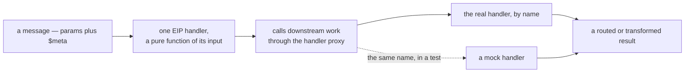
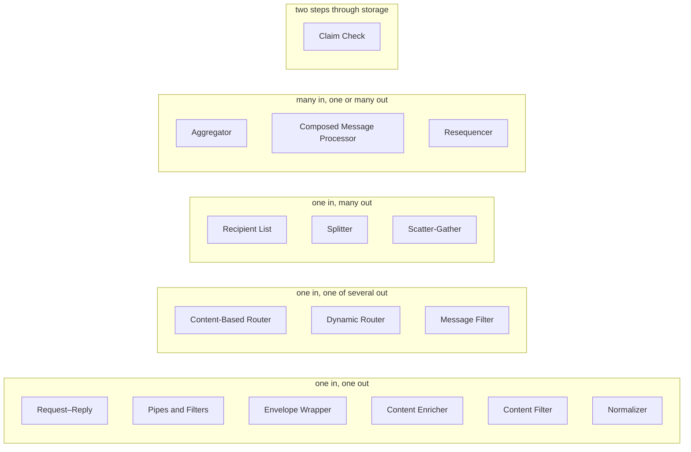
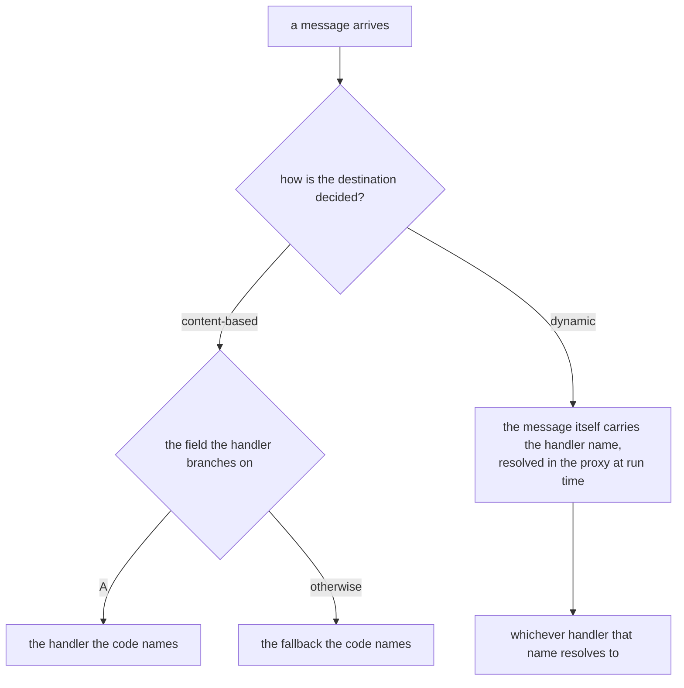
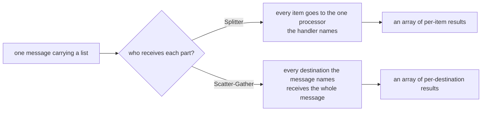
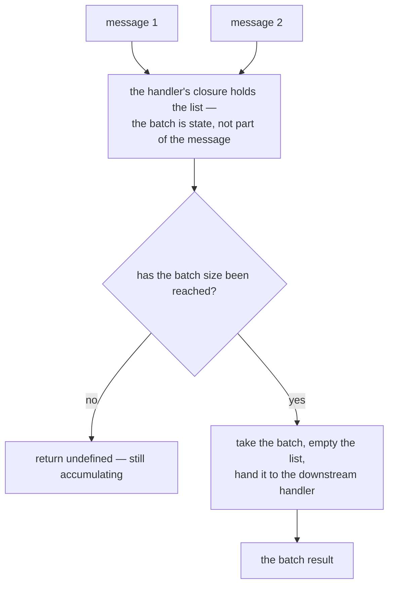
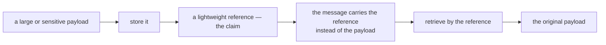

# EIP patterns

[Enterprise Integration Patterns (EIP)](https://www.enterpriseintegrationpatterns.com/) are a
catalogue of well-known solutions for message-based integration problems. Blong handlers are a
natural fit for these patterns because each handler is a pure function that receives a message
(params + $meta) and returns a transformed or routed result.

The `@feasibleone/blong-eip` package provides a reference implementation. Each pattern is a single
file in `orchestrator/eip/` and calls downstream handlers via the `handler` proxy, which means the
concrete implementation can be replaced by a mock during testing.

Every one of them has the same shape, which is why the pattern is a single short file:



The catalogue below is ordered by what each pattern does to the message — the shape, not the
vocabulary, is what tells you which one you want:



## Pattern catalogue

### Request–Reply

The simplest integration pattern: call a handler and return its result unchanged.

```ts
// eip/orchestrator/eip/eipMessageReturn.ts
import {type IMeta, handler} from '@feasibleone/blong';

export default handler(
    () =>
        async function eipMessageReturn(
            {result}: {result: unknown},
            $meta: IMeta,
        ): Promise<unknown> {
            return result;
        },
);
```

### Pipes and Filters

Chain multiple handlers so the output of one becomes the input of the next.

```ts
// eip/orchestrator/eip/eipMessagePipes.ts
export default handler(
    ({handler: {mockPipeA, mockPipeB}}) =>
        async function eipMessagePipes(params: unknown, $meta: IMeta): Promise<unknown> {
            const resultA = await mockPipeA(params, $meta);
            return mockPipeB(resultA, $meta);
        },
);
```

### Content-Based Router

Inspect a field in the message and forward to the appropriate handler.

```ts
// eip/orchestrator/eip/eipMessageRoute.ts
export default handler(
    ({handler: {mockPipeA, mockPipeB}}) =>
        async function eipMessageRoute(
            {destination, ...rest}: {destination: string; [key: string]: unknown},
            $meta: IMeta,
        ): Promise<unknown> {
            if (destination === 'A') return mockPipeA(rest, $meta);
            return mockPipeB(rest, $meta);
        },
);
```



### Dynamic Router

Resolve the target handler name at runtime from the message itself.

```ts
// eip/orchestrator/eip/eipMessageDynamic.ts
export default handler(
    ({handler}) =>
        async function eipMessageDynamic(
            {destination, ...rest}: {destination: string; [key: string]: unknown},
            $meta: IMeta,
        ): Promise<unknown> {
            const target = (handler as Record<string, (...args: unknown[]) => unknown>)[
                destination
            ];
            return target(rest, $meta);
        },
);
```

### Message Filter

Forward the message only when a condition is met; discard it otherwise.

```ts
// eip/orchestrator/eip/eipMessageFilter.ts
export default handler(
    ({handler: {mockPipeA}}) =>
        async function eipMessageFilter(
            {condition, ...rest}: {condition: boolean; [key: string]: unknown},
            $meta: IMeta,
        ): Promise<unknown> {
            if (condition) return mockPipeA(rest, $meta);
            return undefined;
        },
);
```

### Recipient List

Broadcast a message to a fixed set of handlers and collect all results. Supports both parallel
(default) and sequential execution via the `sequential` flag.

```ts
// eip/orchestrator/eip/eipMessageRecipient.ts
export default handler(
    ({handler: {mockPipeA, mockPipeB}}) =>
        async function eipMessageRecipient(
            {sequential, ...rest}: {sequential?: boolean; [key: string]: unknown},
            $meta: IMeta,
        ): Promise<unknown[]> {
            if (sequential) {
                const a = await mockPipeA(rest, $meta);
                const b = await mockPipeB(rest, $meta);
                return [a, b];
            }
            return Promise.all([mockPipeA(rest, $meta), mockPipeB(rest, $meta)]);
        },
);
```

### Splitter

Break a compound message into individual items and process each one. Supports parallel (default) and
sequential processing.

```ts
// eip/orchestrator/eip/eipMessageSplit.ts
export default handler(
    ({handler: {mockItemProcess}}) =>
        async function eipMessageSplit(
            {items, sequential}: {items: unknown[]; sequential?: boolean},
            $meta: IMeta,
        ): Promise<unknown[]> {
            if (sequential) {
                const results: unknown[] = [];
                for (const item of items) results.push(await mockItemProcess(item, $meta));
                return results;
            }
            return Promise.all(items.map(item => mockItemProcess(item, $meta)));
        },
);
```



### Aggregator

Collect individual messages until a batch size is reached, then process the batch.

```ts
// eip/orchestrator/eip/eipMessageAggregate.ts
const BATCH_SIZE = 3;

export default handler(({handler: {mockDataSave}}) => {
    const list: unknown[] = [];
    return async function eipMessageAggregate(message: unknown, $meta: IMeta): Promise<unknown> {
        list.push(message);
        if (list.length >= BATCH_SIZE) {
            const batch = list.splice(0, list.length);
            return mockDataSave({items: batch}, $meta);
        }
        return undefined;
    };
});
```



### Resequencer

Buffer out-of-order messages until a batch is complete, then sort and process in order.

```ts
// eip/orchestrator/eip/eipMessageSort.ts
const BATCH_SIZE = 3;

export default handler(({handler: {mockItemProcess}}) => {
    const list: Array<{order: number; [key: string]: unknown}> = [];
    return async function eipMessageSort(
        params: {order: number; [key: string]: unknown},
        $meta: IMeta,
    ): Promise<unknown[] | undefined> {
        list.push(params);
        if (list.length >= BATCH_SIZE) {
            const batch = list.splice(0, list.length);
            const sorted = batch.sort((a, b) => a.order - b.order);
            const results: unknown[] = [];
            for (const item of sorted) results.push(await mockItemProcess(item, $meta));
            return results;
        }
        return undefined;
    };
});
```

### Composed Message Processor

Split a complex message into parts, process each part with a specialised handler, then merge the
results into a single response.

```ts
// eip/orchestrator/eip/eipMessageCompose.ts
export default handler(
    ({handler: {mockPipeA, mockPipeB}}) =>
        async function eipMessageCompose(
            {part1, part2}: {part1: unknown; part2: unknown},
            $meta: IMeta,
        ): Promise<unknown> {
            const [resultA, resultB] = await Promise.all([
                mockPipeA(part1, $meta),
                mockPipeB(part2, $meta),
            ]);
            return Object.assign({}, resultA, resultB);
        },
);
```

### Scatter-Gather

Send a message to a dynamic list of handlers in parallel and gather all results.

```ts
// eip/orchestrator/eip/eipMessageScatter.ts
export default handler(
    ({handler}) =>
        async function eipMessageScatter(
            {destinations, ...rest}: {destinations: string[]; [key: string]: unknown},
            $meta: IMeta,
        ): Promise<unknown[]> {
            const map = handler as Record<string, (...args: unknown[]) => unknown>;
            return Promise.all(destinations.map(dest => map[dest](rest, $meta)));
        },
);
```

### Envelope Wrapper

Wrap the message payload in a protocol-specific envelope before forwarding.

```ts
// eip/orchestrator/eip/eipMessageWrap.ts
export default handler(
    ({handler: {mockItemProcess}}) =>
        async function eipMessageWrap(params: unknown, $meta: IMeta): Promise<unknown> {
            const payload = Buffer.from(JSON.stringify(params)).toString('base64');
            return mockItemProcess({payload}, $meta);
        },
);
```

### Content Enricher

Fetch additional data from an external source and merge it into the message before processing.

```ts
// eip/orchestrator/eip/eipMessageEnrich.ts
export default handler(
    ({handler: {mockDataEnrich, mockItemProcess}}) =>
        async function eipMessageEnrich(params: unknown, $meta: IMeta): Promise<unknown> {
            const enrichment = await mockDataEnrich(params, $meta);
            return mockItemProcess(Object.assign({}, params, enrichment), $meta);
        },
);
```

### Content Filter

Remove unwanted or sensitive fields from the message before forwarding.

```ts
// eip/orchestrator/eip/eipMessageSimplify.ts
export default handler(
    ({handler: {mockItemProcess}}) =>
        async function eipMessageSimplify(
            {skip: _skip, ...rest}: {skip?: unknown; [key: string]: unknown},
            $meta: IMeta,
        ): Promise<unknown> {
            return mockItemProcess(rest, $meta);
        },
);
```

### Claim Check

Store a large or sensitive payload, replace it with a lightweight reference (claim), then retrieve
the original data when needed.

```ts
// eip/orchestrator/eip/eipMessageClaim.ts
export default handler(
    ({handler: {mockDataSave, mockDataGet}}) =>
        async function eipMessageClaim(params: unknown, $meta: IMeta): Promise<unknown> {
            const {id} = await mockDataSave(params, $meta);
            return mockDataGet({id}, $meta);
        },
);
```



### Normalizer

Translate messages from multiple formats into a single canonical representation.

```ts
// eip/orchestrator/eip/eipMessageNormalize.ts
function normalize(format: string, value: unknown): string {
    const str = String(value);
    if (format === 'uppercase') return str.toUpperCase();
    if (format === 'lowercase') return str.toLowerCase();
    if (format === 'trim') return str.trim();
    return str;
}

export default handler(
    ({handler: {mockItemProcess}}) =>
        async function eipMessageNormalize(
            {format, value}: {format: string; value: unknown},
            $meta: IMeta,
        ): Promise<unknown> {
            return mockItemProcess({format, value: normalize(format, value)}, $meta);
        },
);
```

## Folder structure

```text
realmname/
└── orchestrator/
    ├── eipDispatch.ts           # Dispatch orchestrator for the "eip" namespace
    └── eip/                     # Handler group "realmname.eip"
        ├── ~.schema.ts          # TypeBox type declarations & IRemoteHandler augmentation
        ├── eipMessageReturn.ts
        ├── eipMessagePipes.ts
        └── ...
```

The dispatch orchestrator wires the handler group to the `eip` namespace:

```ts
// realmname/orchestrator/eipDispatch.ts
import {orchestrator} from '@feasibleone/blong';

export default orchestrator(blong => ({
    extends: 'orchestrator.dispatch',
    activation: {
        default: {
            namespace: ['eip'],
            imports: 'realmname.eip',
        },
    },
}));
```

## See also

- [Server-side testing with mocks](./mock-test) – how the EIP handlers are tested using mock
  handlers
- [Handler pattern](./handler) – general handler documentation
- [Orchestrator pattern](./orchestrator) – dispatch orchestrator documentation
