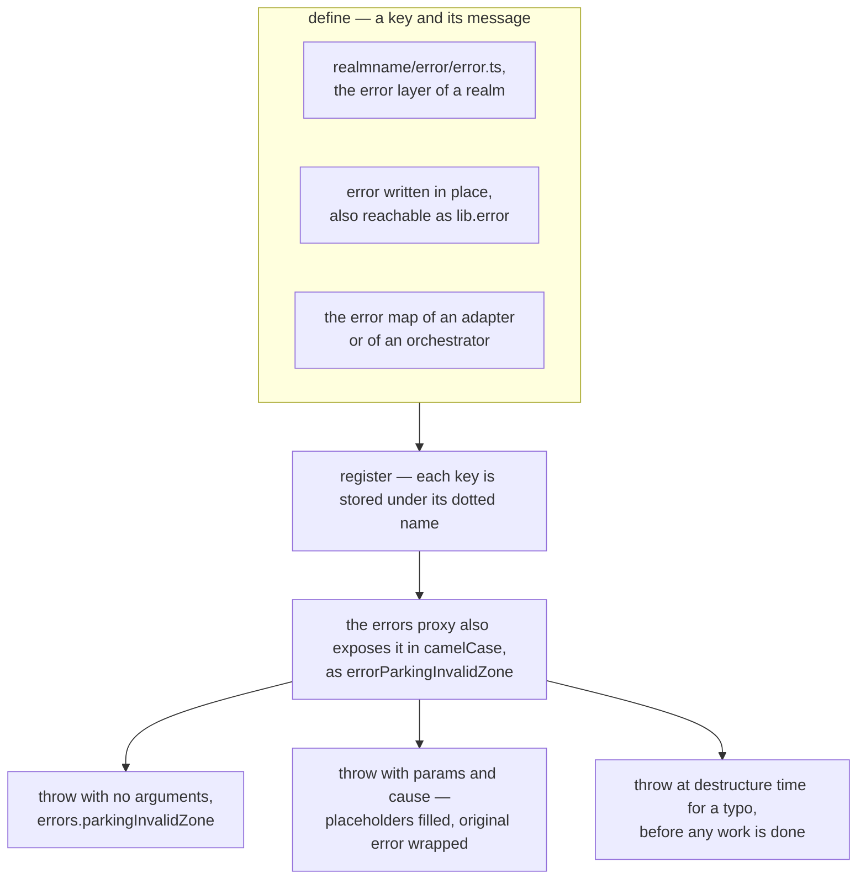

# Error

The patterns below can be used to define and throw [typed errors](../concepts/errors.md) within the
framework. Defining an error and throwing it are separate moments, and the proxy that connects them
is what makes the call sites short:



## Defining errors

To define typed errors within the framework, call the `error` function with an object where each
property defines a single error. Property names must use prefixes, so that name collisions are
avoided.

For simple errors, the value of the property is the error message:

```js
error({
    adapterDisconnect: 'Adapter disconnected',
});
```

For more advanced cases, the error is defined as an object, that defines additional properties for
the error:

```js
error({
    gatewayJwtMissingHeader: {
        message: 'Missing bearer authorization header',
        statusCode: 401,
    },
});
```

The `error` function defines the error so that it can easily be thrown in various places of the
source code. This function is available in various places when using the framework and can be used
both implicitly and explicitly, for example:

- Explicitly, when using `lib.error` in the [handler](./handler.md) function:

    ```ts
    import {handler} from '@feasibleone/blong';

    export default handler(({lib: {error}}) => {
        error({
            parkingInvalidZone: 'Invalid zone {zone}',
        });
    });
    ```

- Implicitly in the `error` layer of a realm:

    ```ts
    // realmname/error/error.ts
    export default {
        subjectSum: 'Numbers must be positive',
    };
    ```

## Throwing errors

The most common place to throw an error is when using the `handler` or `library` functions.

Simple errors do not expect any parameters:

```ts
import {library} from '@feasibleone/blong';

export default library(
    ({errors}) =>
        function sum(...params: number[]) {
            // some processing
            throw errors.subjectSum();
        },
);
```

Other errors may expect some `params`. Also to wrap an external error, pass it in the `cause`.

```ts
import {handler} from '@feasibleone/blong';

export default handler(({errors}) => ({
    async parkingPay({zone}) {
        try {
            // some processing
        } catch (cause) {
            throw errors.parkingInvalidZone({
                cause,
                params: {
                    zone,
                },
            });
        }
    },
}));
```
