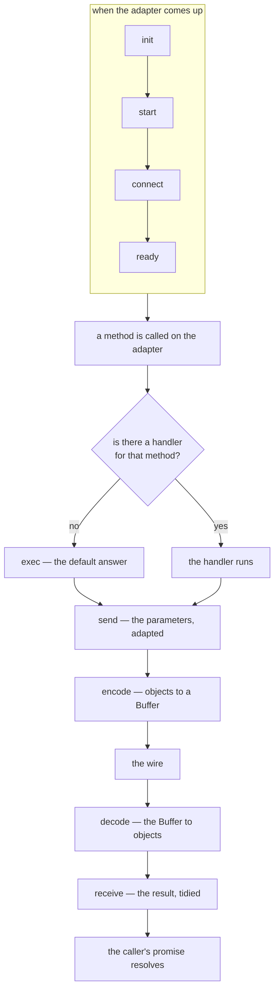
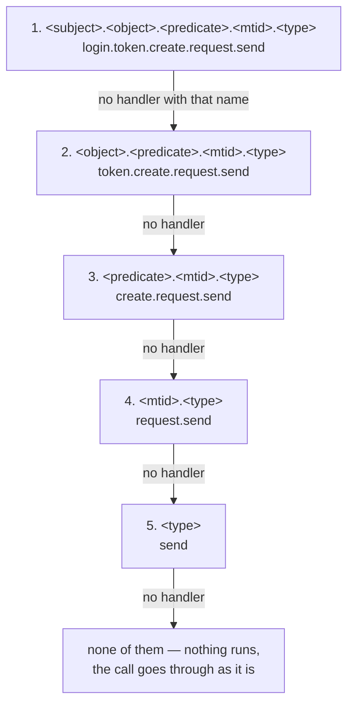

# Handler

Handlers are functions that are called by adapters and orchestrators to implement certain
functionality. Handlers can be based on user-defined APIs or be related to internal logic, for
example the [adapter loop](../concepts/adapter#adapter-loop).

## Internal handlers

The internal handlers have predefined meaning and names and are often related to some common
integration tasks. They have the following purpose:

- `send`: prepare the data for sending, adapting it for the underlying protocol. The input data is
  assumed to be protocol/API independent as much as possible.
- `receive`: transform the received data to be protocol/API independent and remove any data not
  needed by the rest of the system.
- `encode`: JavaScript objects passed to these handlers are converted to Buffer, which is then
  passed to the network.
- `decode`: data frames coming from the network as Buffers are passed to this handler and it
  converts them to JavaScript objects
- `exec`: this handler is called by default if no handler is defined for the [$meta](./meta).method
- `ready`: this handler is called when the adapter is ready to process calls, which for some
  adapters means that connection has been established or a TCP port was opened for listening.
- `idleSend`: this handler is called when there has been an idle period (longer than the configured)
  of no outgoing messages. It usually sends some kind of echo/keep alive message available in the
  protocol.
- `idleReceive`: this handler is called when there has been an idle period (longer than the
  configured) of no incoming messages. It usually disconnects the adapter, as the expectation is
  that the other side is sending some keep-alive messages.
- `drainSend`: this handler is called when the send queue is emptied or has been empty for a
  pre-configured period. It can be used to trigger processing of some pending operations that happen
  during the idle time of the adapter.

:::note

The last three names — `idleSend`, `idleReceive` and `drainSend` — are **planned rather than
current**. They are listed here because they are the intended lifecycle hooks for keep-alive and
idle handling, and because the `idleSend` / `idleReceive` configuration keys that already appear in
adapter examples are written for them. Until they are implemented, no handler of those names is
dispatched and those configuration keys are not read; the nearest hook that exists today is the
empty `AdapterBase.drain`, which is subscribed to the `<id>.drain` event.

:::

The six that are implemented run in a fixed order, and that order is the whole reason for their
names — an outbound call is adapted and encoded, an inbound frame is decoded and tidied:



## Internal API handlers

The internal API handlers usually implement some business functionality. They use namespaces to
prefix the names of the API methods. The framework works best when the naming convention for the
methods uses a [semantic triple](https://en.wikipedia.org/wiki/Semantic_triple) in the format
`subjectObjectPredicate`, where:

- `subject` is the namespace and often is same as the name of the [realm](../concepts/realm) if the
  realm defines only one namespace.
- `object` is often some entity within the realm
- `predicate` is the action being executed on the entity

Here are some examples:

If we have a realm named `user` that has the goal to implement role-based access control, we can
imagine it has the following namespaces:

- `identity`: for implementing the authentication
- `permission`: for implementing the authorization
- `user`: for managing the users and roles. It could have methods for objects named `user` and
  `role`, for example:
    - `userUserAdd` - for creating users
    - `userRoleEdit` - for editing roles

:::note All handlers are converted to async functions

:::

## Library functions

The library functions implement some reusable functionality that is repeated across some of the
handlers within the same realm. Any handler, that has a name that does not match the internal
handlers or the API namespaces is considered to be a library function and is not exposed anywhere
else, except to the sibling handlers.

## Folder structure

The handlers and library functions are grouped together and given a name. This happens by defining
them in a subfolder within the realm folder. This folder is usually in another one, which is used
for defining a layer. The most common approach is to create a separate file for each handler and use
the handler name as file name. This serves multiple reasons:

- allow fast finding of handlers within code editors. For example, in VSCode ctrl+p and then typing
  the first letters of the semantic triple will bring the desired handler (i.e. `ctrl+p uua` is
  likely to find `userUserAdd.ts`)
- easier code review by avoiding files with thousands of rows and a lot of nesting
- better isolation between the handlers

The group name is in the format `realmname.foldername`. This name is then used in the `imports`
property in the adapters and orchestrators.

Let's imagine a realm named `example` which implements a namespace `math` with several methods for
calculating the sum and the average of an array of integer numbers. To do so, it defines a library
function `sum` and handlers `mathNumberSum` and `mathNumberAverage`. It attaches the handlers to an
orchestrator `mathDispatch`.

The following structure is used:

<!-- markdownlint-capture -->
<!-- markdownlint-disable MD033 MD013 MD037 -->
<pre>
📁 example
├──📁 orchestrator
|   ├──📁 math
|   |   ├── error.ts
|   |   ├── sum.ts
|   |   ├── mathNumberSum.ts
|   |   └── mathNumberAverage.ts
|   └── mathDispatch.ts
└── server.ts
</pre>
<!-- markdownlint-restore -->

## Defining handlers and library functions

To enable interoperability between the handlers, library functions, orchestrators, adapters and the
framework, a specific pattern is used to define them.

To define a library function, use the `library` function from the framework and pass a function that
returns the desired library function with the appropriate name:

```ts
// example/orchestrator/math/sum.ts
import {library} from '@feasibleone/blong';

export default library(
    api =>
        function sum(...params: number[]) {
            // implementation
        },
);
```

To define a handler, use the `handler` function from the framework and pass a function that returns
the desired handler with the appropriate name:

```ts
// example/orchestrator/math/mathNumberSum.ts
import {handler} from '@feasibleone/blong';

export default handler(
    api =>
        function mathNumberSum(...params: number[]) {
            // implementation
        },
);
```

## Interoperability

Handlers and functions can call each other by referring through the `api` parameter. It also allows
to access other functions of the framework.

The `api` parameter has the properties, which are often used through destructuring. Check the
following example, that explain their usage:

- `example/orchestrator/math/error.ts` - defines the errors.

    ```ts
    import {library} from '@feasibleone/blong';

    export default library(
        ({
            lib: {
                error, // framework function for defining typed errors
            },
        }) => {
            error({
                numberInteger: 'Numbers must be integer',
            });
        },
    );
    ```

- `example/orchestrator/math/sum.ts` - defines the reusable library function `sum`.

    ```ts
    import {library} from '@feasibleone/blong';

    export default library(
        ({
            errors, // access the defined errors
        }) =>
            function sum(params: number[]) {
                if (!params.every(Number.isInteger)) throw errors.numberInteger();
                return params.reduce((prev, cur) => prev + cur, 0);
            },
    );
    ```

- `example/orchestrator/math/mathNumberSum.ts` - defines the handler for calculating the sum.

    ```ts
    import {handler} from '@feasibleone/blong';

    export default handler(
        ({
            lib: {
                sum, // user defined library function
            },
        }) =>
            function mathNumberSum(params) {
                return sum(params);
            },
    );
    ```

- `example/orchestrator/math/mathNumberAverage.ts` - defines the handler for calculating the
  average.

    ```ts
    import {handler} from '@feasibleone/blong';

    export default handler(
        ({
            config: {
                precision, // access configuration
            },
            handler: {
                mathNumberSum, // local or remote handler
            },
        }) =>
            async function mathNumberAverage(numbers: number[], $meta) {
                if (!numbers?.length) return;
                return ((await mathNumberSum(numbers, $meta)) / numbers.length).toPrecision(
                    precision,
                );
            },
    );
    ```

- `example/orchestrator/mathDispatch.ts` - defines a
  [dispatch orchestrator](./orchestrator#dispatch).

    ```ts
    import {orchestrator} from '@feasibleone/blong';

    export default orchestrator(() => ({
        extends: 'orchestrator.dispatch',
    }));
    ```

- `example/server.ts` - defines the `example` [realm](./realm) and the default configuration for the
  orchestrator.

    ```ts
    import {realm} from '@feasibleone/blong';

    export default realm(() => ({
        config: {
            default: {
                mathDispatch: {
                    namespace: 'number',
                    imports: 'example.number',
                },
            },
        },
        ...rest,
    }));
    ```

## Overriding the default handling

Handlers and adapter/orchestrator instances can override a method that the framework (or another
handler group) already provides and delegate back to the default implementation. This is how custom
persistence reuses the automatic CRUD, how codecs transform requests, and how adapters hook the
lifecycle.

### The `super` object — prototype-chain delegation

`super` is plain JavaScript prototype-chain inheritance, not a framework abstraction. The runtime
wires handler groups into a chain with `Object.setPrototypeOf()` (see the
[wiring-pipeline rationale](../rationale/wiring-pipeline#prototype-chain-wiring)) so
`super.<method>` resolves the "parent" implementation: an earlier-attached handler group, a
synthetic handler bound to the adapter (procedures, CRUD bindings), the adapter instance, or the
`AdapterBase` lifecycle defaults.

To use `super`, a handler must return an **object literal with method shorthand**. A plain
`function` expression cannot reference `super`.

```ts
// example/orchestrator/math/mathNumberAverage.ts
import {handler} from '@feasibleone/blong';

export default handler(({lib: {precision}}) => ({
    async mathNumberAverage(params, $meta) {
        const sum = await super.mathNumberSum(params, $meta); // delegate
        return (sum / params.length).toPrecision(precision);
    },
}));
```

### `super.exec` — reuse the automatic CRUD

The generic knex adapter implements `find`/`get`/`add`/`edit`/`remove`/
`merge`/`insert`/`update`/`delete` for every declared table (see
[`adapter.knex`](./schema-sync.md#auto-bound-crud-handlers)). A custom persistence handler that must
run business logic before or after the standard operation is named after the method (e.g.
`accessUserEdit` → `access.user.edit`) and delegates the generic part with `super.exec`:

```ts
// realmname/adapter/db/accessUserEdit.ts
import {handler} from '@feasibleone/blong';

export default handler(({handler: {'db/coreTripleMerge': coreTripleMerge}}) => ({
    async accessUserEdit(params, $meta) {
        const result = await super.exec(params, $meta); // standard update
        // … custom handling (e.g. graph-edge sync) …
        await coreTripleMerge({triples, refreshPath: true}, $meta);
        return result;
    },
}));
```

For `get`/`find` this is the idiomatic way to enrich results (e.g. joining `core_resource` names
onto resource-backed rows); for `edit`/`remove` it lets the standard row operation run while custom
code handles related graph edges.

### `send` / `receive` — transform parameters and results

The adapter loop applies two conversion handlers around every method call:

- **`send`** — transforms the **outgoing parameters** before the API method executes at the target
  adapter.
- **`receive`** — transforms the **incoming result** after the method returns.

Both are looked up by `getConversion` in priority order — the first name that resolves wins, so the
chain falls back from the most specific to the most general. A candidate is built by joining
`$meta.method`, the `mtid` and the conversion being resolved (`send` or `receive`) with dots, and it
is matched **after `methodId` has run over it**, which removes the dots and lower-cases the letters:
`login.token.create.request.send` and a handler key spelled `loginTokenCreateRequestSend` are the
same handler. So the lookup is a walk down five names, each a shorter piece of the one before it —
here for a call to `login.token.create` with `mtid: request`:



What each name is made of, and when it can match:

| #   | Candidate                                      | Where it comes from                                                                     | In the example                    |
| --- | ---------------------------------------------- | --------------------------------------------------------------------------------------- | --------------------------------- |
| 1   | `<subject>.<object>.<predicate>.<mtid>.<type>` | `$meta.method`, with any suffix after `[`, `#` or `?` trimmed                           | `login.token.create.request.send` |
| 2   | `<object>.<predicate>.<mtid>.<type>`           | the same path without the part before a `/`, or without the `stripNamespace` segments   | `token.create.request.send`       |
| 3   | `<predicate>.<mtid>.<type>`                    | `$meta.opcode`, which is the method's last segment                                      | `create.request.send`             |
| 4   | `<mtid>.<type>`                                | the message type on its own                                                             | `request.send`                    |
| 5   | `<type>`                                       | nothing but the conversion — the generic hook; **not tried when the `mtid` is `event`** | `send`                            |

The first name in that example is a real one: the MLE codec implements `loginTokenCreateRequestSend`
(and the same shape for the other pre-auth calls) to encrypt them with the handshake keys, while
every other call finds nothing at the first four candidates and lands on the codec's plain `send`
and `receive` — the two hooks every call passes through. `$meta` may also be `false`; the first four
candidates need it, so only the last one is tried in that case.

```ts
// adapter codec stack (e.g. MLE on top of JSON-RPC)
export default handler(() => ({
    async send(params, $meta) {
        params = await encrypt(params, $meta);
        return super.send(params, $meta); // encrypt, then let the next codec send
    },
    async receive(result, $meta) {
        await decrypt(result.body);
        return super.receive(result, $meta);
    },
}));
```

### Adapter lifecycle overrides

Adapters hook the lifecycle (`start`/`stop`/`connect`/`init`/`ready`) and delegate with `super` so
the base behaviour still runs:

```ts
// realmname/adapter/http/sim/echo.ts
async start() {
    // custom startup (e.g. open a TCP server)
    super.connect(); // bind handle() into the adapter loop
    return super.start(); // default start: attach handlers + register adapters
},
async stop(...params) {
    try {
        /* custom shutdown */
    } finally {
        return super.stop(...params);
    }
},
```

See also [schema-sync](./schema-sync#overriding-a-synthetic-handler) for the `super.sqlItem*`
delegation pattern used to override synthetic procedure handlers.

## Folder-Level Configuration (config.ts)

A `config.ts` file can be placed in any handler folder to define configuration for all handlers in
that folder. The file supports intent-keyed config (`default`, `dev`, `prod`, etc.), keeping
environment-specific values co-located with the handlers that use them.

```text
example/
└── orchestrator/
    └── math/
        ├── config.ts            ← default config for math handlers
        ├── ~.schema.ts
        └── mathNumberAverage.ts
```

```ts
// example/orchestrator/math/config.ts
export default {
    default: {
        precision: 4,
    },
    dev: {
        precision: 8,
    },
};
```

Handlers in the folder receive this config automatically via their `config` parameter.

To override values from outside the folder (e.g. for deployment-specific secrets or URLs that cannot
live in source code), use the `namespace` property in the realm's `server.ts`:

```ts
// example/server.ts — override math handler config
import {realm} from '@feasibleone/blong';

export default realm(() => ({
    url: import.meta.url,
    config: {
        prod: {
            namespace: {
                math: {
                    precision: 8, // override with deployment-specific value
                },
            },
        },
    },
}));
```

**Priority:** Realm `namespace` override > `config.ts` active intent > `config.ts` `default`

## Handler-Test Continuum

Handlers and tests share deep structural similarities — both orchestrate sequences of calls,
validate results, and produce outputs. The framework embraces this by providing mechanisms that work
identically in both contexts.

### Checkpoints and Branches

A **checkpoint** reports a moment; a **branch** explains a choice. They are the two shapes of one
idea — a _progress point_, recorded in one place and drawn one way by the log
([R26, R27](../rationale/semantic-log.md)) — and they differ in one respect: a checkpoint is
optional-chained, a branch never is, because a branch _selects_.

```ts
export default handler(
    ({handler: {validate, persist, quote}}) =>
        async function orderProcess(params, $meta) {
            const validated = await validate(params, $meta);
            $meta.checkpoint?.('validated', {orderId: validated.id});

            const price = $meta.decide?.('price-tier', {total: validated.total}, [
                {
                    name: 'bulk',
                    when: values => (values.total as number) > 1000,
                    run: () => quote.bulk(),
                },
                {name: 'single', when: () => true, run: () => quote.single()},
            ]);

            const saved = await persist(validated, price, $meta);
            $meta.checkpoint?.('persisted', {orderId: saved.id, version: saved.version});

            return saved;
        },
);
```

`$meta.checkpoint` is **absent** in production, so the `?.` call costs nothing and records nothing;
`$meta.decide` is present in every mode and keeps which branch ran, which is what lets a production
sequence diagram draw the alternatives as an `alt` block. Code that holds no `$meta` — a library
function — reports points through `lib.checkpoint?.()`, `undefined` under the same rule, and
branches through `lib.decide(…)`, which is always there. See the
[checkpoint concept](../concepts/checkpoint) for the modes and what each records.

### Optional Assertions

Handlers destructure `assert` from `lib`, following the same pattern as `checkpoint`: `undefined` in
production, active in test/debug mode. Both use optional chaining for zero-cost in production:

```ts
export default handler(
    ({lib: {assert}, handler: {accountGet, accountUpdate}}) =>
        async function accountDebit({accountId, amount}, $meta) {
            const account = await accountGet({accountId}, $meta);
            assert?.ok(account.balance >= amount, 'Sufficient funds');
            $meta.checkpoint?.('balance-checked', {balance: account.balance});

            const result = await accountUpdate(
                {accountId, balance: account.balance - amount},
                $meta,
            );
            assert?.equal(result.balance, account.balance - amount, 'Balance updated correctly');
            $meta.checkpoint?.('debit-applied', {newBalance: result.balance});

            return result;
        },
);
```

In production (`checkpointMode: 'production'`), both `assert` and `checkpoint` are `undefined` — all
`assert?.` and `checkpoint?.` calls are no-ops. In test/debug mode, `assert` is `node:assert` and
failures are reported normally.

### Graduating Tests to Handlers

A test handler that proves a workflow works can be promoted to a production handler by moving it
from the `test` layer to the `orchestrator` layer, changing assertions from mandatory to optional,
and adding checkpoints. See the [unified handler-test rationale](../rationale/unified-handler-test)
for the full design.
