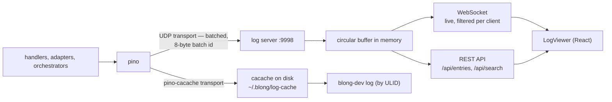
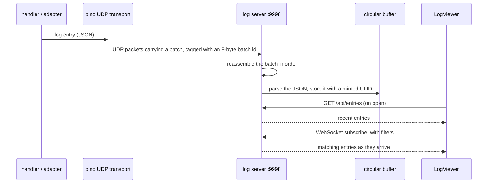

# Real-Time Log

The Blong framework ships with a real-time log viewer. When the framework is running locally, a log
server is available at `http://127.0.0.1:9998`. All queries use a REST API.

## How it fits together

Entries reach a reader through two **independent** pino transports. The live viewer and the on-disk
cache are separate sinks, not two views of one store, so an entry missing from the viewer is not
evidence that it was never written to disk (or the other way round):



The live path, end to end:



The batch id is what lets the server put batched packets back in order; the ULID is what gives every
entry a stable key, in the buffer and in the on-disk cache alike.

## Quick Reference

```bash
# 20 most recent entries
curl -s 'http://127.0.0.1:9998/api/entries?limit=20' | jq '.entries[]'

# Errors only
curl -s 'http://127.0.0.1:9998/api/entries?level=error&limit=10' | jq '.entries[]'

# Full-text search
curl -s 'http://127.0.0.1:9998/api/search?search=connection+refused' | jq '.entries[]'

# Filter by service name
curl -s 'http://127.0.0.1:9998/api/entries?name=gateway&limit=20' | jq '.entries[]'

# Trace a request across services
curl -s 'http://127.0.0.1:9998/api/entries?traceId=abc-123' | jq '.entries[]'
```

## REST API

### GET /api/entries

Returns the most recent log entries. Supports filtering.

| Parameter | Type   | Description                                                           |
| --------- | ------ | --------------------------------------------------------------------- |
| `level`   | string | Minimum log level: `trace`, `debug`, `info`, `warn`, `error`, `fatal` |
| `name`    | string | Service name (substring match, case-insensitive)                      |
| `traceId` | string | Exact trace ID match                                                  |
| `search`  | string | Free-text search across all properties                                |
| `after`   | string | Return only entries after this ULID (pagination)                      |
| `limit`   | number | Max entries to return (default: 200)                                  |

### GET /api/search

Same as `/api/entries` but searches the full buffer instead of just recent entries.

### GET /api/config

Returns server configuration including recognised property names. Useful for discovering available
filter fields.

## Common Workflows

### Check for errors after a code change

```bash
curl -s 'http://127.0.0.1:9998/api/entries?level=error&limit=5' \
  | jq '.entries[] | {msg, name, err: .err.message}'
```

### Monitor a specific service

```bash
curl -s 'http://127.0.0.1:9998/api/entries?name=orchestrator&limit=30' \
  | jq '.entries[] | {levelName, msg}'
```

### Verify an API call

```bash
# By method name
curl -s 'http://127.0.0.1:9998/api/search?search=userUserAdd' \
  | jq '.entries[] | {levelName, msg, name}'
```

### Trace a request through services

```bash
# Find the trace ID
TRACE=$(curl -s 'http://127.0.0.1:9998/api/entries?search=transfer&limit=1' \
  | jq -r '.entries[0].traceId')

# All logs for that trace
curl -s "http://127.0.0.1:9998/api/entries?traceId=$TRACE" \
  | jq '.entries[] | {name, levelName, msg}'
```

### Poll for new entries

```bash
LAST_ID=$(curl -s 'http://127.0.0.1:9998/api/entries?limit=1' \
  | jq -r '.entries[-1].id')

# Later, get only new entries
curl -s "http://127.0.0.1:9998/api/entries?after=$LAST_ID" \
  | jq '.entries[] | {levelName, msg}'
```

## Log Entry Properties

| Property    | Type   | Description                                                     |
| ----------- | ------ | --------------------------------------------------------------- |
| `id`        | string | ULID — monotonically increasing, sortable                       |
| `time`      | number | Unix timestamp in milliseconds                                  |
| `level`     | number | Pino level: 10=trace 20=debug 30=info 40=warn 50=error 60=fatal |
| `levelName` | string | Human-readable level name                                       |
| `msg`       | string | Log message                                                     |
| `name`      | string | Service/module name                                             |
| `traceId`   | string | Distributed trace ID                                            |
| `err`       | object | Error details: `{message, stack, type}`                         |
| `req`       | object | HTTP request: `{method, url, headers, body}`                    |
| `res`       | object | HTTP response: `{statusCode, headers, responseTime}`            |
| `$meta`     | object | Blong framework metadata: `{mtid, method, …}`                   |

## Runtime Introspection Endpoints

For inspecting the framework's internal state (registered adapters/orchestrators, handlers, config),
enable the `systemDebug` endpoints in the suite's `server.ts` (dev only — never in production):

```ts
config: {
    dev: {
        gateway: {debug: true},        // include stack traces in error responses
        systemDebug: {enabled: true},  // expose /api/sys/* endpoints
    },
}
```

| Endpoint               | Returns                                       |
| ---------------------- | --------------------------------------------- |
| `GET /api/sys/config`  | Effective merged runtime configuration        |
| `GET /api/sys/ports`   | All registered adapter/orchestrator names     |
| `GET /api/sys/methods` | All handler method groups with handler counts |
| `GET /api/sys/modules` | All registered realm module names             |
| `GET /api/sys/rpc`     | Internal RPC server address                   |

### Typical troubleshooting workflow

```bash
# Is the expected adapter/orchestrator registered?
curl -s http://localhost:8080/api/sys/ports | jq '.ports[]'

# Are the expected handlers present?
curl -s http://localhost:8080/api/sys/methods \
  | jq '.methods[] | select(.name | contains("myRealm"))'

# What is the effective config?
curl -s http://localhost:8080/api/sys/config | jq '.myRealm.myAdapter'

# Correlate with logs
curl -s 'http://127.0.0.1:9998/api/entries?level=error&limit=10' \
  | jq '.entries[] | {msg, name}'
```

## The on-disk cache

The `pino-cacache` transport keeps entries in a `cacache` directory (`cachePath`, default
`~/.blong/log-cache`) so `blong-dev log <ulid>` can fetch one later. Two properties of that store
are worth knowing:

- **Retention deletes the entry's index file.** A `cacache` key hashes into an index file of its
  own, so marking a pruned entry as deleted instead of removing the file leaves one file per entry
  ever written and makes every later read of the truth read all of them. The transport removes the
  file (`removeFully`), and so does the semantic store that shares the directory.
- **The semantic store keeps a secondary index** (`order.jsonl`, append-only) and reads that instead
  of `cacache`'s index, which is one file per key. The transport keeps none: it is protected by the
  store's interval sweep, which reconciles against `cacache` and prunes to the same bound.
- **A slow retention pass is reported.** The transport runs in a pino worker thread with no logger,
  so it writes to stderr when its index scan or its retention pass takes longer than a second — the
  same margin the rest of the framework uses for a slow step. A retention that _fails_ is reported
  there too, rather than swallowed: a pass that never runs is indistinguishable from one that found
  nothing to do, and the difference is a cache that grows without bound.

## Implementation

The log viewer lives in `tools/blong-log/`. It exposes a React `LogViewer` component (used in the
browser) and a server that stores log entries forwarded from Pino.

For more on the design rationale see [rationale/real-time-log](../rationale/real-time-log.md).
