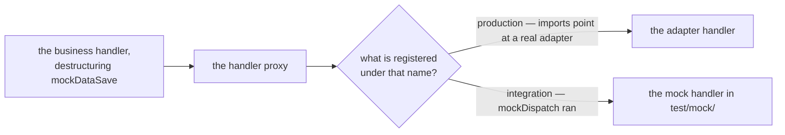

# Server-side testing with mocks

When writing integration tests for handlers that call external systems (databases, downstream
services, transformation engines), you can replace those systems with lightweight mock handlers that
live in the `server/test` layer. This gives you full in-process integration tests that are fast,
deterministic, and require no running infrastructure.

## How it works

The `server/test` layer is activated under the `integration` intent. It adds two orchestrators to
the realm:

- **`mockDispatch`** – exposes a `mock` namespace backed by simple handler implementations in
  `server/test/mock/`. These handlers simulate the external dependencies your business handlers rely
  on.
- **`testDispatch`** – exposes a `test` namespace backed by test scenario handlers in
  `server/test/test/`. Each test handler exercises one business handler and asserts on the results.

When the `integration` intent is active, the framework automatically sets
`remote.canSkipSocket: true`, so every call (`eip.*`, `mock.*`, `test.*`) stays in the same process
and resolves through the in-process local registry – no network or RPC transport needed.

## Mock, sim or real

Three levels of backend fidelity are available, and what separates them is what they can prove — not
how convenient they are:

| Level | Where it lives                     | Activated by                         | Proves                                                                                    | Cannot prove                                                                        |
| ----- | ---------------------------------- | ------------------------------------ | ----------------------------------------------------------------------------------------- | ----------------------------------------------------------------------------------- |
| Mock  | `test/mock/` + `mockDispatch`      | the `integration` intent, in-process | business logic, branching, EIP composition, that call names wire up                       | anything about the adapter — the protocol, framing, codec and credentials never run |
| Sim   | the `sim/` layer                   | the `integration` intent             | the adapter, codec and transport: framing, request/response mapping, idle and retry paths | the backend's behaviour: persistence, isolation, offsets, real credentials          |
| Real  | `test/blong-int-*` + a k3d cluster | each suite's adapter config          | the backend itself: SQL isolation and deadlocks, broker semantics, service quirks         | nothing about the backend — but fewer cases fit in one run                          |

The rule those three imply: **mock the logic, simulate the protocol, and use the real backend when
the hard part is state.** A mock proves nothing about the adapter because it replaces it; a sim
speaks the real protocol but answers with fixed values, so an HSM that rejects a key type still
passes; only a real backend can deadlock.

## Folder structure

```text
realmname/
├── orchestrator/
│   ├── eipDispatch.ts           # Business namespace
│   └── eip/                     # Business handlers that call mock.* handlers
│       └── eipMessageClaim.ts
└── server/                      # Server platform
    └── test/                    # Server test layer – auto-activated under "integration"
        ├── mockDispatch.ts      # Orchestrator: exposes "mock" namespace
        ├── testDispatch.ts      # Orchestrator: exposes "test" namespace
        ├── mock/                # Handler group "realmname.mock"
        │   ├── ~.schema.ts      # IRemoteHandler type declarations for mock handlers
        │   ├── mockDataSave.ts
        │   ├── mockDataGet.ts
        │   └── mockItemProcess.ts
        └── test/                # Handler group "realmname.test"
            ├── testEipClaim.ts
            └── testEipPipes.ts
```

## Step 1 – Write the mock handlers

Mock handlers are ordinary handlers that live in `test/mock/`. They return hardcoded or in-memory
data that the business handlers depend on.

```ts
// realmname/server/test/mock/mockDataSave.ts
import {type IMeta, handler} from '@feasibleone/blong';

export default handler(
    () =>
        async function mockDataSave(data: unknown, $meta: IMeta): Promise<{id: string}> {
            return {id: 'mock-id'};
        },
);
```

```ts
// realmname/server/test/mock/mockDataGet.ts
import {type IMeta, handler} from '@feasibleone/blong';

export default handler(
    () =>
        async function mockDataGet(
            {id}: {id: string},
            $meta: IMeta,
        ): Promise<{id: string; payload: unknown}> {
            return {id, payload: 'stored-payload'};
        },
);
```

Optionally add a `~.schema.ts` to declare the mock handler signatures so the TypeScript compiler and
IDE can verify call sites:

```ts
// realmname/server/test/mock/~.schema.ts
import {validationHandlers} from '@feasibleone/blong';

export default validationHandlers({});

declare module '@feasibleone/blong' {
    interface IRemoteHandler {
        mockDataSave<T = Promise<{id: string}>>(data: unknown, $meta: IMeta): T;
        mockDataGet<T = Promise<{id: string; payload: unknown}>>(
            params: {id: string},
            $meta: IMeta,
        ): T;
    }
}
```

## Step 2 – Add the mock orchestrator

`mockDispatch` wires the mock handler group to the `mock` namespace. It is only activated in the
`integration` environment.

```ts
// realmname/server/test/mockDispatch.ts
import {orchestrator} from '@feasibleone/blong';

export default orchestrator(blong => ({
    extends: 'orchestrator.dispatch',
    activation: {
        default: {},
        integration: {
            namespace: ['mock'],
            imports: ['realmname.mock'],
        },
    },
}));
```

## Step 3 – Add the test orchestrator

`testDispatch` wires the test handler group to the `test` namespace.

```ts
// realmname/server/test/testDispatch.ts
import {orchestrator} from '@feasibleone/blong';

export default orchestrator(blong => ({
    extends: 'orchestrator.dispatch',
    activation: {
        default: {},
        integration: {
            namespace: ['test'],
            imports: ['realmname.test'],
        },
    },
}));
```

## Step 4 – Write the test handlers

Test handlers call the real business handler and assert on the results. They live in
`server/test/test/` and follow the [test handler pattern](./test).

```ts
// realmname/server/test/test/testEipClaim.ts
import {type IAssert, type IMeta, handler} from '@feasibleone/blong';

export default handler(({lib: {group}, handler: {eipMessageClaim}}) => ({
    testEipClaim: ({name = 'eip claim'}: {name?: string}, $meta: IMeta) =>
        group(name)([
            async function claimCheck(assert: IAssert, {$meta}: {$meta: IMeta}) {
                const result = (await eipMessageClaim(
                    {large: 'payload', sensitive: true},
                    $meta,
                )) as Record<string, unknown>;
                assert.equal(result.id, 'mock-id', 'claim ID returned');
                assert.equal(result.payload, 'stored-payload', 'stored payload retrieved');
            },
        ]),
}));
```

## Step 5 – Test layer activation

The `server/test` layer is **auto-discovered** and activates under the `integration` intent — no
`children: ['./test']` and no `integration: {test: true}` block are needed in the realm `server.ts`.
The mock/test orchestrators co-locate their own `activation` (as in Steps 2-3).

## Step 6 – Enable tests in the root server

In the root `server.ts` (loaded by the test runner), set the servers to listen on random ports and
list the test entry-points in `watch.test`. The framework automatically sets
`remote.canSkipSocket: true` for the `integration` intent — no need to add it manually:

```ts
// server.ts
import {server} from '@feasibleone/blong';

export default server(blong => ({
    url: import.meta.url,
    validation: blong.type.Object({}),
    children: ['./realmname'],
    config: {
        default: {
            rpcServer: {
                port: 0,
            },
            gateway: {
                port: 0,
            },
        },
        integration: {
            watch: {
                test: ['test.eip.claim', 'test.eip.pipes'], // test entry-points
            },
        },
    },
}));
```

## Step 7 – Write the test runner

```ts
// index.test.ts
import load from '@feasibleone/blong-gogo';
import tap from 'tap';

import server from './server.ts';

const platform = await load(server, 'suite-name', 'suite-name', [
    'microservice',
    'integration',
    'dev',
]);
await platform.start();
await tap.test('my suite', async test => {
    await platform.test(test);
});
await platform.stop();
```

## How the handler proxy resolves mock calls

Business handlers receive a `handler` proxy in their factory argument:

```ts
export default handler(
    ({handler: {mockDataSave, mockDataGet}}) =>
        async function eipMessageClaim(params: unknown, $meta: IMeta) {
            const {id} = await mockDataSave(params, $meta);
            return mockDataGet({id}, $meta);
        },
);
```

In production the orchestrator `imports` config points to a real adapter. In the `integration`
environment, `mockDispatch` registers `mockDataSave` and `mockDataGet` under the `mock` namespace,
and the `handler` proxy resolves those names through the local registry. No code in the business
handler changes between environments.

The proxy resolves one name, and which handler answers it is a property of the environment rather
than of the call:



## Level 2 — the `sim` layer

A `sim` layer is a fake backend that answers the real protocol. It is a well-known layer activated
only under the `integration` intent (`sim: {server: {integration: true}}` in
`core/blong-lib/layers.ts`), and the adapter under test reaches it through its own configuration —
no handler changes, which is the whole point.

### An HTTP service: `test/blong-sim-api`

The suite serves a real OpenAPI spec from an in-process mock: `orchestrator.openapi` runs the
world-time API on port 8082, the sim's adapter maps the operation to a handler
(`namespace: {mocktime: 'time.world-time'}`), and the client adapter (`extends: 'adapter.http'` with
`codec.openapi`) is pointed at the same spec URL its production config names. The test then calls
`time.get` and asserts on a value that crossed the codec, the HTTP client and the mock server.

### A device on a socket: `test/blong-sim-tcp`

The Payshield HSM has no HTTP in front of it, so the sim is a socket server on the port the client
connects to (1601). Both sides use the same codec — `ut-codec-payshield` with
`headerFormat: '6/string-left-zero'` — and the sim's `receive` handler answers each command, so the
test exercises framing, the request/response match and the reply parsing rather than a stub that
returns an object.

## Level 3 — real back ends

The real level is the integration suites: `test/blong-int-adapter/` runs the real drivers against
services provisioned in a throwaway cluster (MySQL, MongoDB, Kafka, Redis, Keycloak, Vault, MinIO
and the cluster API itself), and `test/blong-int-sql/` runs MySQL, including a test that provokes a
real deadlock. Each suite waits for its backends to answer before it starts.

Not everything has a real suite: Slack and GitHub are manual, `webhook` has none, and TCP has only
its sim. Those gaps are the honest measure of what the suite can claim.

## Full example

See `demo/blong-eip/` for a complete working implementation — sixteen patterns, each tested against
the mock level:

- Business handlers: `eip/orchestrator/eip/`
- Mock handlers: `eip/test/mock/`
- Test handlers: `eip/test/test/`
- Mock orchestrator: `eip/test/mockDispatch.ts`
- Test orchestrator: `eip/test/testDispatch.ts`
- Test runner: `index.test.ts`

## See also

- [EIP patterns](./eip) – the patterns that are tested using this approach
- [Test handler pattern](./test) – general test handler documentation
- [Handler pattern](./handler) – how business handlers are written
- [Layer concept](../concepts/layer.md) – where the `sim` layer sits in the activation table
- [Suite patterns](./suite.md) – the integration suites and their cluster
- `test/blong-sim-api/`, `test/blong-sim-tcp/` and `test/blong-int-adapter/` – the worked examples
