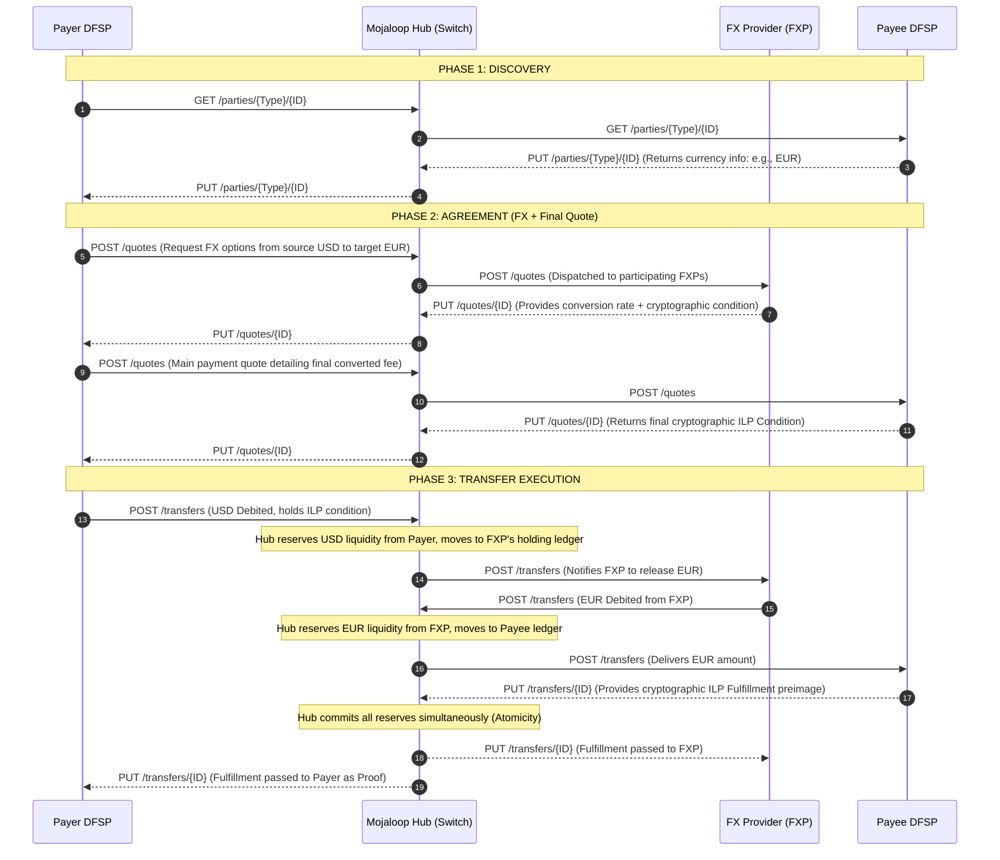
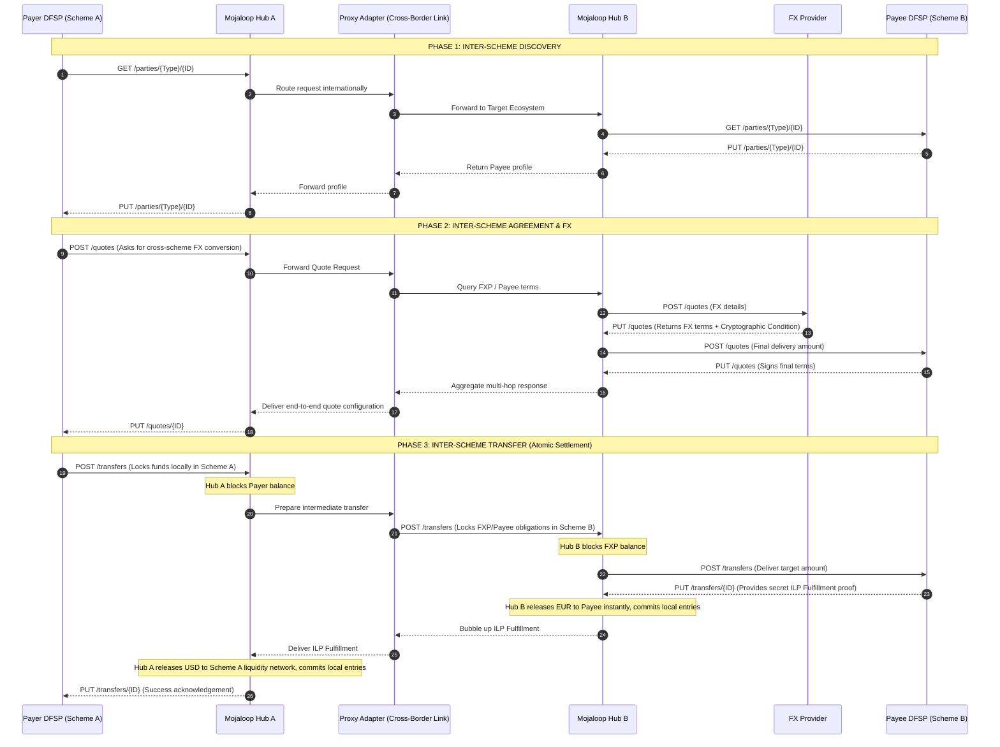

# Mojaloop Payment Flow Patterns

## Cross-currency (single scheme)

```mermaid
sequenceDiagram
    autonumber
    participant Payer as Payer DFSP
    participant Hub as Mojaloop Hub (Switch)
    participant FXP as FX Provider (FXP)
    participant Payee as Payee DFSP

    Note over Payer, Payee: PHASE 1: DISCOVERY
    Payer->>Hub: GET /parties/{Type}/{ID}
    Hub->>Payee: GET /parties/{Type}/{ID}
    Payee-->>Hub: PUT /parties/{Type}/{ID} (Returns currency info: e.g., EUR)
    Hub-->>Payer: PUT /parties/{Type}/{ID}

    Note over Payer, Payee: PHASE 2: AGREEMENT (FX + Final Quote)
    Payer->>Hub: POST /quotes (Request FX options from source USD to target EUR)
    Hub->>FXP: POST /quotes (Dispatched to participating FXPs)
    FXP-->>Hub: PUT /quotes/{ID} (Provides conversion rate + cryptographic condition)
    Hub-->>Payer: PUT /quotes/{ID}

    Payer->>Hub: POST /quotes (Main payment quote detailing final converted fee)
    Hub->>Payee: POST /quotes
    Payee-->>Hub: PUT /quotes/{ID} (Returns final cryptographic ILP Condition)
    Hub-->>Payer: PUT /quotes/{ID}

    Note over Payer, Payee: PHASE 3: TRANSFER EXECUTION
    Payer->>Hub: POST /transfers (USD Debited, holds ILP condition)
    Note over Hub: Hub reserves USD liquidity from Payer, moves to FXP's holding ledger
    Hub->>FXP: POST /transfers (Notifies FXP to release EUR)
    FXP->>Hub: POST /transfers (EUR Debited from FXP)
    Note over Hub: Hub reserves EUR liquidity from FXP, moves to Payee ledger
    Hub->>Payee: POST /transfers (Delivers EUR amount)
    Payee-->>Hub: PUT /transfers/{ID} (Provides cryptographic ILP Fulfillment preimage)
    Note over Hub: Hub commits all reserves simultaneously (Atomicity)
    Hub-->>FXP: PUT /transfers/{ID} (Fulfillment passed to FXP)
    Hub-->>Payer: PUT /transfers/{ID} (Fulfillment passed to Payer as Proof)
```

## Inter-scheme cross-currency

```mermaid
sequenceDiagram
    autonumber
    participant Payer as Payer DFSP (Scheme A)
    participant HubA as Mojaloop Hub A
    participant Proxy as Proxy Adapter (Cross-Border Link)
    participant HubB as Mojaloop Hub B
    participant FXP as FX Provider
    participant Payee as Payee DFSP (Scheme B)

    Note over Payer, Payee: PHASE 1: INTER-SCHEME DISCOVERY
    Payer->>HubA: GET /parties/{Type}/{ID}
    HubA->>Proxy: Route request internationally
    Proxy->>HubB: Forward to Target Ecosystem
    HubB->>Payee: GET /parties/{Type}/{ID}
    Payee-->>HubB: PUT /parties/{Type}/{ID}
    HubB-->>Proxy: Return Payee profile
    Proxy-->>HubA: Forward profile
    HubA-->>Payer: PUT /parties/{Type}/{ID}

    Note over Payer, Payee: PHASE 2: INTER-SCHEME AGREEMENT & FX
    Payer->>HubA: POST /quotes (Asks for cross-scheme FX conversion)
    HubA->>Proxy: Forward Quote Request
    Proxy->>HubB: Query FXP / Payee terms
    HubB->>FXP: POST /quotes (FX details)
    FXP-->>HubB: PUT /quotes (Returns FX terms + Cryptographic Condition)
    HubB->>Payee: POST /quotes (Final delivery amount)
    Payee-->>HubB: PUT /quotes (Signs final terms)
    HubB-->>Proxy: Aggregate multi-hop response
    Proxy-->>HubA: Deliver end-to-end quote configuration
    HubA-->>Payer: PUT /quotes/{ID}

    Note over Payer, Payee: PHASE 3: INTER-SCHEME TRANSFER (Atomic Settlement)
    Payer->>HubA: POST /transfers (Locks funds locally in Scheme A)
    Note over HubA: Hub A blocks Payer balance
    HubA->>Proxy: Prepare intermediate transfer
    Proxy->>HubB: POST /transfers (Locks FXP/Payee obligations in Scheme B)
    Note over HubB: Hub B blocks FXP balance
    HubB->>Payee: POST /transfers (Deliver target amount)
    Payee-->>HubB: PUT /transfers/{ID} (Provides secret ILP Fulfillment proof)
    Note over HubB: Hub B releases EUR to Payee instantly, commits local entries
    HubB-->>Proxy: Bubble up ILP Fulfillment
    Proxy-->>HubA: Deliver ILP Fulfillment
    Note over HubA: Hub A releases USD to Scheme A liquidity network, commits local entries
    HubA-->>Payer: PUT /transfers/{ID} (Success acknowledgement)
```
