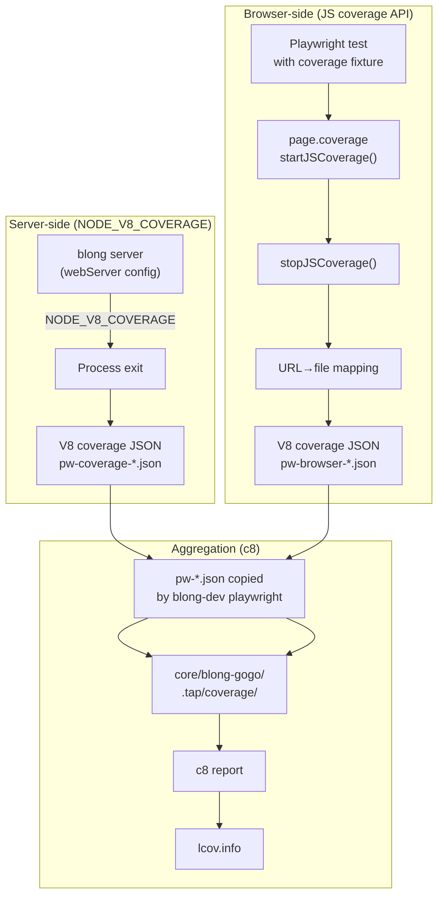

# Playwright Testing Patterns

This page covers the practical patterns for writing full-stack Playwright tests in a Blong suite.

## Setup Pattern

### Package dependencies

```json
{
    "devDependencies": {
        "@playwright/test": "^1.52.0",
        "@feasibleone/blong-browser": "workspace:^1.0.0",
        "@feasibleone/blong-dev": "workspace:*"
    },
    "scripts": {
        "ci-test": "blong-dev playwright",
        "playwright": "blong-dev playwright",
        "playwright:update": "blong-dev playwright --update-snapshots"
    }
}
```

### Playwright config

Use the shared `defineBlongConfig()` helper:

```typescript
// playwright.config.ts
import {defineBlongConfig} from '@feasibleone/blong-browser/playwright/config';
export default defineBlongConfig();
```

Override any setting:

```typescript
export default defineBlongConfig({
    timeout: 60_000,
    use: {blongPermissions: false},
});
```

`defineBlongConfig()` includes `webServer` entries that auto-start the blong server (port 8080)
and Vite dev server (port 5173) in CI (`reuseExistingServer: !process.env.CI`).

## Test File Pattern

Test files use the `.play.ts` extension and import from `@feasibleone/blong-browser/playwright`:

```typescript
import {test, expect} from '@feasibleone/blong-browser/playwright';

test('description', async ({portal}) => {
    // portal is already logged in
    await portal.menuClick('subject.object.browse');
    await portal.waitForTableData();
    await expect(portal.page).toHaveScreenshot('screenshot-name.png');
});
```

## Model CRUD Pattern

For standard model pages, use the generic CRUD helpers. Widget types are auto-detected from
`blong-*` CSS classes in the DOM — just pass plain values:

```typescript
import {test, expect} from '@feasibleone/blong-browser/playwright';
import {browseModel, createAndEditModel} from '@feasibleone/blong-browser/playwright/model';

test.describe('Entity CRUD', () => {
    browseModel(test, expect, {
        subject: 'realm',
        object: 'entity',
        searchText: 'Filter Text',  // optional: filters table before screenshot
    });

    createAndEditModel(test, expect, {
        subject: 'realm',
        object: 'entity',
        fields: {
            'entity.entityName': 'New Entity',
            'entity.entityType': 'typeA',           // auto-detected as select
            'entity.parentId': 'Parent Name',        // auto-detected as dropdown
            'entity.quantity': 42,                   // auto-detected as number
            'entity.active': true,                   // auto-detected as checkbox
            'entity.createdDate': '06/15/2024',      // auto-detected as date
        },
        editFields: {
            'entity.entityName': 'Edited Entity',
        },
    });
});
```

## Element Selector Pattern

### Form inputs — by name attribute

```typescript
// Text input
await page.fill('input[name="coral.coralName"]', 'value');

// Textarea
await page.fill('textarea[name="coral.description"]', 'value');

// Number input
await page.fill('input[name="coral.maxDepth"]', '42');
```

### Widget inputs — by id attribute (hyphens, not dots)

Widget IDs use hyphens where `name` attributes use dots. The model form system converts
`coral.familyId` to `coral-familyId` for IDs, because dots conflict with CSS selectors.

```typescript
// Dropdown — click the wrapper by data-testid (also uses hyphens)
const dropdown = page.locator('[data-testid="coral-familyId"]');
await dropdown.click();
await page.locator('.p-dropdown-item:has-text("Acroporidae")').click();

// Checkbox — by id attribute
const cb = page.locator('input[type="checkbox"][id="coral-endangered"]');
await cb.check();

// Date/Calendar — by id attribute (no name attr on Calendar inputs)
const dateInput = page.locator('input[id="coral-discovered"]');
await dateInput.fill('06/15/2024');
await dateInput.press('Escape'); // Close the date picker overlay

// SelectButton — by text content (no field-specific selector needed)
await page.locator('.p-selectbutton [role="button"]:has-text("Soft Coral")').first().click();
```

### Toolbar buttons — by data-testid

```typescript
await page.getByTestId('editor-save').click();
await page.getByTestId('editor-edit').click();
await page.getByTestId('editor-cancel').click();
await page.getByTestId('editor-refresh').click();
```

### Menu items — by data-testid

```typescript
// Menu group (derived from first child's subject)
await page.getByTestId('portal-menu-marine').click();

// Menu item (semantic triple with dots→dashes)
await page.getByTestId('portal-menu-marine-coral-browse').click();
```

### Table cells — by data-testid

```typescript
// Cell: {fieldName}-{rowIndex}
await page.getByTestId('coral-0').click();

// Table actions
await page.getByTestId('coral-addButton').click();
await page.getByTestId('coral-deleteButton').click();
```

### Login — by name and data-testid

```typescript
await page.fill('input[name="username"]', 'admin');
await page.fill('input[name="password"]', 'admin');
await page.getByTestId('login-submit').click();
```

## Screenshot Pattern

```typescript
// Full page screenshot
await expect(portal.page).toHaveScreenshot('page-name.png');

// Screenshot with masked dynamic content
await expect(portal.page).toHaveScreenshot('page-name.png', {
    mask: [portal.page.locator('input[name="entity.entityName"]')],
});

// Update baselines
// node --run playwright:update
```

## Portal Helper Pattern

The Portal class provides high-level methods. Use these instead of raw selectors:

```typescript
test('full flow', async ({portal}) => {
    // Navigate
    await portal.menuClick('marine.coral.browse');
    await portal.waitForTableData();

    // Fill form
    await portal.fill('coral.coralName', 'Test');
    await portal.fillTextarea('coral.description', 'Description');

    // Save and verify
    await portal.save();
    await expect(portal.page).toHaveScreenshot('saved.png');

    // Table interaction
    await portal.tableRowClickByText('Test');
    await portal.waitForFormLoad();
});
```

## Running Tests

```bash
# CI mode (auto-starts servers via webServer config)
node --run ci-test

# Local development (servers already running)
node --run blong &    # blong server on port 8080
node --run dev &      # Vite dev server on port 5173
node --run playwright

# Run specific test file
node --run playwright -- test/coral.play.ts

# Update screenshot baselines
node --run playwright:update

# Run with headed browser (for debugging)
node --run playwright -- --headed

# Run with Playwright UI mode
node --run playwright -- --ui
```

## Waiting for Form Data Pattern

When opening an existing record for editing, the form renders immediately but API data arrives
asynchronously. Use `waitForFormData()` after `waitForFormLoad()` to avoid filling fields before
the API response populates them:

```typescript
await portal.waitForFormLoad();   // Form visible, skeleton gone
await portal.waitForFormData();   // At least one input has a value from the API

// Now safe to fill fields
await fillFields(portal.page, editFields);
```

## Code Coverage

Playwright tests can collect coverage from both the server-side blong process and the browser-side
React/JS code using the `--coverage` flag.

### Quick Start

Add `--coverage` to your `ci-test` script in the suite's `package.json`:

```json
{
    "scripts": {
        "ci-test": "blong-dev playwright --coverage"
    }
}
```

Run tests as usual — coverage is collected automatically and aggregated into the unified report:

```bash
# Run all Playwright tests with coverage
node --run ci-test

# Or pass --coverage directly
blong-dev playwright --coverage
```

### How It Works

Playwright coverage collection happens in two directions simultaneously:



**Server-side:** When `--coverage` is passed, the `blong-dev playwright` command sets the
`NODE_V8_COVERAGE` environment variable. The blong server process (spawned by Playwright's
`webServer` config) inherits this and writes V8 coverage data to `.playwright/coverage/v8/`
when the process exits.

**Browser-side:** The `@feasibleone/blong-browser/playwright` package includes a coverage
fixture that runs automatically for every test. It uses Playwright's Chromium-specific
`page.coverage.startJSCoverage()` API to collect JavaScript coverage from the browser.
After each test, it maps Vite dev server URLs (e.g. `http://localhost:5173/src/...`) to
filesystem paths and writes V8-format JSON files.

After all tests complete, both sets of coverage files are copied with a `pw-` prefix into
`core/blong-gogo/.tap/coverage/`, where they are picked up by the next `c8 report` run.

### Coverage Fixture

The coverage fixture is built into the test object exported by
`@feasibleone/blong-browser/playwright`. Test files do **not** need to import a separate
fixture — coverage is collected automatically when `NODE_V8_COVERAGE` is set:

```typescript
import {test, expect} from '@feasibleone/blong-browser/playwright';
// Coverage is collected automatically — no extra imports needed
```

The fixture:

- Starts JS coverage with `resetOnNavigation: false` so coverage accumulates across
  multi-page workflows (login → navigation → form interaction)
- Writes browser coverage files named `browser-{md5hash}.json` to the `NODE_V8_COVERAGE` dir
- Skips silently when `NODE_V8_COVERAGE` is not set (normal development)
- Skips silently in non-Chromium browsers (Firefox/WebKit don't support `page.coverage`)

#### Composing Fixtures Manually

If you create a custom test object (e.g., extending the portal fixture with additional
fixtures), you can compose the coverage fixture:

```typescript
import {test as baseTest} from '@feasibleone/blong-browser/playwright';
import {coverageFixture} from '@feasibleone/blong-browser/playwright/coverage';
import {addExtraFixture} from './my-fixture';

// Compose coverage + portal + extra fixture
const test = coverageFixture(baseTest);
test.extend({/* your extra fixtures */});
```

### CI Integration

In CI, coverage flows through the Rush pipeline:

1. `rush ci-test` — runs all test passes including `blong-dev playwright --coverage`,
   which writes coverage data to `core/blong-gogo/.tap/coverage/`
2. `rush ci-coverage` — runs `core/blong-gogo/run-coverage.sh`, which aggregates all
   coverage (tap + Playwright) into a single `lcov.info`
3. `romeovs/lcov-reporter-action` — posts a coverage summary on the PR

The `run-coverage.sh` script detects Playwright coverage files automatically:

```bash
pw_count=$(ls core/blong-gogo/.tap/coverage/pw-*.json 2>/dev/null | wc -l)
if [ "$pw_count" -gt 0 ]; then
    echo "run-coverage.sh: Including $pw_count Playwright coverage file(s)"
fi
```

### Path Mapping

Browser coverage URLs from Vite (e.g. `http://localhost:5173/src/components/Portal.tsx`)
are mapped to filesystem paths by stripping the protocol/host prefix and resolving
relative to the project root. Files from `node_modules`, Vite's HMR client, and
`@react-refresh` are excluded automatically.

## Stateful Mock Pattern (Dirty Cycle)

When the mock adapter mutates an in-memory array, records persist across test runs. This means
edit tests may find the record already contains the expected values, leaving react-hook-form
in a clean state (Save button disabled).

The `createAndEditModel()` helper uses a dirty cycle to work around this:

```typescript
// 1. Fill with suffixed values → form is dirty → save
await fillFields(page, addSuffix(editFields, randomSuffix));
await portal.save();

// 2. Fill with actual values → form is dirty again → save
await fillFields(page, editFields);
await portal.save();
```

The `addSuffix()` helper only modifies text and textarea values, leaving selects, dropdowns,
checkboxes, and dates unchanged.
