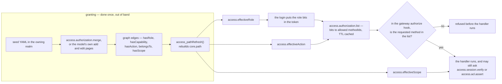
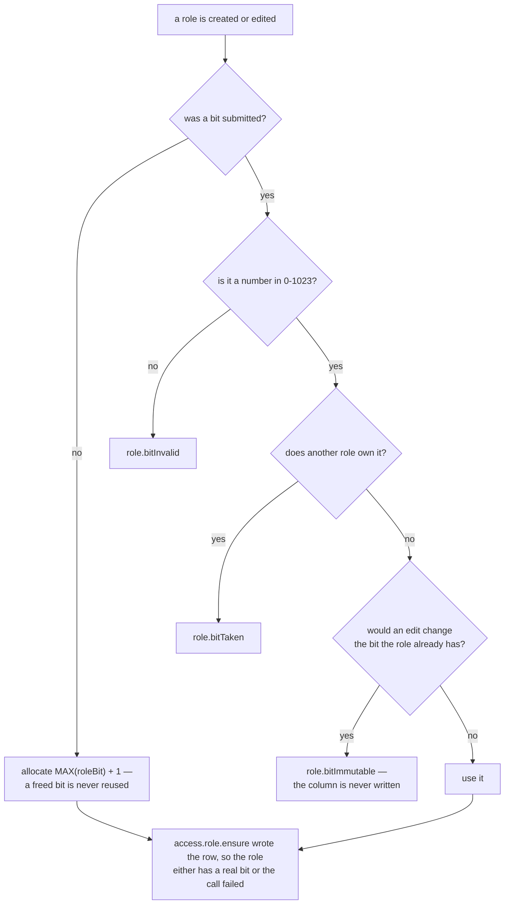

# RBAC

Seeding, granting and verifying role-based access control. The `blong-access` README documents the
tables, the handlers and the configuration defaults; this page shows how to use them. The
[RBAC concept](../concepts/rbac.md) describes the model.

## 1. Turn the gate on

```ts
config: {
    default: {
        gateway: {authorize: 'access.authorization.list'}, // ← turns RBAC on
    },
},
```

Without that hook the routes are served with no RBAC check. The README's usage block shows the full
suite wiring (server, login, core and access realms as children).

## 2. Model the authority data

| Concept    | Resource type       | Links to     | Meaning                                         |
| ---------- | ------------------- | ------------ | ----------------------------------------------- |
| action     | `access.action`     | —            | one guarded method (a semantic triple)          |
| capability | `access.capability` | actions      | a group of actions — "what someone does"        |
| role       | `access.role`       | capabilities | a job; carries the unique `roleBit`             |
| user       | `access.user`       | roles, units | the caller                                      |
| unit       | `party.unit`        | roles        | an org unit that can hold roles for its members |

The edges are `hasAction`, `hasCapability`, `hasRole`, `belongsTo` (and `hasScope` for the implicit
ACL grant). After changing them the materialized paths must be refreshed:
`access.authorization.merge` does it for you, hand-written SQL calls `CALL access_pathRefresh()`.

Granting is an occasional out-of-band write, while deciding happens on every request — which is why
the two halves are shaped so differently:



## 3. Seed roles, capabilities and users

Roles are declared by **name only** — the bit is allocated (see below):

```yaml
# meta/db/1-accessRoleMerge.yaml
resourceType: access.role
role:
    - description: Admin role with full access
      name: Admin
```

Capabilities, actions and the users that hold them go in one authorization merge:

```yaml
# meta/db/accessAuthorizationMerge.yaml
capability:
    loginCapability: accessLogin
    userManagement: accessUserFind,accessUserAdd,accessUserEdit
role:
    Admin: loginCapability,userManagement
user:
    testAdmin: {password: testPassword, roles: Admin}
```

Realm-specific grants belong in the owning realm's own merge file (same handler, same format); both
files are additive and idempotent.

## 4. Role bits

| Situation                                | Behaviour                                                    | Error               |
| ---------------------------------------- | ------------------------------------------------------------ | ------------------- |
| No bit given                             | allocated as `MAX(roleBit) + 1`; a freed bit is never reused | —                   |
| Bit given and free                       | used                                                         | —                   |
| Bit given and owned by another role      | refused                                                      | `role.bitTaken`     |
| Bit that is not a number in 0–1023       | refused                                                      | `role.bitInvalid`   |
| Edit that changes an existing role's bit | refused; the column is never written                         | `role.bitImmutable` |

All five rows are one decision, taken in one place:



Every creation path — the model's add, registration, the authorization merge, the seed merge and the
gateway's bundles — goes through `access.role.ensure`, so a role either exists with a real bit or
the call fails with one of the errors above. The UI leaves the bit blank; the save response carries
the allocated value.

## 5. Login eligibility

A user may establish (and renew) a session only while the `accessLogin` action is in their effective
actions:

```yaml
capability:
    loginCapability: accessLogin
role:
    Admin: loginCapability
```

Removing that capability from a role refuses its logins at the session gate with
`login.loginNotAllowed` (401); a deactivated user gets `login.userInactive`. See the
[sessions concept](../concepts/sessions.md).

## 6. Verify inside a handler

```ts
export default handler(({handler: {accessSessionVerify}}) => ({
    async invoiceInvoiceApprove(params: {invoiceId: string}, $meta: IMeta) {
        // Re-checks the live graph, not just the token, and requires the record
        // when the entity is guarded by the record-level ACL.
        const {userId} = await accessSessionVerify(
            {
                action: 'invoice.invoice.approve',
                record: {entity: 'invoice.invoice', recordId: params.invoiceId},
            },
            $meta,
        );
        // … proceed
    },
}));
```

`access.session.verify` throws the `access.session.*` (401) family and `acl.notPermitted` (403, with
a `reason`), so a caller can branch without parsing messages.

## 7. Test it

- **Permission map** — after login, assert the expected action is present:
  `result.permissions.includes('accessTestPrivate')`.
- **Refusals** — call with `$meta.expect: ['<error>']` and assert the thrown error's `type`, so the
  test documents the expected failure instead of crashing.
- **Group wiring** — a test group runs only when the platform that owns it lists it in
  `integration.watch.test`.

## 8. Troubleshooting

| Symptom                                   | Likely cause                                                                         |
| ----------------------------------------- | ------------------------------------------------------------------------------------ |
| 403 with a valid token, empty action list | the materialized paths are stale — run `CALL access_pathRefresh()`                   |
| A role exists but has no row              | not possible any more: a taken bit is refused; older databases may hold such a ghost |
| A token still authorizes old permissions  | the authorization cache TTL; the token's bits resolve against the current mapping    |
| A capability has no effect                | its action resource name differs — matching ignores dots, nothing else               |
