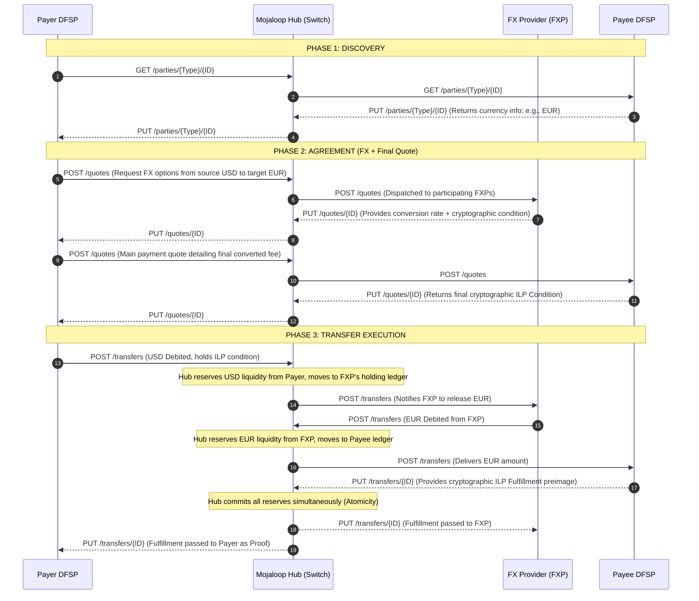
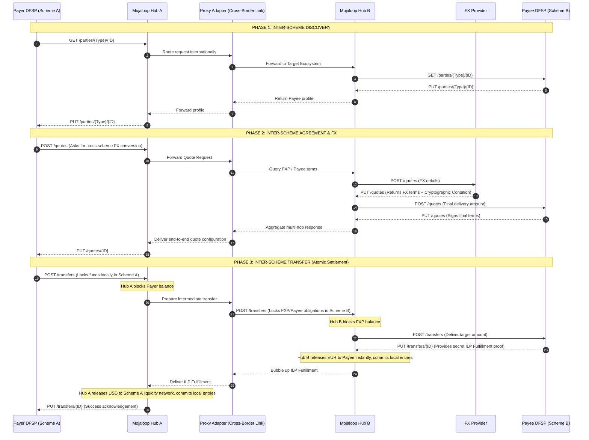

# Semantic Log Flows

The two transfer flows in `core/semantic-log/flow/` are the library's **end-to-end evidence**: real
HTTP between real processes, with every assertion made against the records each participant actually
retained, rather than against objects a test built.

This page carries the sequence diagrams and annotates them leg by leg, so the diagrams can be read
against the code that implements them and against the tests that pin them. The participant
catalogue, the faults and the requirement mapping live in the [pattern guide](./semantic-log.md),
and what the library is at all is the [concept](../concepts/semantic-log.md).

- [Pattern guide](./semantic-log.md) — the calls that change behaviour, the faults, how to run one
- [Concept](../concepts/semantic-log.md) — what the library is
- [Rationale](../rationale/semantic-log.md) — why it is shaped this way

## These flows are a demonstration

They are **demonstration fixtures for the logging library**. They are not an implementation of
Mojaloop, not a payment system, and not a model of how settlement should be built. Their purpose is
to generate realistic multi-service traffic — real HTTP between real processes, real failure paths,
records read back out of each participant's own cache — so the library's behaviour can be watched,
asserted and explained end to end.

They are **loosely based** on two published Mojaloop features:

| Flow                                  | Based on                                                                                                                                                                                              |
| ------------------------------------- | ----------------------------------------------------------------------------------------------------------------------------------------------------------------------------------------------------- |
| `single` — cross-currency, one scheme | [Foreign Exchange — currency conversion](https://docs.mojaloop.io/product/features/fx.html): a Payer DFSP obtains a conversion rate from an FXP and then executes the transfer in the target currency |
| `inter` — cross-border, two schemes   | [Interscheme](https://docs.mojaloop.io/product/features/interscheme.html): two schemes joined by a **proxy participant** that routes for adjacent DFSPs/FXPs in the other scheme                      |

### What is simplified or omitted, deliberately

| In the Mojaloop flow                                                                                                                                              | In these fixtures                                                                                                       |
| ----------------------------------------------------------------------------------------------------------------------------------------------------------------- | ----------------------------------------------------------------------------------------------------------------------- |
| An **Oracle** resolves the party identifier, and `GET /parties` is answered with a `PUT /parties/{ID}`                                                            | Three generic `POST` routes — `/parties`, `/quotes`, `/transfers` — with no directory; the payee answers directly       |
| Two `POST /quotes` rounds (liquidity cover from the FXP, then the transfer terms from the payee), plus the Payer's own confirmation step                          | One quote round: the provider's rate is threaded through the payee and returned to the payer once                       |
| An FX marketplace: several FXPs bid for the conversion and the DFSP selects one                                                                                   | One provider per scheme, chosen by configuration                                                                        |
| Real ILP cryptographic conditions and fulfilment preimages                                                                                                        | Placeholder strings (`sha256:condition`, `sha256:preimage`); nothing is cryptographically verified                      |
| Two-phase reserve/commit across ledgers, atomic settlement, clearing accounts                                                                                     | A single `withhold` and its release on failure — which is the observability the library needs to demonstrate            |
| Abort flows                                                                                                                                                       | A refusal status (409, 422, 503) and an error record                                                                    |
| Inter-scheme discovery by broadcast, cached identifiers, stale-cache self-healing, proxy registration through an admin API, and `GET /transfers` resolved locally | Absent: the corridor is configured rather than discovered, and the proxy's routing decision is a single recorded branch |
| Non-repudiation: the proxy routes but takes **no part in the agreement of terms**                                                                                 | **Preserved** — the proxy forwards `/quotes` unchanged and adds no terms of its own                                     |

The rates, amounts and identifiers are invented. No participant holds state that survives a run, and
nothing here is a statement about how a real scheme should behave.

### What the fixtures add

Four things in the fixtures are deliberately absent from the drawings, because they exist for the
observability rather than for the protocol: the originating scheme's `fxpA` local indication, the
proxy's `hold` branch, the two identity headers on every hop, and the optional cluster-service sink.
They are listed with their reasons under
[legs the fixture adds](#legs-the-fixture-adds-and-the-diagrams-do-not-draw).

## How to read the annotations

Both diagrams use mermaid's `autonumber`, which numbers **arrows only** — the `Note over …` lines
carry no number, so the tables below key on the arrow numbers and name the note by its position.

Each leg is annotated with one of three things:

| Annotation     | Meaning                                                                                       |
| -------------- | --------------------------------------------------------------------------------------------- |
| a file + step  | the fixture implements the leg; the named file is the participant that logs it                |
| _collapsed_    | the fixture carries the leg's effect inside another leg, because the protocol is simplified   |
| _not modelled_ | the fixture does not perform the leg — the reason is given, so the omission is not a surprise |

**The protocol is deliberately simplified.** The diagrams describe the exchange as Mojaloop
publishes it (`GET`/`PUT` resource pairs, two quote rounds, a separate FX settlement leg) — see
[above](#these-flows-are-a-demonstration) for exactly what the fixtures keep, drop and invent. The
fixtures collapse the protocol onto three generic `POST` routes — `/parties`, `/quotes`,
`/transfers` — with the **phase names taken from the diagrams** (`discovery`, `quote`, `transfer`).
A leg that the fixtures collapse is still recorded here, so the difference between the diagram and
the code is a written decision rather than a gap a reader has to notice.

## Cross-currency (single scheme)

Four participants: `payer`, `hub`, `fxp` (the FX provider), `payee`. Wired by `startFlow('single')`
in `flow/flows.ts`.

### Leg by leg

| Leg  | Diagram leg                               | Fixture                                                                                                                                                                                                         |
| ---- | ----------------------------------------- | --------------------------------------------------------------------------------------------------------------------------------------------------------------------------------------------------------------- |
| 1    | Payer → Hub `GET /parties/{Type}/{ID}`    | `flow/payer.ts` step `discovery`: `hop(payer, hubUrl, '/parties', …)`, logging `looking up payee` with the `req` block                                                                                          |
| 2    | Hub → Payee `GET /parties/{Type}/{ID}`    | `flow/hub.ts` route `/parties`: `hop(hub, payeeUrl, '/parties', …)`, logging `party lookup forwarded`                                                                                                           |
| 3    | Payee → Hub `PUT /parties/{ID}`           | `flow/payee.ts` route `/parties` answers `{currency: 'EUR'}`, logging `party profile returned`                                                                                                                  |
| 4    | Hub → Payer `PUT /parties/{ID}`           | the `{status, body}` result `hop` returns; the payer logs `payee found` with `res.status` and the top-level field `payeeCurrency`                                                                               |
| 5    | Payer → Hub `POST /quotes` (FX options)   | `payer.ts` step `quote`: `hop(payer, hubUrl, '/quotes', {amount, from, to})`, logging `requesting fx quote` — see legs 8–9 for the collapsed round                                                              |
| 6    | Hub → FXP `POST /quotes`                  | `hub.ts` route `/quotes`: `hop(hub, fxpUrl, '/quotes', …)`, logging `quote request received`                                                                                                                    |
| 7    | FXP → Hub `PUT /quotes/{ID}`              | `flow/fxp.ts`: `decide('rate-within-limit', {rate, rateLimit}, …)`, then `rate published` `{rate, condition}` — or `rate declined` and a 409 (fault F5)                                                         |
| 8    | Hub → Payer `PUT /quotes/{ID}` (round 1)  | _collapsed_ into leg 12: the fixture carries one quote round, so the provider's `rate` is threaded through the payee and merged into the single answer                                                          |
| 9    | Payer → Hub `POST /quotes` (main quote)   | _collapsed_ into leg 5: one `POST /quotes` from the payer covers both rounds of the diagram                                                                                                                     |
| 10   | Hub → Payee `POST /quotes`                | `hub.ts` route `/quotes`: `hop(hub, payeeUrl, '/quotes', fx.body)` — the provider's rate is forwarded to the payee, not re-derived                                                                              |
| 11   | Payee → Hub `PUT /quotes/{ID}`            | `payee.ts` route `/quotes` answers `{condition: 'sha256:condition'}`, logging `quote signed`                                                                                                                    |
| 12   | Hub → Payer `PUT /quotes/{ID}`            | `hub.ts` answers `{…payee.body, rate}` and logs `quote assembled` `{rate}`. The payer prices it with `decide('quote-acceptable', {rate, rateLimit, status})`, logging `quote accepted` or `quote refused` (409) |
| 13   | Payer → Hub `POST /transfers`             | `payer.ts` step `transfer`: `hop(payer, hubUrl, '/transfers', {amount, currency})`, logging `submitting transfer`                                                                                               |
| note | Hub reserves USD liquidity                | `hub.ts` route `/transfers`: `withhold({routing: …})` and `withhold({liquidity: {reserved, currency}})`, then `liquidity reserved` — **retained, never transmitted** (R10)                                      |
| 14   | Hub → FXP `POST /transfers`               | _not modelled_: the fixture's provider is consulted in the quote phase only, and the hub settles directly with the payee. A second settlement participant would add no new observability                        |
| 15   | FXP → Hub `POST /transfers` (EUR debited) | _not modelled_ — same leg                                                                                                                                                                                       |
| note | Hub reserves EUR, moves to Payee ledger   | the same single `withhold({liquidity})` as the previous note: one reservation is what the fixture's simplified protocol needs                                                                                   |
| 16   | Hub → Payee `POST /transfers`             | `hub.ts`: `hop(hub, payeeUrl, '/transfers', body)`, logging `settlement committed` `{res}` on success                                                                                                           |
| 17   | Payee → Hub `PUT /transfers/{ID}`         | `payee.ts` route `/transfers` answers `{fulfilment: 'sha256:preimage'}`, logging `transfer fulfilled` — or `transfer refused` (422, F1) or `transfer awaiting fulfilment` (504, F4)                             |
| note | Hub commits all reserves (atomicity)      | `hub.ts`: `settlement committed` on the happy path; on a refusal `withhold({settlement: …})` then `error('settlement failed')` → 502, with the withheld detail riding that record                               |
| 18   | Hub → FXP `PUT /transfers/{ID}`           | _not modelled_ (leg 14)                                                                                                                                                                                         |
| 19   | Hub → Payer `PUT /transfers/{ID}`         | the reply the payer's `hop` returns; `payer.ts` logs `transfer complete` `{res}` and answers 200 `{status: 'settled'}`                                                                                          |

## Inter-scheme cross-currency

Seven participants: `payer`, `hubA`, `fxpA`, `proxy`, `hubB`, `fxp`, `payee`. Wired by
`startFlow('inter')`. The two schemes each hold **their own** provider, which is what makes the
corridor's rate and the originating scheme's indication two different numbers — see the additions
below the table.

### Leg by leg

| Leg  | Diagram leg                            | Fixture                                                                                                                                                                                                                               |
| ---- | -------------------------------------- | ------------------------------------------------------------------------------------------------------------------------------------------------------------------------------------------------------------------------------------- |
| 1    | Payer → HubA `GET /parties`            | `payer.ts` step `discovery` → `hop(payer, hubAUrl, '/parties', …)`; the payer is pointed at hub A rather than the local hub                                                                                                           |
| 2    | HubA → Proxy "route internationally"   | `flow/hubA.ts` route `/parties`: `hop(hubA, proxyUrl, '/parties', …)`, logging `party lookup routed internationally` — hub A has **no directory of its own**, which is what makes it a separate participant rather than a URL change  |
| 3    | Proxy → HubB "forward to target"       | `flow/proxy.ts` route `/parties` (phase `discovery`): `decide('route-selection', {corridor, reachable})` then `hop(proxy, hubBUrl, …)`, logging `routing to target ecosystem` — the rationale rides that record (R11)                 |
| 4    | HubB → Payee `GET /parties`            | hub B is `installHub` with scheme B's provider and payee: route `/parties` logs `party lookup forwarded`                                                                                                                              |
| 5    | Payee → HubB `PUT /parties`            | `payee.ts` route `/parties`; `party profile returned`                                                                                                                                                                                 |
| 6    | HubB → Proxy profile                   | the `{status, body}` the `hop` returns — the proxy adds no transformation, so it logs nothing extra                                                                                                                                   |
| 7    | Proxy → HubA profile                   | the same result, one hop back up the corridor                                                                                                                                                                                         |
| 8    | HubA → Payer profile                   | `hubA.ts` replies with the proxy's status and body; the payer logs `payee found`                                                                                                                                                      |
| 9    | Payer → HubA `POST /quotes`            | `payer.ts` step `quote`                                                                                                                                                                                                               |
| 10   | HubA → Proxy "forward quote request"   | `hubA.ts` route `/quotes`: `hop(hubA, proxyUrl, '/quotes', body)`                                                                                                                                                                     |
| 11   | Proxy → HubB "query FXP / payee terms" | `proxy.ts` route `/quotes` (phase `quote`): route, then `hop(proxy, hubBUrl, …)`                                                                                                                                                      |
| 12   | HubB → FXP `POST /quotes`              | `hub.ts` route `/quotes` on hub B: `hop(hubB, fxpUrl, …)`, logging `quote request received`. On a refusal it logs `provider declined the quote` and **carries the provider's status back** rather than synthesising a rate (fault F5) |
| 13   | FXP → HubB terms                       | `fxp.ts`; `rate published` or `rate declined`                                                                                                                                                                                         |
| 14   | HubB → Payee `POST /quotes`            | `hub.ts`: `hop(hubB, payeeUrl, '/quotes', fx.body)`                                                                                                                                                                                   |
| 15   | Payee → HubB "signs final terms"       | `payee.ts`; `quote signed`                                                                                                                                                                                                            |
| 16   | HubB → Proxy "aggregate"               | `hub.ts` route `/quotes` answers `{…payee.body, rate}`, logging `quote assembled`                                                                                                                                                     |
| 17   | Proxy → HubA "deliver configuration"   | the `{status, body}` the proxy's `hop` returns                                                                                                                                                                                        |
| 18   | HubA → Payer `PUT /quotes/{ID}`        | `hubA.ts` route `/quotes` answers the **corridor's** body. It first takes a **local indication** from its own provider and logs `cross-scheme quote assembled` `{rate, localRate, localStatus}` — see the additions below             |
| 19   | Payer → HubA `POST /transfers`         | `payer.ts` step `transfer`; hub A logs `local funds blocked`                                                                                                                                                                          |
| note | Hub A blocks the payer balance         | `hubA.ts`: `withhold({liquidity: {reserved, currency, scheme: 'A'}})` — R10, retained locally and released only if the settlement fails                                                                                               |
| 20   | HubA → Proxy "prepare intermediate"    | `hubA.ts`: `hop(hubA, proxyUrl, '/transfers', body)`                                                                                                                                                                                  |
| 21   | Proxy → HubB `POST /transfers`         | `proxy.ts` route `/transfers` (phase `transfer`): route, then `hop(proxy, hubBUrl, …)`                                                                                                                                                |
| note | Hub B blocks the FXP balance           | `hub.ts` on hub B: `withhold({routing: …})` and `withhold({liquidity: …})`                                                                                                                                                            |
| 22   | HubB → Payee "deliver target amount"   | `hub.ts`: `hop(hubB, payeeUrl, '/transfers', body)`                                                                                                                                                                                   |
| 23   | Payee → HubB secret fulfilment         | `payee.ts` route `/transfers`; `transfer fulfilled` (or `transfer refused` 422 / `transfer awaiting fulfilment` 504)                                                                                                                  |
| note | Hub B releases EUR and commits         | `hub.ts`: `settlement committed`, or `withhold({settlement: …})` + `error('settlement failed')`                                                                                                                                       |
| 24   | HubB → Proxy "bubble up fulfilment"    | the hop result propagating up; no extra record in the proxy                                                                                                                                                                           |
| 25   | Proxy → HubA "deliver fulfilment"      | the hop result propagating up                                                                                                                                                                                                         |
| note | Hub A releases USD and commits         | `hubA.ts`: `inter-scheme settlement committed` `{res}`, with the reserved liquidity still local. On failure: `error('inter-scheme settlement failed')` → 502, and the withheld liquidity rides that record                            |
| 26   | HubA → Payer success acknowledgement   | the effect: `payer.ts` logs `transfer complete` and answers 200 `{status: 'settled'}`                                                                                                                                                 |

### Legs the fixture adds, and the diagrams do not draw

The fixtures are not only a transcription of the diagrams. Four things they carry are absent from
the drawings, and each is deliberate:

| Addition                          | Where                              | Why it is there                                                                                                                                                                                                                                                                             |
| --------------------------------- | ---------------------------------- | ------------------------------------------------------------------------------------------------------------------------------------------------------------------------------------------------------------------------------------------------------------------------------------------- |
| `hubA → fxpA` local indication    | `hubA.ts` route `/quotes`          | two schemes quoting one corridor quote different numbers; recording the local indication beside the corridor's rate is what lets an operator tell a moved corridor from a moved local price. Recorded **beside** the answer, never gating it — a declined indication is reported, not fatal |
| The proxy's `hold` branch         | `proxy.ts` (`ROUTES`, `reachable`) | a proxy whose receiving link is not configured has no route and must hold (503) rather than forward into an address it was never given. Reachability is derived from the deployment, so the branch is real and not a guard against something that never happens                             |
| Two identity headers on every hop | `participant.ts` (`hop`)           | `x-semantic-trace` (causal correlation) and `x-semantic-flow` (the execution ULID) — the diagram draws the protocol, not the observability envelope                                                                                                                                         |
| The optional cluster-service sink | `participant.ts`, `flows.ts`       | with `--service`, each participant's records are shipped **beside** the local cache; without it the run is complete and offline (R18)                                                                                                                                                       |

## What the flow code demonstrates

Every feature below is exercised where it naturally occurs — these are calls a real service would
make at that point, not demonstration code — and each is pinned by a test that reads the
participants' own retained records.

| Feature                                                     | Where the fixture does it                                                                             | Pinned by                                                                                                                                     |
| ----------------------------------------------------------- | ----------------------------------------------------------------------------------------------------- | --------------------------------------------------------------------------------------------------------------------------------------------- |
| One real process per participant, over real HTTP            | `participant.ts` (`createParticipant`, `listen`, `hop`)                                               | `test/flow/participant.test.ts`                                                                                                               |
| A trace across every participant and every hop              | `hop` sets `x-semantic-trace`; `traceFrom` mints only at the entry point                              | `test/flow/happy.test.ts` — "every participant logs in one trace"                                                                             |
| One execution is one flow id, carried unchanged             | `flowFrom` mints the ULID once; every later participant forwards it                                   | `test/flow/happy.test.ts` — "one execution is one flow id…"                                                                                   |
| The flow id is **not** the trace id                         | `participant.ts` binds them separately (`bindTrace` + `withFlow`)                                     | `test/flow/happy.test.ts` — "…and it is not the trace (D1/D3)"                                                                                |
| The flow **kind** is the drift key                          | `flows.ts` `FLOW_KIND` → `createParticipant({kind})` → `withFlow({id, kind})`                         | `test/flow/happy.test.ts` — the asserted `kind` values `transfer.single` / `transfer.inter`                                                   |
| Phases come from the diagrams                               | `participant.phase(name, fn)` → `step(name, fn)` for `discovery`/`quote`/`transfer`                   | `test/flow/participant.test.ts` — "phase steps the bound flow and refuses to step outside one"; F4                                            |
| Intent is bound once, at the entry participant              | `flows.ts` passes `intent` for the payer only                                                         | `test/flow/participant.test.ts` — "an entry participant runs every request under its declared intent"                                         |
| The causal chain is walkable from the records               | `rememberRecord` → `refs.parent` → the sink's `toEvent` → `LineageIndex.chain`                        | `test/flow/happy.test.ts` — "the causal chain is walkable…" and "…reconstruct the chain through the service"                                  |
| References are minted locally, with no service              | `withIdentity`, `mintRecordRef` (`r`), `refs.template` (`t`), `refs.trace` (`x`)                      | `test/flow/happy.test.ts` — "references are locally minted and carry a template-id prefix"                                                    |
| The parent link is rendered, not just stored                | `renderHuman` renders `p=<id>` in the reference group                                                 | `test/flow/happy.test.ts` — the `p=${parent}` assertion against the shipped renderer                                                          |
| Withholding, and its release on failure                     | `hub.ts`/`hubA.ts` `withhold(…)` then an `error` or a `fatal`                                         | `test/flow/faults.test.ts` F1; `test/flow/happy.test.ts` — the inter-scheme refusal                                                           |
| Withheld detail belongs to the execution that withheld it   | `stepLogger()` — a **request-scoped** `logger.child({})`                                              | `test/flow/guards.test.ts` — "withheld detail belongs to the execution that withheld it…"                                                     |
| Branch rationale, exactly where a service branches          | `decide(…)` in `payer` (`quote-acceptable`), `fxp` (`rate-within-limit`), `proxy` (`route-selection`) | `test/flow/faults.test.ts` F5; `test/flow/happy.test.ts` — the proxy's `route-selection` rationale                                            |
| A refusal stops the chain and travels as a status           | every route sets `reply.status(result.status)`, never returns the envelope                            | `test/flow/faults.test.ts` F1; `test/flow/guards.test.ts` — a refusal with no stated reason                                                   |
| A declined quote cannot be mis-priced                       | the payer folds the provider's status into `quote-acceptable`                                         | `test/flow/faults.test.ts` F5                                                                                                                 |
| Faults are deployment properties, not test branches         | `startFlow(kind, {faults})` → `install*` options                                                      | the whole of `test/flow/faults.test.ts`                                                                                                       |
| Offline: nothing needs to be running                        | no `serviceUrl` → readable output, references and the local cache alone                               | `test/flow/happy.test.ts` — "the flow runs with no cluster service anywhere (R18 acceptance)"                                                 |
| A service sink is a **second** destination                  | `serviceUrl` → `createServiceWriter`, beside the local cache                                          | `test/flow/participant.test.ts` — "a participant with a service URL ships its records there…"                                                 |
| The last record is flushed before the cache closes          | `close()` flushes loggers, then sinks, then the cache                                                 | `test/flow/happy.test.ts` — every test reads the store after the run's records were flushed                                                   |
| An identity is a single token, or it is not one             | `identityHeader` rejects absent, blank and comma-joined values                                        | `test/flow/participant.test.ts` — "only a non-empty string identity header is propagated", "a header repeated on the wire is not an identity" |
| Caller misuse throws; a weird identity on the wire does not | `withFlow` rejects a malformed ULID or an empty kind; the wire path reports                           | `test/flow/participant.test.ts` — "run refuses a malformed flow id and an empty kind"                                                         |
| The library is a front door, not an addition (R17)          | the participants import `semantic-log` and `fastify` and nothing else                                 | `test/flow/happy.test.ts`, `test/flow/coverage.test.ts`                                                                                       |

## Running and testing the flows

`node flow/run.ts --flow single|inter` runs a flow by hand; see the
[pattern guide](./semantic-log.md#running-a-flow-by-hand) for the runner's flags, and the package's
own README (`core/semantic-log/README.md`) for the cluster service the `--service` flag ships to.

> Links to the package's sources are given as paths rather than hyperlinks: the docs site is built
> from `docs/blong/docs/` alone, so a link escaping this tree would be a broken link in the
> published site.
