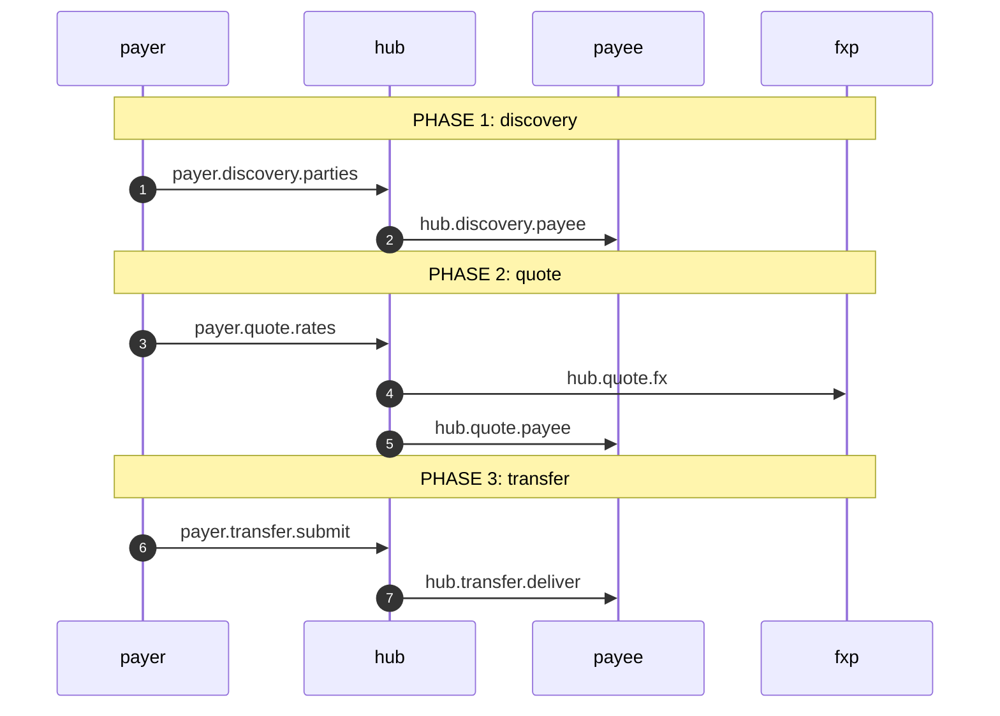
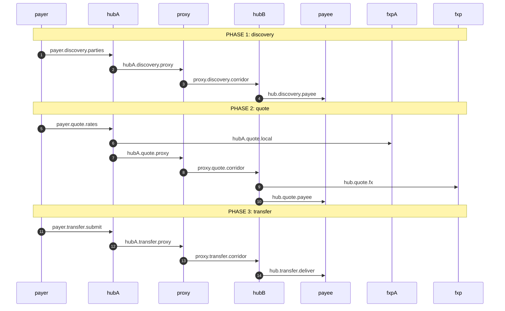

# Semantic Log Flows

The two transfer flows in `core/semantic-log/flow/` are the library's **end-to-end evidence**: real
HTTP between real processes, with every assertion made against the records each participant actually
retained, rather than against objects a test built.

This page carries the sequence diagrams and annotates them leg by leg, so the diagrams can be read
against the code that implements them and against the tests that pin them. The participant
catalogue, the faults and the requirement mapping live in the [pattern guide](./semantic-log.md),
and what the library is at all is the [concept](../concepts/semantic-log.md).

- [Pattern guide](./semantic-log.md) — the calls that change behaviour, the faults, how to run one
- [Concept](../concepts/semantic-log.md) — what the library is
- [Rationale](../rationale/semantic-log.md) — why it is shaped this way

## These flows are a demonstration

They are **demonstration fixtures for the logging library**. They are not an implementation of
Mojaloop, not a payment system, and not a model of how settlement should be built. Their purpose is
to generate realistic multi-service traffic — real HTTP between real processes, real failure paths,
records read back out of each participant's own cache — so the library's behaviour can be watched,
asserted and explained end to end.

They are **loosely based** on two published Mojaloop features:

| Flow                                  | Based on                                                                                                                                                                                              |
| ------------------------------------- | ----------------------------------------------------------------------------------------------------------------------------------------------------------------------------------------------------- |
| `single` — cross-currency, one scheme | [Foreign Exchange — currency conversion](https://docs.mojaloop.io/product/features/fx.html): a Payer DFSP obtains a conversion rate from an FXP and then executes the transfer in the target currency |
| `inter` — cross-border, two schemes   | [Interscheme](https://docs.mojaloop.io/product/features/interscheme.html): two schemes joined by a **proxy participant** that routes for adjacent DFSPs/FXPs in the other scheme                      |

### What is simplified or omitted, deliberately

| In the Mojaloop flow                                                                                                                                              | In these fixtures                                                                                                       |
| ----------------------------------------------------------------------------------------------------------------------------------------------------------------- | ----------------------------------------------------------------------------------------------------------------------- |
| An **Oracle** resolves the party identifier, and `GET /parties` is answered with a `PUT /parties/{ID}`                                                            | Three generic `POST` routes — `/parties`, `/quotes`, `/transfers` — with no directory; the payee answers directly       |
| Two `POST /quotes` rounds (liquidity cover from the FXP, then the transfer terms from the payee), plus the Payer's own confirmation step                          | One quote round: the provider's rate is threaded through the payee and returned to the payer once                       |
| An FX marketplace: several FXPs bid for the conversion and the DFSP selects one                                                                                   | One provider per scheme, chosen by configuration                                                                        |
| Real ILP cryptographic conditions and fulfilment preimages                                                                                                        | Placeholder strings (`sha256:condition`, `sha256:preimage`); nothing is cryptographically verified                      |
| Two-phase reserve/commit across ledgers, atomic settlement, clearing accounts                                                                                     | A single `withhold` and its release on failure — which is the observability the library needs to demonstrate            |
| Abort flows                                                                                                                                                       | A refusal status (409, 422, 503) and an error record                                                                    |
| Inter-scheme discovery by broadcast, cached identifiers, stale-cache self-healing, proxy registration through an admin API, and `GET /transfers` resolved locally | Absent: the corridor is configured rather than discovered, and the proxy's routing decision is a single recorded branch |
| Non-repudiation: the proxy routes but takes **no part in the agreement of terms**                                                                                 | **Preserved** — the proxy forwards `/quotes` unchanged and adds no terms of its own                                     |

The rates, amounts and identifiers are invented. No participant holds state that survives a run, and
nothing here is a statement about how a real scheme should behave.

### What the fixtures add

Four things in the fixtures are deliberately absent from the drawings, because they exist for the
observability rather than for the protocol: the originating scheme's `fxpA` local indication, the
proxy's `hold` branch, the two identity headers on every hop, and the optional cluster-service sink.
They are listed with their reasons under
[legs the fixture adds](#legs-the-fixture-adds-and-the-diagrams-do-not-draw).

## How to read the annotations

The diagrams below are **generated from a real run** of the fixtures — every arrow is a call a
record declared, and every label is the **leg id the source declares**. That is the point of the
ids: `hub.transfer.deliver` in the diagram is a literal in `flow/hub.ts`, and the table under each
diagram names the file and line that declares it, so a reader moves from a picture of a run to the
line of code that made it without guessing.

Each diagram uses mermaid's `autonumber`, which numbers **arrows only** — the `Note over …` lines
carry no number. The table is the diagram in full, and it says what a picture cannot:

| Column              | Meaning                                                                                                                     |
| ------------------- | --------------------------------------------------------------------------------------------------------------------------- |
| `call`              | the leg id, as declared in the code                                                                                         |
| `caller → receiver` | who declared the call, and who they declared it to — the receiver the caller _named_, not one inferred from who answered    |
| `phase`             | the step the call was observed in (`discovery`, `quote`, `transfer`)                                                        |
| `position`          | the counter path the caller assigned: `2.2.1` is the first call made while answering `2.2`                                  |
| `declared`          | how many declarations were observed — one per execution, so a chatty call site is still one call                            |
| `answered`          | of those, how many had their receiver observed too. **`0` is the interesting case**: the call was made and nothing answered |
| `declared in`       | the file and line that declares the id                                                                                      |

An arrow drawn with a cross (`--x`) is a call the caller declared that nothing answered — a receiver
that is missing, failing, or wired to the wrong address. A call seen only from its receiver's side
is drawn as a note rather than an arrow, because an arrow needs a caller and the only one available
would be an invention.

**The protocol is deliberately simplified.** The fixture collapses Mojaloop's published exchange
(`GET`/`PUT` resource pairs, two quote rounds, separate FX settlement legs) onto three generic
`POST` routes — `/parties`, `/quotes`, `/transfers` — keeping the published **phase names**
(`discovery`, `quote`, `transfer`). What each fixture keeps, collapses and drops relative to the
published protocol is stated in prose under each diagram, so the difference between what is drawn
here and what the protocol says is a written decision rather than a gap a reader has to notice.

Regenerate both blocks with:

```bash
cd core/semantic-log
SEMANTIC_LOG_UPDATE_DIAGRAMS=1 ./node_modules/.bin/tap test/flow/observedFlows.test.ts
```

## Cross-currency (single scheme)

Four participants: `payer`, `hub`, `fxp` (the FX provider), `payee`. Wired by `startFlow('single')`
in `flow/flows.ts`.

Relative to the published exchange, this fixture:

- **collapses the two quote rounds into one** — the payer sends one `POST /quotes` that carries both
  the FX request and the main quote, and the hub threads the provider's rate through the payee and
  merges both answers into the single reply;
- **does not model the FX provider's transfer legs** — the provider is consulted in the quote phase
  only, and the hub settles directly with the payee. A second settlement participant would add no
  new observability, so its absence is a decision rather than an oversight;
- **keeps the liquidity reservations out of the wire** — the hub's `withhold({liquidity})` is
  retained in the record and never transmitted (R10), which is why no leg carries it.

Before the generated block, this section carried a hand-written diagram of the **published**
protocol and a table mapping each of its legs to the fixture. Both are gone: the diagram drifted
from the code silently, and the table was the wrong answer to a reasonable request — what a reader
needs is not a legend but a label that can be found in the source. The prose above is what the
tables carried that a generated table cannot: which parts of the published exchange this fixture
deliberately does not implement.

<!-- BEGIN OBSERVED FLOWS: transfer.single -->
Participants: `payer`, `hub`, `payee`, `fxp`. 7 calls observed across 1 execution(s).



| call | caller → receiver | phase | position | declared | answered | declared in |
| ---- | ----------------- | ----- | -------- | -------- | -------- | ----------- |
| `payer.discovery.parties` | `payer` → `hub` | discovery | 1 | 1 | 1 | `flow/payer.ts:66` |
| `hub.discovery.payee` | `hub` → `payee` | discovery | 1.1 | 1 | 1 | `flow/hub.ts:68` |
| `payer.quote.rates` | `payer` → `hub` | quote | 2 | 1 | 1 | `flow/payer.ts:82` |
| `hub.quote.fx` | `hub` → `fxp` | quote | 2.1 | 1 | 1 | `flow/hub.ts:99` |
| `hub.quote.payee` | `hub` → `payee` | quote | 2.2 | 1 | 1 | `flow/hub.ts:110` |
| `payer.transfer.submit` | `payer` → `hub` | transfer | 3 | 1 | 1 | `flow/payer.ts:121` |
| `hub.transfer.deliver` | `hub` → `payee` | transfer | 3.1 | 1 | 1 | `flow/hub.ts:141` |
<!-- END OBSERVED FLOWS: transfer.single -->

## Inter-scheme cross-currency

Seven participants: `payer`, `hubA`, `fxpA`, `proxy`, `hubB`, `fxp`, `payee`. Wired by
`startFlow('inter')`. The two schemes each hold **their own** provider, which is what makes the
corridor's rate and the originating scheme's indication two different numbers — see the additions
below the block.

<!-- BEGIN OBSERVED FLOWS: transfer.inter -->
Participants: `payer`, `hubA`, `proxy`, `hubB`, `payee`, `fxpA`, `fxp`. 14 calls observed across 1 execution(s).



| call | caller → receiver | phase | position | declared | answered | declared in |
| ---- | ----------------- | ----- | -------- | -------- | -------- | ----------- |
| `payer.discovery.parties` | `payer` → `hubA` | discovery | 1 | 1 | 1 | `flow/payer.ts:66` |
| `hubA.discovery.proxy` | `hubA` → `proxy` | discovery | 1.1 | 1 | 1 | `flow/hubA.ts:60` |
| `proxy.discovery.corridor` | `proxy` → `hubB` | discovery | 1.1.1 | 1 | 1 | `flow/proxy.ts:45` |
| `hub.discovery.payee` | `hubB` → `payee` | discovery | 1.1.1.1 | 1 | 1 | `flow/hub.ts:68` |
| `payer.quote.rates` | `payer` → `hubA` | quote | 2 | 1 | 1 | `flow/payer.ts:82` |
| `hubA.quote.local` | `hubA` → `fxpA` | quote | 2.1 | 1 | 1 | `flow/hubA.ts:94` |
| `hubA.quote.proxy` | `hubA` → `proxy` | quote | 2.2 | 1 | 1 | `flow/hubA.ts:102` |
| `proxy.quote.corridor` | `proxy` → `hubB` | quote | 2.2.1 | 1 | 1 | `flow/proxy.ts:46` |
| `hub.quote.fx` | `hubB` → `fxp` | quote | 2.2.1.1 | 1 | 1 | `flow/hub.ts:99` |
| `hub.quote.payee` | `hubB` → `payee` | quote | 2.2.1.2 | 1 | 1 | `flow/hub.ts:110` |
| `payer.transfer.submit` | `payer` → `hubA` | transfer | 3 | 1 | 1 | `flow/payer.ts:121` |
| `hubA.transfer.proxy` | `hubA` → `proxy` | transfer | 3.1 | 1 | 1 | `flow/hubA.ts:136` |
| `proxy.transfer.corridor` | `proxy` → `hubB` | transfer | 3.1.1 | 1 | 1 | `flow/proxy.ts:47` |
| `hub.transfer.deliver` | `hubB` → `payee` | transfer | 3.1.1.1 | 1 | 1 | `flow/hub.ts:141` |
<!-- END OBSERVED FLOWS: transfer.inter -->

Relative to the published exchange, this fixture:

- **routes the corridor through a proxy participant** — hub A holds no directory of its own, so
  `hubA.discovery.proxy` is a real hop to a real participant rather than a URL change;
- **keeps two providers, one per scheme** — hub A asks `fxpA` for its own indication
  (`hubA.quote.local`) and the corridor's rate comes from hub B's provider (`hub.quote.fx`). Wiring
  both schemes to one provider would make the pair hub A writes unable to differ, so nothing could
  tell a hub that settled on the wrong quote from a correct one;
- **carries each phase end to end** — one leg per hop per phase, which is what makes the counter
  paths read as a depth-first walk of the corridor (`1.1.1.1`, `2.2.1.2`, `3.1.1.1`).

### Legs the fixture adds, and the diagrams do not draw

The generated blocks draw what the service **observed**; this section is about the fixture's own
additions relative to the published protocol — the records the both-ends discipline requires, which
are calls rather than protocol legs.

The fixtures are not only a transcription of the diagrams. Four things they carry are absent from
the drawings, and each is deliberate:

| Addition                          | Where                              | Why it is there                                                                                                                                                                                                                                                                             |
| --------------------------------- | ---------------------------------- | ------------------------------------------------------------------------------------------------------------------------------------------------------------------------------------------------------------------------------------------------------------------------------------------- |
| `hubA → fxpA` local indication    | `hubA.ts` route `/quotes`          | two schemes quoting one corridor quote different numbers; recording the local indication beside the corridor's rate is what lets an operator tell a moved corridor from a moved local price. Recorded **beside** the answer, never gating it — a declined indication is reported, not fatal |
| The proxy's `hold` branch         | `proxy.ts` (`ROUTES`, `reachable`) | a proxy whose receiving link is not configured has no route and must hold (503) rather than forward into an address it was never given. Reachability is derived from the deployment, so the branch is real and not a guard against something that never happens                             |
| Two identity headers on every hop | `participant.ts` (`hop`)           | `x-semantic-trace` (causal correlation) and `x-semantic-flow` (the execution ULID) — the diagram draws the protocol, not the observability envelope                                                                                                                                         |
| The optional cluster-service sink | `participant.ts`, `flows.ts`       | with `--service`, each participant's records are shipped **beside** the local cache; without it the run is complete and offline (R18)                                                                                                                                                       |

## What the flow code demonstrates

Every feature below is exercised where it naturally occurs — these are calls a real service would
make at that point, not demonstration code — and each is pinned by a test that reads the
participants' own retained records.

| Feature                                                     | Where the fixture does it                                                                             | Pinned by                                                                                                                                     |
| ----------------------------------------------------------- | ----------------------------------------------------------------------------------------------------- | --------------------------------------------------------------------------------------------------------------------------------------------- |
| One real process per participant, over real HTTP            | `participant.ts` (`createParticipant`, `listen`, `hop`)                                               | `test/flow/participant.test.ts`                                                                                                               |
| A trace across every participant and every hop              | `hop` sets `x-semantic-trace`; `traceFrom` mints only at the entry point                              | `test/flow/happy.test.ts` — "every participant logs in one trace"                                                                             |
| One execution is one flow id, carried unchanged             | `flowFrom` mints the ULID once; every later participant forwards it                                   | `test/flow/happy.test.ts` — "one execution is one flow id…"                                                                                   |
| The flow id is **not** the trace id                         | `participant.ts` binds them separately (`bindTrace` + `withFlow`)                                     | `test/flow/happy.test.ts` — "…and it is not the trace (D1/D3)"                                                                                |
| The flow **kind** is the drift key                          | `flows.ts` `FLOW_KIND` → `createParticipant({kind})` → `withFlow({id, kind})`                         | `test/flow/happy.test.ts` — the asserted `kind` values `transfer.single` / `transfer.inter`                                                   |
| Phases come from the diagrams                               | `participant.phase(name, fn)` → `step(name, fn)` for `discovery`/`quote`/`transfer`                   | `test/flow/participant.test.ts` — "phase steps the bound flow and refuses to step outside one"; F4                                            |
| Intent is bound once, at the entry participant              | `flows.ts` passes `intent` for the payer only                                                         | `test/flow/participant.test.ts` — "an entry participant runs every request under its declared intent"                                         |
| The causal chain is walkable from the records               | `rememberRecord` → `refs.parent` → the sink's `toEvent` → `LineageIndex.chain`                        | `test/flow/happy.test.ts` — "the causal chain is walkable…" and "…reconstruct the chain through the service"                                  |
| References are minted locally, with no service              | `withIdentity`, `mintRecordRef` (`r`), `refs.template` (`t`), `refs.trace` (`x`)                      | `test/flow/happy.test.ts` — "references are locally minted and carry a template-id prefix"                                                    |
| The parent link is rendered, not just stored                | `renderHuman` renders `p=<id>` in the reference group                                                 | `test/flow/happy.test.ts` — the `p=${parent}` assertion against the shipped renderer                                                          |
| Withholding, and its release on failure                     | `hub.ts`/`hubA.ts` `withhold(…)` then an `error` or a `fatal`                                         | `test/flow/faults.test.ts` F1; `test/flow/happy.test.ts` — the inter-scheme refusal                                                           |
| Withheld detail belongs to the execution that withheld it   | `stepLogger()` — a **request-scoped** `logger.child({})`                                              | `test/flow/guards.test.ts` — "withheld detail belongs to the execution that withheld it…"                                                     |
| Branch rationale, exactly where a service branches          | `decide(…)` in `payer` (`quote-acceptable`), `fxp` (`rate-within-limit`), `proxy` (`route-selection`) | `test/flow/faults.test.ts` F5; `test/flow/happy.test.ts` — the proxy's `route-selection` rationale                                            |
| A refusal stops the chain and travels as a status           | every route sets `reply.status(result.status)`, never returns the envelope                            | `test/flow/faults.test.ts` F1; `test/flow/guards.test.ts` — a refusal with no stated reason                                                   |
| A declined quote cannot be mis-priced                       | the payer folds the provider's status into `quote-acceptable`                                         | `test/flow/faults.test.ts` F5                                                                                                                 |
| Faults are deployment properties, not test branches         | `startFlow(kind, {faults})` → `install*` options                                                      | the whole of `test/flow/faults.test.ts`                                                                                                       |
| Offline: nothing needs to be running                        | no `serviceUrl` → readable output, references and the local cache alone                               | `test/flow/happy.test.ts` — "the flow runs with no cluster service anywhere (R18 acceptance)"                                                 |
| A service sink is a **second** destination                  | `serviceUrl` → `createServiceWriter`, beside the local cache                                          | `test/flow/participant.test.ts` — "a participant with a service URL ships its records there…"                                                 |
| The last record is flushed before the cache closes          | `close()` flushes loggers, then sinks, then the cache                                                 | `test/flow/happy.test.ts` — every test reads the store after the run's records were flushed                                                   |
| An identity is a single token, or it is not one             | `identityHeader` rejects absent, blank and comma-joined values                                        | `test/flow/participant.test.ts` — "only a non-empty string identity header is propagated", "a header repeated on the wire is not an identity" |
| Caller misuse throws; a weird identity on the wire does not | `withFlow` rejects a malformed ULID or an empty kind; the wire path reports                           | `test/flow/participant.test.ts` — "run refuses a malformed flow id and an empty kind"                                                         |
| The library is a front door, not an addition (R17)          | the participants import `semantic-log` and `fastify` and nothing else                                 | `test/flow/happy.test.ts`, `test/flow/coverage.test.ts`                                                                                       |

## Running and testing the flows

`node flow/run.ts --flow single|inter` runs a flow by hand; see the
[pattern guide](./semantic-log.md#running-a-flow-by-hand) for the runner's flags, and the package's
own README (`core/semantic-log/README.md`) for the cluster service the `--service` flag ships to.

> Links to the package's sources are given as paths rather than hyperlinks: the docs site is built
> from `docs/blong/docs/` alone, so a link escaping this tree would be a broken link in the
> published site.
