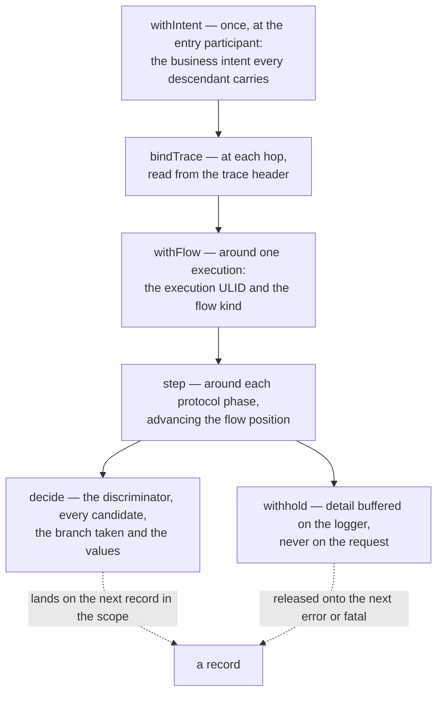

# Semantic Log

How to use `core/semantic-log/`. The option reference, the inspector, the cluster service's routes
and the development commands live in the package's own README, `core/semantic-log/README.md`; this
page covers the calls that change behaviour, what the shipped fixtures demonstrate, and how to run
them.

See the [concept](../concepts/semantic-log.md) for what the library is, the
[flow walkthrough](./semantic-log-flows.md) for the two sequence diagrams annotated leg by leg
against the fixture code, and the [rationale](../rationale/semantic-log.md) for why it is shaped
this way.

## The calls that change behaviour

Everything else — the record id, the template identity, the `r`/`t`/`x`/`p` reference group, the
inline-payload reference, the flow position, the rendering and the local cache — happens inside
`createLogger`. These are the only calls a service has to make:

| Call                                      | When                                        | Effect                                                                                                                                                      |
| ----------------------------------------- | ------------------------------------------- | ----------------------------------------------------------------------------------------------------------------------------------------------------------- |
| `withIntent({name, actor, tenant}, fn)`   | once, at the entry participant              | every descendant record carries the business intent                                                                                                         |
| `bindTrace(traceId, fn)`                  | at each hop, read from `x-semantic-trace`   | links the chain across services; a trace may span more than one flow                                                                                        |
| `withFlow({id, kind}, fn)`                | around one execution                        | binds the flow **execution** id (a caller-minted ULID) and the flow **kind** (a deployment property, and the key drift is observed under)                   |
| `step(name, fn)`                          | around each protocol phase                  | advances the flow position and records the step; a throw marks that step failed. A stalled flow therefore reports the last step it reached, still `running` |
| `decide(discriminator, values, branches)` | wherever a service branches                 | records the discriminator, every candidate in evaluation order, the branch taken and the values, on the **next** record emitted in that scope               |
| `logger.withhold(fields)`                 | for detail held locally and not transmitted | buffered, and released onto the next `error`/`fatal` — "withheld means withheld" until something fails                                                      |

The scopes nest, and what a scope decides is inherited by everything inside it:



Two identities travel between services as headers: `x-semantic-trace` (causal correlation) and
`x-semantic-flow` (the execution ULID). An identity is a **single token**: a header that is absent,
blank, or repeated — which the HTTP parser delivers as one comma-joined string — is not carried, and
the participant falls back or mints instead.

`withhold` buffers on the **logger**, not on the request, so a participant that serves many requests
must withhold on a request-scoped `logger.child({})` or one execution's detail will ride another
execution's failure. The shipped participants do exactly that; a child shares the write tracker, so
a parent's `flush` still drains it.

### What the logger lifts out of the fields object

`logger.info(msg, fields)` — the second argument **is** the field bag. Five keys are lifted into
slots of their own rather than into `record.fields`:

| Key                      | Slot          | Note                                               |
| ------------------------ | ------------- | -------------------------------------------------- |
| `err`                    | `record.err`  | serialized; its message feeds the identity, masked |
| `req`                    | `record.req`  | operation and target, rendered in the header       |
| `res`                    | `record.res`  | status and elapsed time, rendered in the header    |
| `messageId`, `operation` | header fields | greppable, not detail lines                        |

Everything else lands in `record.fields` under its own name, so
`logger.info('payee found', {res: {status: 200}, payeeCurrency: 'EUR'})` stores
`record.fields.payeeCurrency`. Wrapping the bag — `{fields: {payeeCurrency: 'EUR'}}` — stores
`record.fields.fields.payeeCurrency`, which renders as one opaque line and is read by nothing.

## The two flows

Both live in `core/semantic-log/flow/` and run over real HTTP. They are **demonstration fixtures**,
not an implementation of Mojaloop: they are loosely based on its published
[FX](https://docs.mojaloop.io/product/features/fx.html) and
[Interscheme](https://docs.mojaloop.io/product/features/interscheme.html) features, simplified so
that they produce realistic traffic for the library. The sequence diagrams they implement, annotated
leg by leg, are on the [flow walkthrough](./semantic-log-flows.md), which also states what they
simplify, omit and add.

**`single`** — a scheme-internal transfer, four participants. The payer drives the three phases
against the hub, and the hub fans out: the provider answers the quote phase, the payee answers
discovery and settlement.

| Phase       | Call path                           |
| ----------- | ----------------------------------- |
| `discovery` | `payer → hub → payee`               |
| `quote`     | `payer → hub → fxp`, then `→ payee` |
| `transfer`  | `payer → hub → payee`               |

**`inter`** — the cross-border transfer, seven participants. The payer is pointed at the originating
scheme's hub, which crosses to the receiving scheme through the proxy; each scheme holds its **own**
FX provider, so the corridor's rate and the originating scheme's local indication are two different
numbers.

| Phase       | Call path                                                                           |
| ----------- | ----------------------------------------------------------------------------------- |
| `discovery` | `payer → hubA → proxy → hubB → payee`                                               |
| `quote`     | `payer → hubA → {fxpA (local indication), proxy → hubB → fxp}`, then `hubB → payee` |
| `transfer`  | `payer → hubA → proxy → hubB → payee`                                               |

| Participant   | Role                                                                                                                       |
| ------------- | -------------------------------------------------------------------------------------------------------------------------- |
| `payer`       | the entry point: mints both identities when the request carries none, sets the intent, drives discovery → quote → transfer |
| `hub`         | the scheme-internal switch; withholds routing and liquidity detail until a settlement fails                                |
| `hubA`        | the originating scheme's switch: reserves local liquidity, prices locally, then crosses                                    |
| `proxy`       | the cross-border link: chooses the receiving scheme and records _why_                                                      |
| `hubB`        | the receiving scheme's switch                                                                                              |
| `fxp`, `fxpA` | the FX providers (receiving and originating schemes)                                                                       |
| `payee`       | the far end; the origin a cross-service failure must be attributed to                                                      |

Every route computes a `{status, body}` result and sets the status on the fastify reply explicitly.
Returning that object from a handler would answer HTTP 200 with the envelope as the body, so a
downstream hop would see success and a failure could never leave the participant.

## Faults

A fault is a **deployment property** handed to `startFlow`, never a branch a test steers a
participant into. Each exists to make a requirement reachable:

| Fault                    | Configuration            | Requirements made reachable                                                                              |
| ------------------------ | ------------------------ | -------------------------------------------------------------------------------------------------------- |
| F1 payee refuses         | `faults.blockTransfers`  | R15 one incident ranked to the payee; R6a novelty; R10 escalation                                        |
| F2 payer retries         | `faults.retries = 40`    | R6b rate-shift; R12 one identifier for unchanged code                                                    |
| F3 hub rewords a message | `faults.rewordLiquidity` | R6c drift; the reword is a new template, which is what the deploy diff reports as one added and one gone |
| F4 payee stalls          | `faults.stallTransfers`  | R9 last step recorded                                                                                    |
| F5 provider declines     | `faults.declineRate`     | R11 branch rationale                                                                                     |

## Requirement → demonstration

The register is a test, not a table: `test/flow/coverage.test.ts` maps R1–R25 to the tests that
demonstrate each and then **checks the mapping** — the named file must exist and must contain the
named test, so a demonstration that was deleted or renamed fails the suite instead of being
believed.

| Requirement                | Demonstrated by                                                                                             |
| -------------------------- | ----------------------------------------------------------------------------------------------------------- |
| R1 masking                 | `src/fingerprint.test.ts` — two executions differing only in values share a fingerprint                     |
| R2 stack compaction        | `src/stack.test.ts`                                                                                         |
| R3 hash-first identity     | `src/fingerprint.test.ts`, `src/service/provider.test.ts`                                                   |
| R4 registry                | `src/service/registry.test.ts`, `src/service/persistence.test.ts`                                           |
| R5 providers               | `src/service/provider.test.ts`                                                                              |
| R6 three detectors         | `src/service/detectors.test.ts` and the flow faults F1/F2/F3                                                |
| R7 lineage and intent      | `test/flow/happy.test.ts` — one trace across four and across seven participants, with walkable parent links |
| R8 digest                  | `src/service/digest.test.ts`                                                                                |
| R9 flow progress           | `test/flow/faults.test.ts` F4, `test/flow/participant.test.ts`                                              |
| R10 disclosure             | `test/flow/faults.test.ts` F1, `test/flow/guards.test.ts` (the happy path is the control)                   |
| R11 branch rationale       | `test/flow/faults.test.ts` F5, the inter-scheme routing decision                                            |
| R12 stable identity        | `test/flow/faults.test.ts` F2 — 41 executions of unchanged code share one identifier                        |
| R13 exemplars              | `src/service/ingest.test.ts`                                                                                |
| R14 search and deploy diff | `src/service/search.test.ts`                                                                                |
| R15 correlation            | `src/service/incidents.test.ts`, the inter-scheme refusal                                                   |
| R16 facets                 | `src/service/facets.test.ts`                                                                                |
| R17 front door parity      | `test/parity.test.ts` (the §5.1 matrix)                                                                     |
| R18 service-independent    | every flow test runs with no service; `test/offline.test.ts`                                                |
| R19 references             | `src/render.test.ts`, `test/flow/happy.test.ts`                                                             |
| R20 rendered format        | `src/render.test.ts`                                                                                        |
| R21 inspect on demand      | `test/spawn.test.ts`                                                                                        |

## Running a flow by hand

The runner makes the fixtures runnable without a test harness:

```bash
cd core/semantic-log

node flow/run.ts --flow single                  # offline; watch the lines
node flow/run.ts --flow inter                   # seven participants through the proxy
node flow/run.ts --flow single --fault blockTransfers
node flow/run.ts --flow single --fault retries --count 40

node bin/semantic-log-service.ts &              # start the cluster service
node flow/run.ts --flow single --service http://127.0.0.1:9455
curl -s 'http://127.0.0.1:9455/digest?since=0'
curl -s 'http://127.0.0.1:9455/incidents'
```

The runner validates its arguments, so a mistyped fault name exits 2 with the usage line rather than
quietly running a fault-free flow that looks like a successful one. `--service` is a **second**
destination: the records are retained locally either way, and `semantic-log-inspect` resolves a
printed reference afterwards.

## Testing a participant

Two rules, both learned from a defect that stayed green for seven review rounds.

**Assert against an artifact the run produced.** The fixtures read records back out of each
participant's own cache and assert on those, rather than on objects the test built. A test that
constructs the very thing it then verifies cannot fail, and hides a broken mechanism behind a
passing suite.

**A green coverage gate is not evidence that the mechanism works.** The gate proves code _ran_; it
cannot see an untaken side of `??` or `?.`, and it says nothing about whether a value that was
written is ever read. When adding an assertion, re-inject the bug it is meant to catch and confirm
the suite goes red for that reason — and check the test count is right first, because a crashed run
also reads as red.

## Making the framework use it

The runtime selects the implementation once, in `blong-gogo`'s framework config:

```ts
config: {
    default: {
        log: {impl: 'semantic'},
    },
    dev: {
        log: {
            format: 'human',
            cache: {dir: '~/.blong/log-cache', limit: 5000},
            cacache: {cachePath: '~/.blong/log-cache'},
            color: true,
            cluster: {enabled: true},
        },
    },
}
```

- `impl` (`'semantic'` or `'pino'`) — which logger the runtime installs.
- `level` (level name) — records below it are not emitted at all.
- `format` (`'human'` or `'json'`) — one readable line, or one JSON object per record.
- `color` (`boolean`) — ANSI in human format; on by default at a terminal.
- `slowMs` (number) — how long one of the log's own steps may take before it is reported at warn
  level; default 1000. The loader reads the same key for its own steps.
- `cache` (`{dir, limit, slowMs}`) — the store: where records live, how many, and how long the read
  of the retention order may take.
- `cluster.enabled` (`boolean`) — run the service in this process.
- `cluster.port` / `cluster.host` — where it binds; the bound port is read back and reported.

`cluster` is on in `dev`, `integration` and `playwright`, and off in `cli` and `prod`: a development
run can then be drawn from what it just did, and a test run leaves diagrams behind, without a
production process holding a service open.

## Slow steps, and what retention does with them

Every step the framework measures is reported at warn level when it takes longer than `log.slowMs`,
and reported _while_ it runs once it crosses that margin — so a start that spends seconds in one
step says which step, how long it has been there and how far it has got, rather than printing
nothing:

```text
warn  blong operation "start log" still running (1000ms) {"label":"start log","elapsedMs":1000}
warn  blong operation "start log" took 8500ms {"label":"start log","elapsedMs":8500}
```

The steps measured are the loader's — the suite factory, the config, layer discovery, every
component import and start, every child realm — and the store's own read of the retention order,
which is the one that grows with what the directory holds.

## What the store keeps: three tenants, and why the shape is the key

The store holds three kinds of entry, each bounded on its own:

| Tenant     | Key                   | What one entry is                                             | Bound         |
| ---------- | --------------------- | ------------------------------------------------------------- | ------------- |
| `template` | the shape reference   | the newest occurrence of that shape, plus how many there were | `limit`       |
| `record`   | the record's id       | one record, kept beside its shape                             | `recordLimit` |
| `payload`  | the payload reference | one large field value                                         | `limit`       |

The **shape** is the primary one. A shape is what a record repeats — the emitter's fingerprint with
the varying values masked, cut to the shape reference that also rides the record as `refs.template`
— so a retry burst of forty-one attempts is _one_ entry that says it happened forty-one times,
rather than forty-one entries that each say it happened once. Two consequences are the reason it is
worth the change: a shape that every run emits (a startup record) keeps a place at the bound while
the one-off records written after it age out, and the store holds kinds of event instead of traffic,
so the same bound spans far more history.

It also means the entry is **not** the log line, and that is stated rather than hidden. A record
earns an entry of its own, in the second tenant, exactly when folding it into its shape would hide
something worth keeping: it **withheld a payload** (the reference in the line has to resolve against
an occurrence that carried it), or it **carries an error** (the shape of a failure repeats, but the
occurrence is what is being diagnosed). Those two questions live in one place, `src/retention.ts`,
so that the store writing an entry and the renderer printing a link cannot disagree about whether
that link resolves — the record link is printed only when the entry exists.

Nothing that _counts_ occurrences should read the store as its source: the service's rate and
novelty detectors are fed from the stream as a run happens (`serviceUrl`), which is also what a
deployment does. A store that folds is a store, not a ledger.

## The retention order, and the index over it

The store prunes oldest-first, so it needs the order of what it retains. That order is kept in a
secondary index beside the cache — `order.jsonl`, an append-only file, one line per write and one
per removal:

```json
{"id":"9f3a2c1d4e5f","k":"template","n":3}
{"id":"01J8Z9K2M9…","k":"record","s":"9f3a2c1d4e5f"}
{"id":"01JZ...","d":1}
```

Reading that one file is what an open does. The alternative is `cacache`'s own index, which is one
file _per key_, each in a directory of its own: ten thousand retained entries is ten thousand reads
and roughly half a second before a process prints its first line. On this machine the difference was
1.2 s before the index existed and 0.67 s after.

**The order is the position, and a line carries no noise.** A line carries the entry, its tenant and
the two things the next open cannot re-derive — the count a shape stands for (`n`) and the shape a
per-emit record belongs to (`s`) — never the time: an entry's place in the file is when it was last
written, the time is already on stdout, and a cache that kept every varying field would be
accumulating the noise the log design exists to remove.

Three rules keep it honest, and they are what make it safe for several processes at once:

- **Append only.** A small append lands whole, so two writers interleave lines instead of
  overwriting each other. A rewrite is the single-writer assumption the store before this one was
  retired for.
- **Last line for an id wins.** That is what makes a repeated write a _refresh_: the entry takes the
  newest place in the prune order rather than a second one, and the count stays exact — the last
  line for a shape carries the count it had reached. Counted twice it would take the bound over by
  one and evict an entry that should have stayed.
- **`cacache` is the truth**, and the pass that rewrites the file reads it first. That pass is due
  when the interval has elapsed (`sweepIntervalMs`, a day by default) and also when the index has
  grown past a few times what it holds: between passes the file gains a line per write and per
  removal, and a process that logs at all logs faster than it is swept. Either way the truth is read
  first, which is what makes the rewrite complete rather than one process's view of a store other
  processes are writing to. An index that has drifted costs the store time, never correctness.
- **A directory without one is read the expensive way once** and given one: a directory written
  before this index existed, or by a writer that keeps none. That read is also the one that is
  reported when slow, and the one that triggers the repair below.

There is deliberately no pass inside a running process. The file grows only with _activity_ — a
process that is idle appends nothing, measured — so a long-lived one accumulates in proportion to
what it logs, and the next open bounds it: one sequential read, then the rewrite. A pass inside a
running process would have to read the truth to be complete, which is the half second this index
exists to avoid, and paying it periodically to shrink a file that is only as large as the traffic
that earned it is the wrong trade.

- **Retention deletes the index file of a pruned entry** rather than appending a deletion to it,
  because a `cacache` key hashes into a file of its own: a tombstone leaves the file behind, so the
  index grows by one file per entry ever written and any read of the truth reads all of them. A
  directory that still holds such files is repaired when it is read that way — the slow read is
  reported, the dead files are removed in the background, and the retention pass then collects the
  content they orphaned. Raise `log.slowMs` on a machine that is legitimately slow, or set it to `0`
  in the store's config to turn both the report and the repair off.

## Exposing it to a reader

A method is routed by the gateway only when the realm's **`gateway` layer** declares it — the layer,
not the adapter:

```ts
// core/blong-realm/gateway/blong/blongFlowFind.ts
export default validation(
    async ({lib: {type}}) =>
        function blongFlowFind() {
            return {params: type.Object({}), result: type.Unknown()};
        },
);
```

Without that declaration the gateway answers `-32000 Not Found` while the same method resolves
in-process, because an in-process call never touches the gateway's routes. `blong-dev proxy` is the
way to check: it puts plain JSON in front of the MLE-encrypted RPC endpoint.

And the grant lists **called method names**, not handler names:

```yaml
role:
    Admin: blongRealmRead
capability:
    blongRealmRead: >-
        blong.flow.find,blong.flow.get,blong.template.find,
        blong.search.find,blong.digest.get,blong.incident.find
```

`blongFlowFind` in that list matches nothing, because `gateway.authorize` compares
`blong.flow.find`.

## Reading the pages in a spec

- **Pin what you capture.** A page whose content grows every run is only worth capturing once its
  rows are pinned — `searchText` types into the page's filter, the way `browseModel`'s `searchText`
  does.
- **Mask what cannot repeat.** An execution id is minted per execution, a timestamp is a wall clock
  and a home directory names one machine; `mask` hides those cells while the rest of the page stays
  visible.
- **A DataTable's empty state is a row**, so `tbody tr` matches it as readily as a row of data.
  Recognise a data row by a cell it renders, never by excluding the empty state's class or text —
  excluding a thing by what it looks like reads the same whether it is right or wrong.

## Regenerating the diagrams artifact

`core/blong-realm/docs/observedFlows.md` is committed documentation, regenerated only when the flag
says so:

```bash
BLONG_REGENERATE_DIAGRAMS=1 node --run playwright -- test/blong.play.ts --update-snapshots
```

It holds the mermaid the service drew for one real execution of the realm's own read. Both ends of
its arrow are read off the call: the caller is the **logical unit the leg id names** — the
namespace, in blong, never the process that happened to write the record — and the receiver is the
namespace the leg id was aimed at. A monolith therefore draws the units a request travelled through
rather than one participant per process.
