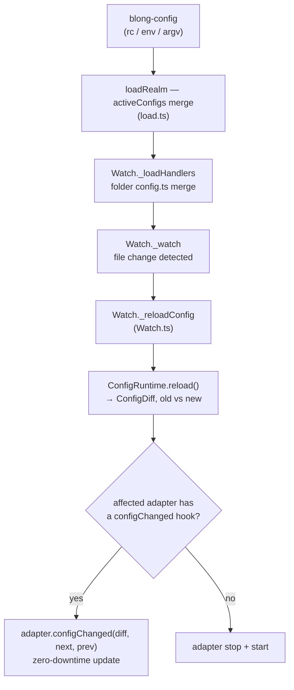

# Configuration Hot Reload

## Problem

Configuration handling in Blong was spread across multiple locations: `blong-config` (external
file/env loading), `blong-gogo/load.ts` (activation merge at startup), and `Watch.ts` (file-change
detection). This fragmentation made it hard to reason about the full config lifecycle and prevented
runtime configuration changes from propagating cleanly to running components such as database
adapters.

Any configuration change — even a trivial one like updating a log level — forced a full process
restart because there was no mechanism to:

- diff the new effective configuration against the old one,
- decide which adapters were affected,
- call an adapter-specific reconfiguration routine.

Restarting dropped all in-flight requests and broke all established connections, which was
particularly disruptive for adapters with expensive connection setup (database pools, TCP sessions)
and made iterative development slow.

## Solution

A unified `ConfigRuntime` class centralizes the full configuration lifecycle:

1. **Centralize** load/merge logic into a single authoritative pipeline.
2. **Expose config via a stable proxy**, so handlers always see the latest values without requiring
   a process restart.
3. **Detect configuration changes** and notify the affected adapters so they can react (e.g.,
   reconnect to a database) rather than forcing a full restart.
4. **Preserve developer experience** — no mandatory new syntax in handlers, minimal new rules to
   learn.

## Design

### Reload flow (simplified)



A configuration change therefore notifies the adapters it affects rather than restarting the
process: `ConfigRuntime.reload()` produces a diff of the old and new effective configuration,
`Watch._reloadConfig` works out which adapters that diff touches, and each of those either handles
the change through its `configChanged` hook — a zero-downtime update, which is what an adapter needs
in order to reconnect without dropping in-flight work — or, having no such hook, is stopped and
started again. The capability this buys is the one the goals above asked for: a database connection
can be re-pointed without a restart.

### Proxy-based config access

A core requirement for hot reload is that handlers **never cache leaf config values at startup**.
Because handler functions are re-evaluated on every call, they naturally avoid caching. However,
startup code (adapters, orchestrators) that destructures config into local constants will miss live
updates.

The design uses a JavaScript `Proxy` to expose configuration as a stable object reference whose
backing data is replaced on reload:

```typescript
// ✅ Safe — leaf value read at call time inside the handler
handler(
    ({config}) =>
        async function myHandler() {
            return {host: config.db.host}; // always fresh
        },
);

// ✅ Safe — intermediate object destructured at startup, leaf read later
adapter(({config}) => {
    const {db} = config; // 'db' is a stable proxy node
    return {
        exec() {
            return connect(db.host, db.port);
        }, // fresh on each call
    };
});

// ❌ Unsafe — leaf value cached at startup, misses hot reload
adapter(({config}) => {
    const host = config.db.host; // primitive cached here
    return {
        exec() {
            return connect(host);
        },
    };
});
```

The rule: **destructure intermediate config objects freely at startup; read leaf (primitive) values
only at call time**.

**What the code does today.** That rule holds for code reading the runtime's own configuration
proxy. It does _not_ hold for the `config` argument a handler or a layer receives:
`mergeLayerConfig` merges that component's slice into a plain object before handing it over, so the
argument is a snapshot taken when the layer was assembled. A handler reading `config.timeout` inside
its function body therefore sees the value from load time however it reached it. A live
handler-facing config is unimplemented; what the reload reaches is the runtime's configuration proxy
and the components that implement the `configChanged` hook.

### ConfigRuntime

A `ConfigRuntime` class owns the full config lifecycle:

| Responsibility | Detail                                                     |
| -------------- | ---------------------------------------------------------- |
| Load           | Combine rc files + env vars + argv + module-level defaults |
| Merge          | Apply intent-ordered merge (`default` + active intents)    |
| Proxy exposure | Return a live proxy object wrapping the merged snapshot    |
| Diff           | Compute a structural diff between old and new snapshots    |
| Subscribe      | A `subscribe()` hook for `(diff, next, prev)` callbacks    |
| Reload         | Re-run load+merge, compute diff, notify subscribers        |

`ConfigRuntime` is created once, at the root of the load, and only when the caller passed its parent
config by name; `Watch` uses it for the reload path. The hook a component implements is
`configChanged(diff, config)` on the port, not `onChange`.

### Proxy contract

The proxy wraps the mutable snapshot object. When config reloads:

1. The new snapshot is built completely, diffed, and installed by a single reference assignment, so
   no reader can observe a half-merged object.
2. Path-based proxies re-read the backing cell on every access, so a reference taken before the
   reload resolves against the new data — which is what the proxy tests assert.
3. A component is notified through `configChanged`, or — with no such hook — its port is stopped and
   started again.

### Adapter config-change hook

Each adapter can optionally implement a `configChanged` lifecycle hook, declared in
`core/blong/types.ts`:

```typescript
// the declaration; `diff` is a flat map of dotted config paths to `{prev, next}` pairs
configChanged?(this: Adapter<T, C>, diff: ConfigDiff, next: unknown, prev?: unknown): Promise<void>;
```

When the reload pipeline finishes diffing, it calls `configChanged` on every adapter whose
configuration namespace was affected. The `diff` argument describes exactly which keys changed.

**Default behaviour** (no hook): if an adapter's config changed and it has no hook,
`Watch._reloadConfig` falls back to stopping the adapter, creating it again through
`registry.createPort()` and starting it — a full adapter stop/start cycle.

**Example — real Knex adapter reconnection** (`core/blong-gogo/src/adapter/server/knex.ts`):

```typescript
async configChanged(diff, next, _prev) {
    // Only rebuild the connection pool when the knex sub-key changed.
    // Changing an unrelated config key (e.g., log level) has no effect.
    const knexChanged = Array.from(diff.keys()).some(
        key => key === this.config.id + '.knex'
            || key.startsWith(this.config.id + '.knex.'),
    );
    if (!knexChanged) return;
    await this.config.context?.queryBuilder?.destroy();
    this.config.knex = (next as Record<string, unknown>)?.[this.config.id]?.['knex'];
    this.config.context = {queryBuilder: Knex(this.config.knex as any) as any};
},
```

The hook only reconstructs the connection pool when the `knex` sub-key changed. Unrelated config
changes do not interrupt existing queries.

### Turning the watcher on

Hot reload is off unless a deployment asks for it. `watch.enabled` defaults to `false`, no intent
turns it on — not `dev`, not `integration` — and the `cli` intent disables it explicitly, so a
command-line run never reloads anything.

```yaml
# .blong_devrc or the suite's own rc file
watch:
    enabled: true
```

Only the files `blong-config` resolved are watched: the shared rc file, the suite's rc file and any
file named with `--config=`. A change to any of them re-runs the merge; a change to a handler or a
layer file takes the ordinary hot-reload path instead.

### Reload pipeline (step by step)

1. **File change detected** (chokidar, existing Watch logic).
2. **Determine change type**: config file vs handler file vs layer file.
3. If a config file changed: a. Re-run `ConfigRuntime.reload()`. b. Compute the diff per adapter
   namespace. c. For each affected adapter: call `configChanged` if present; else stop it and create
   it again. d. Emit structured log event `watch.config.reload`. e. Emit test re-run event (existing
   behaviour).
4. If a handler/layer file changed: existing hot-reload path, unchanged.

### Structured log events

Every reload emits a log entry with the changed keys — and, at present, only those:

```json
{
    "$meta": {"mtid": "event", "method": "watch.config.reload"},
    "changed": ["db.knex.connection.host"]
}
```

`portsAffected` and `action` were planned and are not emitted. The entry is written before the
empty-diff early return, so a reload whose diff is empty still produces one.

## Impact on existing code

| Area                | Impact                                                                                        |
| ------------------- | --------------------------------------------------------------------------------------------- |
| `blong-config`      | No breaking changes; `ConfigRuntime` wraps it                                                 |
| `load.ts`           | Merge orchestration delegates to `ConfigRuntime`                                              |
| `Watch.ts`          | Config-file branch calls `ConfigRuntime.reload()` instead of touching `watch.log.ts`          |
| Adapters (existing) | No change required; fallback is a full adapter restart                                        |
| Adapters (opt-in)   | Can implement `configChanged` for zero-downtime reconfiguration                               |
| Handler code        | No change required, but no handler sees a reloaded value: its `config` argument is a snapshot |

## Developer Rules (Summary)

1. **Do** implement `configChanged` on a component whose connection must survive a reload; without
   it the port is stopped and started, and in-flight requests to it can fail.
2. **Do** read leaf config values inside a function body in the runtime's own code, where the proxy
   is what was passed; in a handler the same read is a snapshot either way.
3. **Don't** expect a reload to reach handler code, or to re-resolve the intent list, or to override
   a `--key=value` from the command line — the intent blocks are frozen at start and argv is
   re-applied last on every merge.
4. **Don't** rely on a reload for a key that no port owns: a log-level change produces a diff and no
   action at all.

**Real example** (`core/config-hot-reload/configReload/server/test/test/testConfigGet.ts`):

```typescript
export default handler(({lib: {group}, handler: {configGet}}) => ({
    testConfigGet: ({name = 'configGet — root proxy access'}, $meta) =>
        group(name)([
            async function greetingComesFromConfig(assert, {$meta}) {
                // config.greeting is a leaf value read at call time — hot-reload safe
                const result = (await configGet({}, $meta)) as {greeting: string};
                assert.equal(
                    result.greeting,
                    'hello',
                    'root proxy: config.greeting should equal the configured default',
                );
            },
        ]),
}));
```

## Future Ideas

1. **Schema-validated config reload** — run TypeBox validation on the new config snapshot before
   applying it. If validation fails, reject the reload and log a structured error, preventing
   invalid configuration from being applied even transiently.

2. **Config change history** — keep a bounded ring buffer of config diffs (name, timestamp, changed
   keys, affected adapters) accessible via the debug REST API. Developers can query what changed and
   when without reading logs or restarting.

3. **Environment-scoped hot reload** — restrict hot reload to the `dev` intent so that `prod`-only
   config keys require an explicit process restart. This prevents accidental production config drift
   when developing against a shared environment.

## Config Access Patterns in Depth

These patterns describe the runtime's configuration proxy, and the caveat below used to be the other
way round. Because the proxy is path-based, a captured sub-object is _not_ stale when the backing
store is replaced; what makes all three patterns equivalent today is the snapshot the handler's
`config` argument already is — see the note under the rule above.

### Pattern 1 — Root proxy access ✅ (always safe)

Hold a reference to the root `config` proxy and traverse down to the leaf **inside** the handler
body on every call.

```typescript
// configGet.ts
export default handler(({config}) => ({
    configGet: () => ({
        // `config.greeting` is evaluated at call time — always current
        greeting: config.greeting,
    }),
}));
```

### Pattern 2 — Partial destructuring ✅ (safe when stopping at object level)

Destructure **down to an intermediate object** in the factory argument. Because the destructured
value is still an object, any leaf read inside the handler body goes through proxy access.

```typescript
// configThemeGet.ts
export default handler(({config: {theme}}) => ({
    configThemeGet: () => ({
        // `theme` is a proxy sub-node (not a scalar).
        // `theme.name` is evaluated at call time — safe.
        themeName: theme.name,
    }),
}));
```

> **Note:** a captured sub-object is a path-based proxy, so it follows a replaced backing store.
> `ConfigRuntime.test.ts` asserts exactly that.

### Pattern 3 — Full destructuring ❌ (never safe for hot-reload values)

```typescript
// ❌ Anti-pattern — do not do this
export default handler(
    ({
        config: {
            theme: {name},
        },
    }) => ({
        configThemeGet: () => ({
            // `name` was captured as 'light' at startup and will never change
            themeName: name,
        }),
    }),
);
```

### Quick-reference table

| Factory argument              | What is captured | Leaf read where?        | Hot-reload safe?                |
| ----------------------------- | ---------------- | ----------------------- | ------------------------------- |
| `({config})`                  | root proxy       | inside handler body     | ✅ always                       |
| `({config: {theme}})`         | sub-object proxy | inside handler body     | ✅ when object mutated in place |
| `({config: {theme: {name}}})` | primitive scalar | at load time (captured) | ❌ never                        |

## PoC Suite

A dedicated PoC suite (`core/config-hot-reload`) exercises the reload path. Its tests assert the
configured defaults rather than a reload: no test in the repository asserts that `configChanged` is
called, that an unrelated key leaves a port alone, or that a handler observes a new value. The
`configReload` realm contains:

- `orchestrator/config/configGet.ts` — side-by-side comparison of root access and partial
  destructuring patterns.
- `server/test/test/testConfigGet.ts` — integration test validating root proxy access.
- `server/test/test/testConfigThemeGet.ts` — integration test specific to partial destructuring
  (`{config: {theme}}` → `theme.name`).
