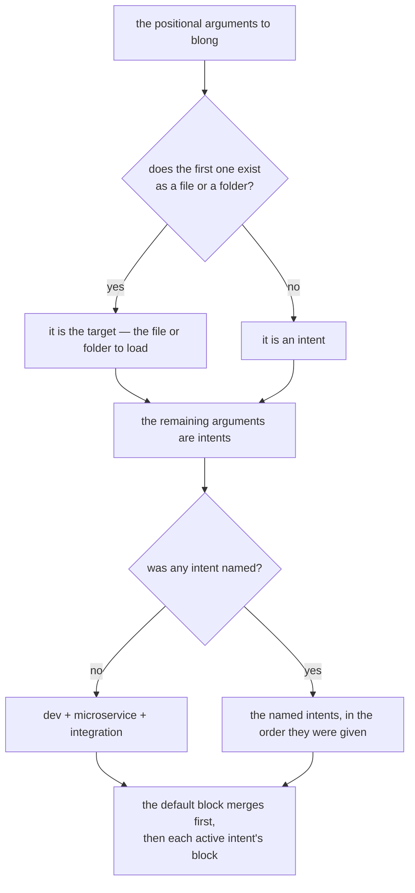

# Intents — CLI Activation System

## Problem

A Blong process needs to play many different roles depending on context:

- **Development server** — hot-reload on every file save, verbose logging, relaxed configuration.
- **Integration-test runner** — watch source files, rerun tests on change, include the test and sim
  layers.
- **Microservice** — activate the layers required to route traffic between realms as separate
  Kubernetes services.
- **Database seeder** — run a one-shot migration or seed script and exit.
- **Debug session** — expose introspection endpoints and include stack traces in error responses.

Early versions addressed this by passing environment names as positional CLI arguments, sometimes
called "activations". The terminology was vague — it was unclear whether an activation was an
environment, a feature flag, a deployment mode, or something else entirely. This ambiguity made it
hard for developers and coding agents to reason about what a given process was doing, and made
documentation inconsistent.

A second problem was that the CLI argument parser (`minimist`) placed all positional arguments into
`_` without distinguishing between a file path and a configuration signal. This caused the first
positional argument — which is optionally a file to load — to be incorrectly forwarded as a
configuration name when it was in fact a path.

Finally, there was no standardised vocabulary for describing the behaviour a specific signal implied
at the process level (e.g. "will this exit?", "will this restart on file changes?").

## Solution

The concept of **intents** replaces "activations" with a clearer model:

- The positional CLI arguments to `blong` are split into an optional **target** (the first argument,
  only when `existsSync` confirms it is a real file or folder) and zero or more **intents** (all
  remaining positional arguments).
- Each intent is a named signal that activates specific configuration blocks, layers, and framework
  features for the lifetime of the process.
- The `default` configuration block is always merged first; each active intent contributes its own
  block on top, in the order they appear on the command line.
- When no intents are provided, the framework defaults to `dev + microservice + integration` — a set
  designed to give an immediate, full-featured development experience without any flags.

The split between the target and the intents is decided by looking at the filesystem, which is what
removed the ambiguity the parser used to have:



### Well-Known Intents and What They Are For

The rows say what each intent is _for_, which is the decision a suite makes; the config keys, layers
and listeners it carries are the reference list in the `.github/skills/blong-intent/SKILL.md`, and
they change more often than the reason for the intent does.

| Intent                 | Purpose                                                        | Process lifetime                                             |
| ---------------------- | -------------------------------------------------------------- | ------------------------------------------------------------ |
| `dev`                  | develop: a developer's defaults for a run somebody is watching | Long-running                                                 |
| `microservice`         | run the realm: the layers that make it work                    | Long-running                                                 |
| `integration`          | test it: the layers a test needs, plus watch/test mode         | Long-running; reruns tests on change; exits when `CI` is set |
| `release`              | be deployed: the one block uat, staging and production share   | Long-running                                                 |
| `k8s`                  | plan a suite: write its deployment tree instead of serving     | **Short-lived** — exits after its work                       |
| `upgrade`              | bring a database up to date: schema sync plus production seeds | **Short-lived** — exits when done                            |
| `cli`                  | answer a command: serve nothing, dispatch in-process           | **Short-lived** — exits after its work                       |
| `playwright`           | hand the lifetime to the runner                                | Long-running until the runner stops it                       |
| `debug`                | ask for detail, where the environment can give it              | No effect on lifetime                                        |
| `server` _(implicit)_  | injected by the server platform                                | —                                                            |
| `browser` _(implicit)_ | injected by the browser platform                               | —                                                            |
| `ci` _(implicit)_      | injected whenever the process runs on CI                       | —                                                            |

### The `microservice` Intent

The `microservice` intent's primary role is to activate the layers required to run a realm as a
self-contained microservice. In practice, the `activation` block for `microservice` in realms
typically contains only layer-activation flags. For example:

```typescript
// server.ts
import {realm} from '@feasibleone/blong';

export default realm(blong => ({
    url: import.meta.url,
    config: {
        microservice: {
            adapter: true,
            orchestrator: true,
        },
    },
}));
```

### The Default Intent Set

Running `blong` with no arguments activates `dev`, `microservice`, and `integration` simultaneously.
This combination is deliberate:

- `dev` applies developer-friendly overrides (verbose logs, relaxed timeouts).
- `microservice` wires up the layers needed for the full inter-realm routing stack, so the
  development server behaves exactly like a deployed microservice.
- `integration` enables the watch/test subsystem, so integration tests rerun automatically whenever
  a source file changes.

The result is a **fast feedback loop**: save a handler file, see the change hot-reloaded, and get
test results within seconds — all without restarting the process or running a separate command. This
directly fulfils the framework's "Minimising development effort" goal by collapsing the write →
reload → test cycle into a single `blong` invocation.

### CLI Parsing Fix

`bin/blong.ts` (and `bin/blong-watch.ts`) now correctly separate the optional target from the intent
list:

```typescript
const [maybeTarget, ...rest] = argv._;
const target = maybeTarget && existsSync(resolve(maybeTarget)) ? maybeTarget : undefined;
const intents = target ? rest : argv._;
```

When no intents are present (plain `blong`), `runServer.ts` falls back to
`DEFAULT_INTENTS = ['microservice', 'integration', 'dev']`, plus `ci` when the process is running on
CI. The first positional is a target only when it names an existing path, and `realm` and `grant`
are reserved first positionals of their own.

### Exclusion Groups

Exclusion groups reject incompatible combinations, for example `dev` with `release`, or
`integration` with `release`. A suite declares them in its own `server()` definition as
`intentsExclusionGroups`, and the loader tests the active intents against every group before it
merges a single source — which is what makes a refusal cost one message and nothing else, and what
keeps the check honest about its own limits: a group no entry declares is not checked, and those two
intents still merge both blocks in the order given, the later one winning where they overlap.

### Platform Intents

`server` and `browser` are added automatically by the framework — they are never passed on the CLI.
They allow layer activation maps to vary configuration per platform without requiring separate
files. `ci` is added the same way whenever the process runs on CI, which is what makes a captured
run behave the same whatever entry point started it.

## See Also

- [Intents concept](../concepts/intents.md) — concise reference for day-to-day use
- **blong-intent** agent skill — step-by-step guide for creating a new intent
