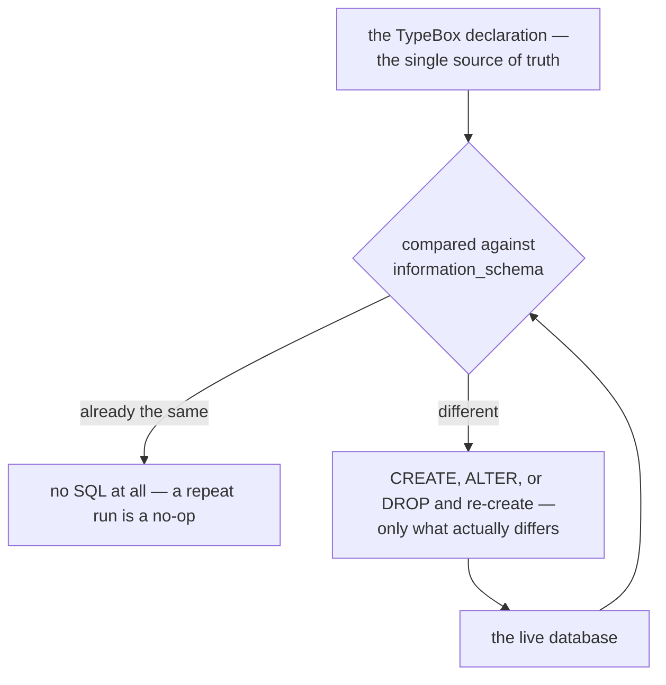
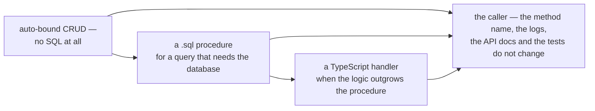

# Rationale: Declarative Schema Management

## The problem

Every application that uses a SQL database has to bridge two worlds: the strongly-typed code world
and the relational schema world. Traditional approaches create friction at that boundary.

**Migration files** (Flyway, Liquibase, TypeORM migrations, Knex migrations) solve schema evolution
but at a cost:

- A separate file must be created for every schema change, even trivial column additions.
- The history of all past migrations must be kept in source control forever.
- Running migrations is a separate deployment step that must be coordinated with application
  rollout.
- In a monorepo with multiple realms, each realm owns its migration history independently, but they
  all land in the same database — ordering conflicts are possible.
- Writing tests that exercise the full schema lifecycle is cumbersome because the test must manage
  migration state explicitly.

**Raw SQL files** committed to the repo sidestep migration history but leave the developer
responsible for detecting drift between the current state and the desired state.

## The solution: declare, don't migrate

The `adapter.knex` schema feature takes a different approach: **the TypeBox schema is the single
source of truth**. When `schema.sync: true` is in the merged configuration, the adapter compares the
desired state (declared in config) against the actual database state and reconciles the difference.
The intended deployment is a dedicated short-lived job so that the structure exists before anything
binds to it, and in that deployment a normal application instance runs no DDL at all — it only binds
synthetic handlers at startup. The `dev` and `upgrade` intents declare their own `schema` block, so
a development run reconciles too: the split is configuration, not a second program. The developer
never writes `CREATE TABLE` or `ALTER TABLE` SQL — they only maintain a TypeBox object definition.
The whole mechanism is a comparison that runs one way, with the declaration as the only thing a
developer edits:



This approach has several advantages:

### 1. The schema stays co-located with the code that uses it

The TypeBox definition lives in the meta layer next to the realm handlers that read from and write
to the table. When a handler changes its expected return shape, the schema file changes too — in the
same commit, in the same code review, for the same business reason.

```text
mysql/meta/type/
├── schema*.ts       ← single source of truth for the table shapes, for example defines schema.item
mysql/adapter/sql/
├── sqlItemAdd.ts    ← uses schema.item (optional override)
└── schema/
    └── sql_item_list_active.sql ← defines a stored procedure, exposed as handler sqlItemListActive
```

### 2. Multiple realms can contribute tables to the same database

Because each realm declares its own tables independently, a suite composed of multiple realms
naturally builds up the full database schema from its parts. There is no central migration registry
to update — the adapter's `ready()` hook handles each realm's tables idempotently.

This makes it straightforward to assemble applications from independently-versioned packages.
`blong-access` declares `access_user` and `access_session`; `blong-party` declares `party_person`
and the rest of the party tables; they land in the same database without coordination overhead. Each
realm names its own tables after itself, which is why the resource graph an access rule points at
and the person a profile describes can be reconciled in one schema without either realm owning the
other's table.

### 3. The database looks like a normal async function call

When a stored procedure is created from a `.sql` file, the adapter automatically discovers it and
wires it as a **synthetic handler** — callable through normal framework dispatch with a camelCase
name, the same way every other handler is called:

```typescript
const activeItems = await handler.sqlItemListActive({}, $meta);
```

From the calling code's perspective there is nothing special about this call. The same mechanism
that routes `userUserAdd` to a TypeScript handler file routes `sqlItemListActive` to the stored
procedure in the database. This means:

- **Mocking is trivial** — in a test that should not hit the database, the test layer registers a
  mock handler named `sqlItemListActive` and the framework routes to it instead.
- **Swapping the implementation** is a configuration change — replace the SQL procedure with a
  TypeScript handler file of the same name and the callers need not change.
- **The vocabulary is consistent** — `sql.item.listActive` is the method name in logs, API docs, and
  test assertions whether the underlying implementation is a stored procedure or a TypeScript
  function.

### 4. Routed CRUD removes boilerplate for common operations

Setting `namespace: 'sql'` and declaring a table answers nine standard methods — `get`, `find`,
`add`, `edit`, `remove`, `merge`, and the bulk `insert`, `update`, `delete` — without any handler
files. This satisfies the RAD principle: the default gives you everything for a straightforward
table, and you override only the operations that need custom logic.

The override mechanism differs from a stored procedure's, and the difference is worth knowing. A
procedure is a synthetic handler attached to the port, so an override delegates with
`super.sqlItemListActive(params, $meta)`. Routed CRUD has no handler object to sit beneath: the call
falls through to the adapter's generic `exec`, so a handler named after the method (`sql.item.add` →
`sqlItemAdd.ts`) takes precedence simply by existing, and delegates the standard work with
`super.exec(params, $meta)` — which is what `realm/blong-access/adapter/db/accessUserEdit.ts` does
when it persists the graph edges a user row implies on top of the ordinary update.

### 5. Diff-only procedure sync avoids unnecessary work

Stored procedures are only `DROP`ped and re-`CREATE`d when the new procedure body differs from what
is already in the database (normalised for whitespace and comments). This means the deployment job
can be run safely multiple times (e.g. during a rolling deploy) without producing spurious DDL on
each invocation.

## Why not ORM?

ORMs (TypeORM, Prisma, Drizzle) solve some of the same problems but introduce their own coupling:

- The application code becomes dependent on the ORM's query builder and lifecycle hooks.
- Switching from one ORM to another (or to raw SQL) requires rewriting all data-access code.
- ORMs often have opinions about handler structure, naming, and transaction management that conflict
  with the Blong handler-first model.

The `adapter.knex` approach uses Knex only as a query builder and thin SQL abstraction. The business
logic handlers call the database via the framework's method dispatch — not via a shared ORM
instance. The schema management layer is a small, replaceable addition on top.

## Why not store procedures for everything?

Stored procedures make sense for:

- Complex queries that benefit from database-side optimisation
- Operations that must be atomic at the DB level without application-level transactions
- Reusable logic shared across multiple application processes

But they are harder to test, version, and refactor than TypeScript code. The framework therefore
supports a **gradual spectrum**: start with auto-bound CRUD (no SQL at all), add `.sql` procedure
files for complex queries, and override with TypeScript handlers when the logic outgrows a
procedure. The calling code does not change — only the backing implementation.

Three implementations, one caller:


