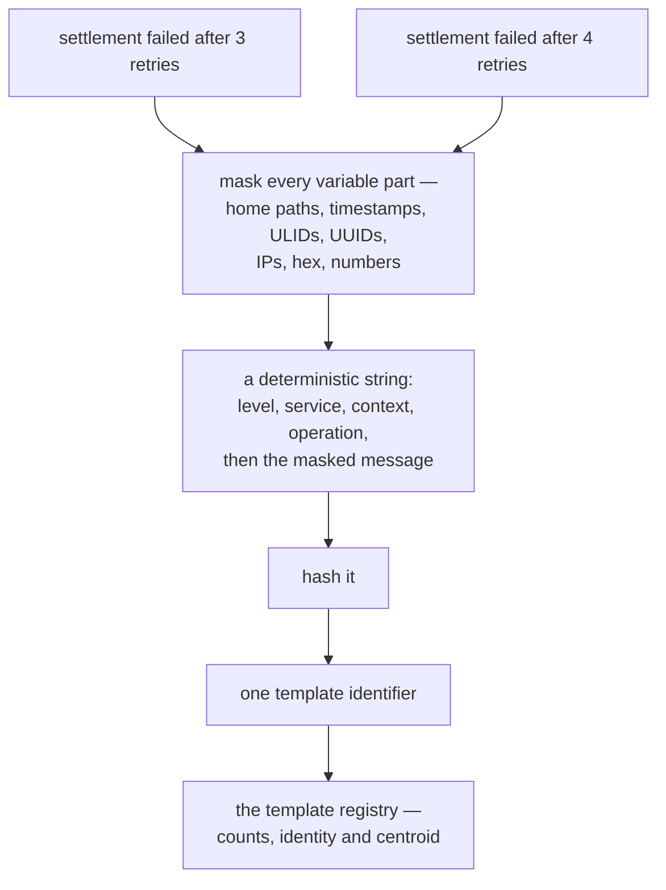

# Semantic Log — Rationale

## The problem

Logging produces text, and text is compared by reading it. That breaks down in three places.

**Identity is text-shaped, so it is unstable.** A message like `settlement failed after 3 retries`
and `settlement failed after 4 retries` are the _same_ code path, but a tool that groups by text
sees two. Alert rules written against such text break whenever a value or a wording changes, so they
are rewritten after every deploy and trusted less each time. An identity that moves when nothing
changed is worse than no identity at all.

**Prose is the only carrier.** Ordinary structured logging gives a line with fields, but nothing
joins a line in one service to the line it caused in the next, and nothing records _why_ a branch
was taken. Reconstructing a cross-service failure means correlating timestamps by hand and reading
source to work out which `if` fired.

**"Something changed" is one undifferentiated alarm.** A never-before-seen message, a familiar
message at ten times its usual rate, and a familiar flow whose shape has moved are three different
problems with three different responses. Collapsing them into one score throws away exactly the
information an operator needs, and a first-seen message at startup drowns the rate change that
actually matters.

## The approach

**Derive identity from structure.** Mask the variable parts of a message and hash the masked form.
Two occurrences of the same path then share one template identifier, and a template identifier
survives a redeploy of unchanged code — so alert rules and stored references outlive a release. A
genuinely reworded message _is_ a new template, which is not a failure of the scheme but the point:
it is what makes a deploy visible as one template added and one gone.

**Carry two identities, because they answer different questions.** A **trace** is causal correlation
and one trace may span more than one flow; a **flow execution** id is a caller-minted ULID naming
exactly one execution and is propagated unchanged. The flow **kind** is a deployment property — the
stable name of a recurring process — and it is the key drift is observed under, because a template's
embedding is keyed by the fingerprint that identifies it and therefore cannot move, while a flow's
shape can.

**Record the reason, not only the outcome.** A branch records the discriminator consulted, every
candidate in evaluation order, the one taken, and the values it was decided on, so the decision can
be replayed from the record without reading source.

**Hold detail until it is wanted.** A service holds routing and liquidity detail a call did not need
to transmit, and releases it only onto a record that reports a failure, so the happy path stays
quiet and the failure carries what it takes to explain itself.

**Keep the service optional.** Readable output, references and the local cache need no service; the
service adds grouping, anomaly detection and search. A run with no service configured is complete,
not degraded.

## The vocabulary

The design was argued first as a manifesto of eleven pillars, and several of its coined terms are
better than the ones that grew back during implementation. They are kept, and used throughout these
pages:

| Coined term                               | What it names                                                                                                                           | Shipped as                                                                       |
| ----------------------------------------- | --------------------------------------------------------------------------------------------------------------------------------------- | -------------------------------------------------------------------------------- |
| **Dynamic progressive disclosure**        | Verbose detail is held un-serialised and released only when something goes wrong, so verbosity is decoupled from a static level setting | `withhold` / escalation over the ring buffer — **R10**                           |
| **Causal graph lineage**                  | Records are a graph rather than a timeline: each one points at the record that caused it                                                | `refs.parent`, walked by the service's lineage index — **R7**                    |
| **Intent-driven telemetry**               | A business intent declared at an entry point is inherited by every descendant record                                                    | `withIntent`, and the `intent` on each record — **R7**                           |
| **Rule evaluation trace**                 | A branch records the discriminator, every candidate in evaluation order, and the one taken                                              | `decide` and `Decision` — **R11**                                                |
| **Progress point**                        | A moment worth keeping in the logic — a checkpoint that reports, a branch that explains                                                 | `point` / `region`, one record facet — **R26**                                   |
| **Observed alternative**                  | A candidate branch is recorded although it never ran, so a decision is drawn with every branch it weighed                               | `alt` / `else` in the diagram — **R27**                                          |
| **Polymorphic telemetry facets**          | One recorded fact supports several audiences, projected when read rather than written per audience                                      | `GET /templates/:ref?facet=…` — **R16**                                          |
| **Template registry as the durable unit** | The group outlives the individual: counts, identity and centroid are kept; records are only evidence                                    | the registry — **R4**, **R12**                                                   |
| **Claim check** (from integration design) | Evidence is fetched on demand rather than carried in every record                                                                       | exemplar retention — **R13**                                                     |
| **Change stream / agent interface**       | A machine consumer reads deltas — what changed — instead of a log tail                                                                  | the digest — **R8**                                                              |
| **Template-level embedding space**        | Behaviour is compared in an embedding space, but the unit embedded is the **template**, never the record                                | embeddings on cache miss only — **R3**, **R14**                                  |
| **Cross-intent contamination**            | One intent degrading another, diagnosed as a collision of behaviours rather than a static threshold                                     | the actionable core is incident correlation — **R15**; the geometry is not built |

These terms were coined in that manifesto and nowhere else, so this table is their durable home —
the requirement ids it cites are the contract, and the pillars that named something that was **not**
built are recorded below rather than dropped.

## Trade-offs

The §5.1 parity matrix is audited by a test in the package rather than restated here, so the
verdicts cannot drift from the code: `core/semantic-log/test/parity.test.ts` records every
capability of the logging libraries this replaces, each marked **kept**, **kept-extended**,
**replaced** or **dropped**, with the tests that cover it and the user-visible consequence of
anything not kept as-is. Where a row is not fully delivered, the row says so rather than weakening
the claim.

Two trade-offs are worth stating plainly, because they shape what the system can promise. The
registry is bounded and templates can be evicted, so identity is stable for what is retained rather
than forever. And rate-shift scoring is a baseline of _completed_ windows, so a burst cannot be
recognised until a baseline exists: the window has to match the timescale of the traffic being
scored, and a caller whose activity happens in milliseconds must configure one that does.

A third rule shapes what the wire carries, and it is the rule progressive disclosure already
follows: **names travel, values stay local.** A checkpoint's name and a branch's discriminator,
candidates and chosen outcome are structural — they identify the code path — so they are transmitted
and drawn. A checkpoint's `data` and a branch's evaluated `values` are payload, so they stay in the
record on disk and in the local cache, where the inspector can show them and a caller's `redact`
patterns can withhold them (R1, R10).

A fourth trade-off is about the store's own cost, and it was learned the hard way. The retention
store keeps the order it prunes by in memory, loaded from `cacache`'s index once at open, because
the alternative — reading the whole index per write — makes one log line cost the size of the store.
That pass is therefore the one step whose cost grows with everything the directory has ever held,
and two rules follow from it. A pruned entry **deletes its index file** instead of appending a
deletion to it: a `cacache` key hashes into a file of its own, so tombstoning leaves one file per
entry ever written whatever the bound does — 450 000 of them here, and a nine-second pause before
the first line a process prints. And a step that crosses the margin in `log.slowMs` is reported at
warn level, because a delay as long as a start is otherwise indistinguishable from work: the warning
names the step, its elapsed time and how far it had got. A directory that still carries those files
is repaired when it is opened, so the slow index scan is reported and then answers itself.

Two **non-goals** are worth stating just as plainly, because they are what a reader is most likely
to expect and not get:

- **This is not a log store, and not an audit log of record.** Retention — the local cache, the
  exemplars, the digest — exists so that a reference resolves and a real occurrence can be
  inspected. Unbounded historical retention is a dropped row of the parity matrix, and a compliance
  archive is a different system with different durability requirements.
- **This is not a metrics or tracing backend.** There is no span UI and no sampling. The causal
  trace id is consumed and carried because lineage needs it; it is not a replacement for the tracing
  system that produced it.

## The cache is storage, not a log

What the on-disk cache is _for_ explains most of the decisions above, and it is worth stating
directly because it caps what any retention mechanism there has to guarantee. It serves four
purposes, and none of them is "keep everything":

- **Progressive disclosure.** stdout and stderr carry the line a person needs; everything bulky —
  the configuration an adapter reports at startup, a payload, a full record — is retained and
  reachable by reference instead of printed. The console stays readable and the context a reader or
  an agent has to hold stays small.
- **No echo of what the console said.** The cache does not need to repeat it. A varying field such
  as the time or the pid is not worth retaining twice, and the retention order does not need it
  either: the order of an append-only index _is_ the order. (The pino transport's `stripKeys` say
  the same thing for the entries themselves.)
- **Per-call sequence diagrams.** What one call did, drawn from the records it left.
- **Per-flow sequence diagrams.** The same, aggregated across the branches a test walked through.

The last two are also delivery artifacts: they are committed and diffed in review, which is why they
must be reproducible from a run rather than typed by hand.

So the cache is a **storage mechanism** for inspection — through the CLI or the API, including after
the process that wrote it has exited — and it will grow more tenants than it has today: more
diagrams, performance metrics, and whatever else turns out to be worth reading back. That is what
the design has to leave room for, and it is the honest reading of two of its choices: a bounded
store with a per-surface limit rather than one number, and an index that carries each entry's kind,
so another surface is additive rather than a redesign.

The first of those tenants has since arrived, and the shape is what it turned out to be about: the
store holds one entry per **shape** — one per kind of record rather than one per occurrence — and
keeps a record under its own id beside that shape exactly when folding it away would hide something
worth reading (a withheld payload, an error). Two things follow from it. The bound measures kinds of
event rather than traffic, which is what lets a shape every run emits keep its place while one-off
records age out. And the store is no longer the record of _how often_ something happened; anything
that counts occurrences — the service's rate and novelty detectors — is fed from the stream as the
run makes it, which is what a deployment does anyway and what the count on a shape's entry exists to
keep honest.

Retention may still need more than one mechanism, and that remains a decision for when the next
tenant asks for it rather than machinery to build in advance.

Today the cache is a development and CI concern: it is what makes a failing test's records readable
afterwards and what the diagrams are drawn from. Nothing about it is production-only, though, and
some of it — the digest, the incidents — is the kind of thing a UAT or production deployment could
ask for later.

## Ideas deliberately not built

More was proposed than was built. Each idea below is recorded with **why it is out**, so a future
contributor meets the decision instead of re-deriving it, and with the gate that would have to be
passed before it earned its place. Nothing here is a promise.

| Idea                                                                                                                                               | Why it is not built                                                                                                                    | Reconsider when                                                                  |
| -------------------------------------------------------------------------------------------------------------------------------------------------- | -------------------------------------------------------------------------------------------------------------------------------------- | -------------------------------------------------------------------------------- |
| **Speculative execution logging** — pre-log the branches a flow might take                                                                         | Very high complexity for unproven value; the runtime would have to know the branch set in advance                                      | A flow whose branches are enumerable and whose latency budget justifies the cost |
| **Self-healing loops** — the logger maps a regression and hot-swaps a route                                                                        | Requires a control plane that can change a running system; explicitly outside a telemetry library's scope                              | The caller has a control plane and wants telemetry to drive it                   |
| **Continuous time-travel replay** — re-inject a captured state delta into a sandbox                                                                | Needs a captured state delta at a boundary, which needs the lineage to be complete and the code to be pure                             | R7 is stable _and_ a flow is deterministic enough to replay                      |
| **Intent “gravity”** — intents warp a vector space                                                                                                 | A metaphor without actionable semantics: no operator decision changes because two clusters moved relatively                            | An operator action follows from it and nothing simpler does                      |
| **Literal spatial collisions between intent clusters**                                                                                             | The part that changes operator behaviour is temporal correlation in causal neighbours, which is what R15 implements instead            | Cross-service correlation proves insufficient                                    |
| **Topology morph engine, temporal slider, cost/vector lenses**                                                                                     | A dashboard needs the data model to be settled first, and the deliverable here is a model plus a query surface                         | R4, R7 and R8 are stable and a UI has an owner                                   |
| **Per-edge coordinate graph payload for agents**                                                                                                   | R8 delivers what an agent needs at a fraction of the cost; coordinates change on every observation and are cheap to recompute          | A consumer needs the geometry itself rather than the change                      |
| **Regex-free search as primary storage**                                                                                                           | Template-level embeddings already answer the search question; per-record embedding would make cost scale with traffic                  | Template counts outgrow in-memory centroids                                      |
| **Vector-database persistence** — an external vector store behind the registry                                                                     | In-memory centroids are enough at the scale reached; a database adds an operational dependency for nothing yet                         | Template count exceeds what one process holds                                    |
| **Budget-aware verbosity** — a byte budget per service, anomalies bypassing it                                                                     | R10 already decouples verbosity from a static level; a budget adds a second mechanism to tune                                          | Withholding proves insufficient for cost control                                 |
| **Cluster hygiene** — merge, split, age and relabel clusters                                                                                       | Needs long-lived clusters and an operator feedback path; the registry is bounded and a wrong grouping is visible through exemplars     | Clusters are long-lived enough to need curation                                  |
| **Operator feedback** — mark a template benign, suppress its alerts                                                                                | Needs R4 and R6 to settle first, and a UI to collect the verdict                                                                       | R6 alerts are trusted enough to need muting                                      |
| **Implicit flow identity** — derive the execution id from async context, or from OpenTelemetry                                                     | Out of scope by ruling: the caller mints the ULID and propagates it. But nothing in the design may **preclude** this                   | Callers can rely on an ambient correlation context                               |
| ~~**Architecture and flow diagrams derived from test runs**~~ **— moved out of this list**: the diagrams are generated from a real run (R23 below) | Enabled by the lineage and flow data, but a diagram artefact has no consumer yet; a Mermaid or DOT file per run is the cheap increment | A run's topology is worth reviewing automatically                                |

## Open questions

Questions the design left open. They are recorded here rather than answered, because answering them
by assumption is how a contract gets a rule nobody chose.

- **Default rendering when stdout is not a terminal.** The readable rendering or the
  machine-readable one? Today the caller chooses `format`; nothing detects a pipe (R18, R20).
- **Cache partitioning.** The local cache is per user and shared by every service on one host.
  Should it be per service, and must a reference stay resolvable from another user's session (R21)?
- **Retention bounds per environment.** How many records, for how long, and what a reference reports
  once its record has been pruned — “no longer retained”, kept distinct from “unknown reference”
  (R19, R21). The CLI reports the distinction only when told with `--expect-retained`, because the
  store genuinely cannot derive it.
- **Detector calibration.** The shipped rate detector scores a baseline of five completed 60-second
  windows, so a caller whose activity happens in milliseconds cannot fill that baseline. The window
  has to match the traffic it scores, and only the caller knows what that is.
- **Embedding model and dimension** for the default offline provider, and how a remote provider
  stays dimension-compatible with a centroid already stored (R5).
- **Multi-tenancy.** Is intent or tenant a partition key for the registry and its centroids (R7)?
- **Privacy posture.** Masked values are never transmitted — confirm that no raw value may ever be
  hashed or retained (R1, R10).
- **Identity on every path.** A record written for an in-process test group, and one written before
  a request reaches its route, carries no flow yet (T-104/T-105). A diagram is drawn from
  executions, so until that is closed the renderer, the route and the realm's pages can only be
  shown to be individually correct — nothing observed ever reaches them, and the honest assertion is
  that they are empty. Closing it means the entry points the runtime knows become the entry points
  the emitter is told about.

## Requirements

The v1 contract, which the rest of this page exists to justify. Each is mapped to the test that
demonstrates it, and that mapping is itself checked — the named file must exist and must contain the
named test: `core/semantic-log/test/flow/coverage.test.ts`. Adding a requirement without a
demonstration fails there rather than going unnoticed.

|     | Requirement                                                                                                                                                                                                                                                                                                                                                                                                                                                                                                          |
| --- | -------------------------------------------------------------------------------------------------------------------------------------------------------------------------------------------------------------------------------------------------------------------------------------------------------------------------------------------------------------------------------------------------------------------------------------------------------------------------------------------------------------------- |
| R1  | **Normalization and masking.** Every record is reduced to a structural form before comparison: timestamps, UUIDs, IPs, hex, bare numbers and line/column numbers become stable tokens.                                                                                                                                                                                                                                                                                                                               |
| R2  | **Hybrid serialization and stack compaction.** The comparable form is a deterministic prefixed string — categorical fields as fixed positions, free text as masked payload — and stacks compact to the error type plus the first two frames with line and column stripped.                                                                                                                                                                                                                                           |
| R3  | **Hash-first fingerprinting.** Identity is an exact fingerprint of the normalized form; embeddings are invoked only on a cache miss or on ambiguity.                                                                                                                                                                                                                                                                                                                                                                 |
| R4  | **Registry as the durable artifact.** Templates are stored — signature, fingerprint, counts, first and last seen, centroid, alert state, exemplar references — and individual records are retained only as evidence.                                                                                                                                                                                                                                                                                                 |
| R5  | **Pluggable embedding provider.** One interface, with a local offline model for development and CI and a remote OpenAI-compatible endpoint for production.                                                                                                                                                                                                                                                                                                                                                           |
| R6  | **Three detectors plus drift.** Novelty (a fingerprint never seen), rate-shift (a known template at an anomalous rate against its own baseline) and drift (a known **flow** whose shape has moved beyond epsilon from its centroid), reported separately; centroids update by moving average.                                                                                                                                                                                                                        |
| R7  | **Causal lineage and intent.** Every record carries a causal parent link and an immutable intent descriptor (name, actor, tenant, priority) that propagates across async boundaries, threads, network calls and transactions.                                                                                                                                                                                                                                                                                        |
| R8  | **`LogDigest` change stream.** A subscription surface that emits deltas rather than records: new and retired templates, typed anomalies, correlations, exemplar references.                                                                                                                                                                                                                                                                                                                                          |
| R9  | **Flow and step progress.** Multi-step logic declares a flow context — caller-minted ULID, stable kind, step name and index, status — attached to records and advanced as the flow moves.                                                                                                                                                                                                                                                                                                                            |
| R10 | **Progressive disclosure.** Detail that is not transmitted is retained locally and flushed retroactively when an escalation condition occurs, decoupling verbosity from static level configuration.                                                                                                                                                                                                                                                                                                                  |
| R11 | **Branch rationale.** Where logic branches, the record captures the discriminator, every candidate considered, the condition and its result, and the branch taken — deterministically, not as prose.                                                                                                                                                                                                                                                                                                                 |
| R12 | **Signature-stable identity across deploys.** Template identifiers are stable when the template is unchanged and when it changes only in masked variables.                                                                                                                                                                                                                                                                                                                                                           |
| R13 | **Exemplar retention.** Each template keeps a bounded number of exemplars; full detail is fetched from on-disk storage on demand rather than kept resident.                                                                                                                                                                                                                                                                                                                                                          |
| R14 | **Semantic search and deploy diff.** Search operates over templates, not records; given two ranges or revisions, the system reports templates added, removed and drifted.                                                                                                                                                                                                                                                                                                                                            |
| R15 | **Cross-service incident correlation.** Temporally correlated anomalies in causal neighbours group into one incident with a ranked root-cause candidate.                                                                                                                                                                                                                                                                                                                                                             |
| R16 | **Facet projection at read time.** One recorded fact supports operational, diagnostic and compliance views, projected when read.                                                                                                                                                                                                                                                                                                                                                                                     |
| R17 | **Front door with capability parity.** The library _is_ the logging API; every capability of the libraries it replaces is kept, replaced with a stated superset, or dropped with a stated user-visible consequence.                                                                                                                                                                                                                                                                                                  |
| R18 | **Readable stdout, independent of the service.** A readable record always reaches stdout (errors also to stderr), with a machine-readable mode; output never depends on the service being reachable.                                                                                                                                                                                                                                                                                                                 |
| R19 | **Cross-reference identifiers.** Every record carries compact references minted locally at emit time — record, template, trace, and an inline **payload** reference for a value too large to inline — resolvable on demand through the CLI, and rendered as a clickable hyperlink where the terminal supports it. The kind set is extensible rather than fixed. The HTTP half of the payload kind is **not** delivered: the service holds no payload store, and the §5.1 row says so rather than claiming otherwise. |
| R20 | **Standard rendered format.** At minimum timestamp, level, service, logger context, message id, operation, message and the shape reference (the record's own, where the record was kept in its own right), plus structured request and response blocks when the record provides them. Field order and styling are free; presence and structure are not.                                                                                                                                                              |
| R21 | **Inspect on demand.** Every record is retained in a bounded local cache keyed by its **shape** — one entry per kind of record, plus a per-emit entry where folding would hide detail — whether or not the service received it, so a reference resolves after the emitting process has exited. The CLI resolves one reference directly, compactly, in detail or machine-readably.                                                                                                                                    |

A caveat on R20's "at minimum": the service name and the version are on every record, but they reach
the human line — and the base fields (`pid`, `hostname`) are collected at all — only when `details`
is asked for. The reader of a pod's log already knows which pod it came from, so repeating it on
every line costs width and buys nothing; the inspector asks for them, because printing one record on
demand is the case where they are the point.

## Requirements added by the leg-identity task

R22–R25 were added after v1 shipped, when naming calls in the code turned out to be the missing half
of the cross-reference R19 promises. They are in their own table so the v1 contract above stays the
contract that was agreed; the authoritative mapping of every requirement to its demonstration is
`core/semantic-log/test/flow/coverage.test.ts`, which checks the mapping rather than asserting it.

|     | Requirement                                                                                                                                                                                                                                                                                                                   |
| --- | ----------------------------------------------------------------------------------------------------------------------------------------------------------------------------------------------------------------------------------------------------------------------------------------------------------------------------- |
| R22 | **Call identity as a library capability.** A call is one id the source declares, the receiver the caller expects, and its position in the execution; the propagation contract is the library's, so an application uses it without adopting the demo fixture. Both ends log, and an attempt appears even when nothing answers. |
| R23 | **Diagrams of what was observed.** The service draws a sequence diagram of a flow **kind** (the union of its calls) and of one **execution**, from records rather than from a document; the fixture's observed shapes are published as a generated artifact and embedded in the docs, with a test comparing the two.          |
| R24 | **Semantic search over records.** Search ranks templates **and** retained records, each result carrying a discriminator; records are embedded when they are retained, under their own key, so the cost follows the retention bound rather than the traffic.                                                                   |
| R25 | **A real local embedding provider.** The optional in-process model is declared, reachable from the environment (`SEMANTIC_LOG_EMBEDDING=local`) and asserted where it is real: it is held to the documented model and width, and it must find a record by a paraphrase that shares no words with it.                          |

Three existing rows are amended by the same task:

- **R5** — the pluggable provider keeps two roles rather than one. CI and production stay on the
  deterministic offline provider (a ranking assertion written against a downloaded model is an
  assertion about a machine), and a dev session opts into the real local model. The limitation of
  the offline provider is asserted rather than assumed: it hashes text, so it cannot answer a
  paraphrase — measured on the same corpus the real-model test uses, where it ranks the payment
  _last_ and the model ranks it _first_.
- **R9** — the flow-id retrieval gap is closed, and the row's `partial` verdict with it: the flow
  ledger indexes records by execution id, publishes the retained executions, and the routes expose
  one kind's union and one execution's diagram.
- **R14** — search no longer stops at templates: a retained record is rank-able by what it says, and
  the deploy diff is unchanged (it remains a template-and-kind read).

## Requirements added by the progress-point task

R26 and R27 were added when the checkpoint — a milestone a handler reports — and the branch
rationale of R11 turned out to be one thing seen twice. A checkpoint and a decision are both
**progress points**: moments in the logic that explain the shape a flow took. So they are one record
facet and one ambient channel, and they differ only in what they select and how they are drawn.

|     | Requirement                                                                                                                                                                                                                                                                                                                                                                                                                                                     |
| --- | --------------------------------------------------------------------------------------------------------------------------------------------------------------------------------------------------------------------------------------------------------------------------------------------------------------------------------------------------------------------------------------------------------------------------------------------------------------- |
| R26 | **Progress points.** A point is a milestone that reports (`checkpoint(name, data)`); a region is a branch that explains (`decide(discriminator, values, branches)`) and carries the position it applied at, so the records it spans are attributable to it. Both are announced from `$meta` (which owns the invocation's captured list) or from `lib` (for code that has no `$meta`), and neither is a second mechanism: one ambient channel, one record facet. |
| R27 | **Progress points in the diagram.** A point is drawn as a note over the participant that reported it; a region is drawn as an `alt`/`else`/`end` block spanning the calls the chosen branch made, with **every** candidate drawn — the unchosen ones empty, because a branch that was weighed and refused is what a reader of a failure most needs to see. A region with no alternatives stays a band over the participants.                                    |

One existing row is amended by the same task, and the amendment is what makes it whole:

- **R11** — the record carries the rationale _and_ the position the branch applied at. Candidates
  were already recorded in evaluation order; what was missing was where the taken branch's work
  happened, without which the rationale explains a call rather than the run. The unchosen branches
  are drawn although they never ran, which is exactly what a diagram drawn only from what happened
  would have omitted.

Three capabilities fall out of the same mechanism rather than needing one of their own. The **phase
band** a multi-step flow already draws is a region with no alternatives; a checkpoint is a natural
escalation point for progressive disclosure (R10); and the captured list a test asserts on is the
same list the diagram is drawn from, so a test and a diagram cannot disagree about what happened. A
fourth is consequential but deliberately **not** claimed: region names are not yet part of the shape
drift compares, so a deploy that adds a branch is not yet a drift observation (R6).

## The flows in `core/semantic-log/flow/` are the end-to-end evidence: real HTTP between real

processes, with every assertion made against records read back out of each participant's own cache
rather than against objects a test built.

- What it is: [concept](../concepts/semantic-log.md)
- How to use it: [pattern guide](../patterns/semantic-log.md)
