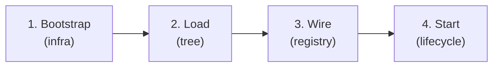
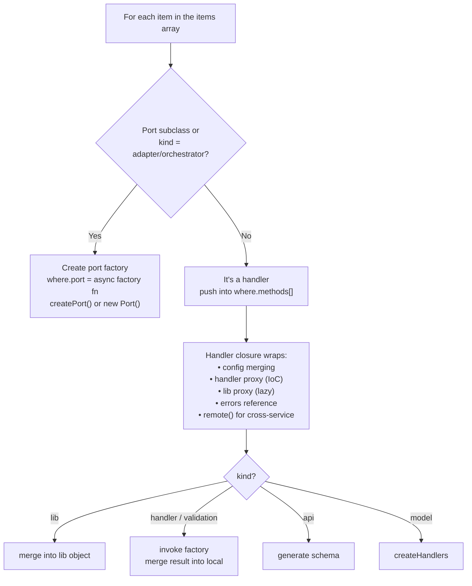
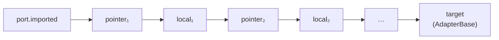

# Wiring Pipeline — How blong-gogo Loads and Wires the Framework

Note: the word "port" comes from legacy terminology. In Blong, the preferred
terms are "adapters" and "orchestrators".

## Problem

`core/blong-gogo/` is responsible for wiring a declarative suite definition —
a tree of `server()` / `browser()` / `realm()` factory calls — into a running
system where adapters, orchestrators, gateways, and handlers are all connected
without any direct imports between them. This wiring goal creates several
hard constraints that must all be satisfied simultaneously:

1. **Zero-import IoC.** Handler files must never import each other. Yet every
   handler needs to call other handlers. Something has to resolve those calls
   at runtime without the caller knowing where the callee lives.

2. **Transparent monolith / microservice topology.** The same handler code must
   work whether the callee is in the same process or on a different Kubernetes
   pod. The routing layer must be invisible to handler authors.

3. **Hot reload without connection loss.** Handler code changes during
   development must be applied immediately without restarting the process,
   dropping in-flight requests, or breaking established database / TCP
   connections.

4. **Environment-scoped activation.** Layers and handler groups must
   automatically activate or deactivate based on the runtime environment
   (`dev`, `test`, `integration`, `prod`). Authors should not have to register
   or unregister them manually.

5. **Platform independence.** The same recursive loader must run in Node.js
   (server) and in the browser, driving both server-side adapters and
   browser-side components.

6. **Hierarchical, live configuration.** Config flows from suite to realm to
   layer to handler, merges environment overrides, and must stay live so that
   a config-file change can reconfigure a running adapter without a full
   process restart.

## Solution

Each constraint above is addressed by a specific design rule in the pipeline:

1. **No direct imports between handlers** — the `handler` proxy in
   `handlerProxy.ts` is the IoC mechanism. `runtime.handler.someMethod` is
   a `Proxy` over the local registry that resolves at call time, not at import
   time. Replacing the underlying function pointer (on hot reload) automatically
   updates all callers.

2. **Kind annotations drive all classification** — every factory is tagged with
   a `Symbol` (`Kind`): `handler`, `lib`, `validation`, `api`, `model`,
   `adapter`, `orchestrator`, `solution`, `server`, `browser`. The loader
   (`layerProxy.ts`) reads the tag and decides whether to create a port factory,
   a method closure, a schema, or a handler chain — no branching on file names
   or folder position.

3. **Layers are activation boundaries** — a layer groups handlers, adapters,
   and orchestrators that activate or deactivate together. Well-known folder
   names (`error`, `adapter`, `orchestrator`, `gateway`, `sim`, `test`,
   `backend`, `component`) are auto-discovered and activated per their default
   environment without any registration call.

4. **Dual registration (Local + RpcServer)** — every method is registered in
   both `Local` (in-process) and `RpcServer` (inter-process). `Remote` checks
   `Local` first; a network hop only happens when the target is genuinely on a
   different pod. Handler code is topology-agnostic.

5. **Prototype-chain wiring enables hot reload** — instead of copying handler
   functions into a flat map, they are chained via `Object.setPrototypeOf()`.
   Replacing one link (`Object.setPrototypeOf(pointer, newLocal)`) propagates
   to every existing reference immediately. The chain also allows a handler to
   call the "super" implementation when overriding a method from another group.

6. **Adapters own their handlers** — handler groups are *attached* to adapters
   via `imports` patterns at start time. The adapter's `imported` prototype
   chain is the lookup scope for `findHandler()`. This scoping is what makes
   the same handler name resolvable differently in different adapters.

7. **The gateway builds routes from validations** — validation schemas collected
   from all `.validation` and `.api` groups are used to generate Fastify routes
   with JSON Schema validation and OpenAPI documentation. No route is registered
   manually.

8. **Platform API injection** — `loadServer.ts` and `loadBrowser.ts` inject
   platform-specific implementations of filesystem operations (fs, path,
   chokidar vs. browser stubs). The recursive loader `load.ts` is
   platform-agnostic and runs identically in both environments.

9. **Realms never import `blong-gogo`** — the `AdapterBase` class and all other
   runtime objects are provided through the dependency injection mechanism.
   This is what makes the same realm code deployable as a monolith or as an
   independent microservice without modification.

10. **Configuration is hierarchical and live** — config keys match the
    hierarchy `{realmName}.{layerGroup}`. All merge operations go through
    `ConfigRuntime`, which exposes the merged result as a stable proxy object.
    Handlers always read the current value at call time; adapters can implement
    a `configChanged` hook for zero-downtime reconfiguration when a config file
    changes.

---

## Overview

The wiring pipeline converts a declarative suite definition (a tree of
`server()` / `browser()` / `realm()` factories) into a running system of
connected adapters, orchestrators, gateways, and handlers. The pipeline has
four major phases:



| Phase | Entry point | What happens |
|-------|-------------|-------------|
| **Bootstrap** | `loadServer.ts` / `loadBrowser.ts` → `load.ts` | Platform API is bound, the root factory is invoked, and infrastructure objects (Log, Error, Registry, Gateway, Remote, Local, Watch, etc.) are instantiated in dependency order. |
| **Load** | `loadRealm()` in `load.ts` | The suite tree is walked recursively. Realms and layers are discovered, imported, and classified. Handler files are read and grouped. |
| **Wire** | `layerProxy.ts` + `Realm.ts` → `Registry` | Handlers are wrapped in closures and registered as methods/ports in the Registry. Adapters and orchestrators are wrapped in port factories. The handler proxy is assembled. |
| **Start** | `Registry.start()` | Ports are created and started. Handler groups are attached to ports. Validations are collected. Gateway routes are built. Watch mode is initialized. |

---

## Component Inventory

### Entry Points

| File | Role |
|------|------|
| `loadServer.ts` | Binds Node.js platform APIs (fs, path, chokidar) and calls `load()`. |
| `loadBrowser.ts` | Binds browser-compatible stubs and calls `load()`. |
| `load.ts` (`loadRealm()`) | The universal recursive loader. Platform-agnostic. |
| `runServer.ts` | CLI entry: parses arguments, calls `loadServer()`, starts the registry. |

### Infrastructure Objects (instantiated during Bootstrap)

These are instantiated once at the root of the tree. Each is a class that
extends `Internal` (from `@feasibleone/blong/types`). Their instantiation order
is determined by an explicit dependency declaration in `load.ts`, not a
hard-coded array position.

| Class | Interface | Responsibility |
|-------|-----------|----------------|
| `Log` / `BrowserLog` | `ILog` | Structured logging (pino on server, console in browser). |
| `ErrorFactory` | `IErrorFactory` | Typed error registration and creation. |
| `Local` | `ILocal` | In-process method registry — a flat `{namespace.name → {method}}` map used for local dispatch. |
| `Registry` | `IRegistry` | Central wiring hub. Owns the `ports` map (port factories), `methods` map (handler groups), and `modules` map (sub-registries). Drives the lifecycle. |
| `Remote` / `RpcClient` | `IRemote` | Method dispatch: finds local handler or sends over RPC. Owns retry, timeout, caching, and `$meta` enforcement. |
| `RpcServer` | `IRpcServer` | Internal Fastify server for inter-service JSON-RPC communication. |
| `Gateway` | `IGateway` | External-facing Fastify server. Builds routes from collected validations. Handles JWT auth, MLE, CORS. |
| `Watch` | `IWatch` | File system watcher. Handles hot-reload of handlers, layers, config, and test re-runs. |
| `ResolutionLocal` / `ResolutionDiscovery` | `IResolution` | Service discovery (localhost in dev, mDNS in prod). |
| `ApiSchema` | `IApiSchema` | Loads/generates OpenAPI schemas and TypeBox validation schemas. |
| `ConfigRuntime` | `IConfigRuntime` | Owns the full config lifecycle: load, merge, proxy exposure, diff, and change notification. |

### Structural Files

| File | Role |
|------|------|
| `Realm.ts` | Receives loaded items and registers them in the Registry as ports (adapters/orchestrators) or method groups (handlers). |
| `layerProxy.ts` | A `Proxy` object returned by `layerProxy()` that intercepts property access during the layer-loading phase to classify and wrap items (handlers → method closures, adapters/orchestrators → port factories). |
| `handlerProxy.ts` | Creates the handler proxy — the IoC mechanism that resolves handler calls at runtime through the registry (local or remote). Also provides `createHandlerClosure`. |
| `AdapterBase.ts` | The runtime-provided base class for all adapters. Exposed through the runtime injection mechanism — realms never import it directly. Custom adapters extend it via prototype-chain inheritance. |
| `loop.ts` | The adapter request/response loop — handles send/receive conversion chains. |
| `lib.ts` | Utility functions: `methodId()`, `methodParts()`, `camelToSentence()`, `parseAnnotatedKey()`. |
| `folderAnalysis.ts` | Analyzes a directory to classify it as suite/realm/handlers. Used for auto-wrapping loose handlers. |

### Sub-Realms (internal packages loaded as children)

| Package folder | Role |
|----------------|------|
| `adapter/server.ts` | Declares available server adapter types (tcp, http, knex, etc.) as a realm. |
| `adapter/browser.ts` | Declares available browser adapter types. |
| `orchestrator/index.ts` | Declares available orchestrator types (dispatch, openapi, etc.). |
| `codec/server.ts` / `codec/browser.ts` | Declares codec implementations. |

---

## Loading Pipeline in Detail

### Phase 1 — Bootstrap

`loadServer.ts` (or `loadBrowser.ts`) calls `load.ts:loadRealm()` with:

- A **platform API** object (filesystem operations, `watch`, `hrtime`, etc.)
- The root **suite factory** (a function annotated with `server()` or `browser()`)
- A **name** (suite name) and **parentConfig** (config file name or object)
- **configNames** (active environment names like `['dev']`, `['integration']`)

On the first call (`api` is undefined), `loadRealm()`:

1. Creates the initial config skeleton with defaults for all infrastructure keys.
2. Builds the infrastructure **items** list with explicit dependency declarations
   and performs a topological sort. Items are instantiated in the resolved order
   (Log, ApiSchema, Port, Error, Watch, Local, Remote/RpcClient, RpcServer,
   Gateway, RestFs, Registry, Codec, Orchestrator, Adapter).
3. Invokes the root factory to get the module config (`mod`), which contains
   `{url, pkg, children, config}`.
4. Merges all config sources through `ConfigRuntime`: module defaults,
   environment overrides, external config files.

### Phase 2 — Tree Walking

The merged `children` list is iterated. Each child can be:

| Child type | Detection | Action |
|------------|-----------|--------|
| **String** (path) | `typeof item === 'string'` | Resolved to a file. On server/browser kind: builds an import function that loads the layer entry file (`{kind}.ts`). On solution kind: scans the directory for sub-items. |
| **Function** (factory) | Infrastructure items or realm factories | Imported dynamically. |
| **Glob object** (browser) | `item.isDirectory` or `item.isFile` present | Loaded via `watch.load()` which calls `_loadHandlers()` or single-file load. |

After import, each item is classified:

| Item kind | How detected | How processed |
|-----------|--------------|---------------|
| **Internal subclass** or `[System]` marker | `fn.prototype instanceof Internal \|\| fn[System]` | Instantiated as an infrastructure object: `api[itemName] = new fn(config, api)` |
| **solution / server / browser** | `kind(fn)` returns `'solution'`, `'server'`, `'browser'` | Recursive call to `loadRealm()`. Result registered via `realm.addModule()`. |
| **Anything else** (layer function) | Default case | Invoked with a `layerProxy(...)`. Result registered via `realm.addLayer()`. |

**Auto-discovery:** Before iterating children, `discoverLayerFolders()` scans
the realm directory for well-known folder names (`error`, `adapter`,
`orchestrator`, `gateway`, `sim`, `test`, `backend`, `component`, etc.) that
are not already listed. These are added as extra children with their default
activation config.

### Phase 3 — layerProxy (The Core Wiring Mechanism)

`layerProxy()` returns a `Proxy` object. When a layer function executes
`api.someGroup(items, namespace, source)`, the proxy's `get` trap activates.

The trap classifies each item in `items`:



**The handler proxy** (`runtime.handler` / `layerApi.handler`) lives in
`handlerProxy.ts` and is a `Proxy` over the `local` object. When a handler
accesses `handler.someMethod`, the proxy:

1. Checks if the port `handles()` the method name → calls the port's local
   `findHandler()`.
2. Otherwise → calls `remote(methodName)` to create a remote dispatch function.

This is how handlers call other handlers without importing them. The proxy
resolves at call-time, enabling hot-reload: replacing the underlying function
pointer automatically updates all callers.

**Annotation syntax:** When `handlerName` starts with `@`, `parseAnnotatedKey()`
extracts annotations that modify `$meta` or merge config before delegating to
the resolved handler.

### Phase 3b — Realm.addLayer()

After `layerProxy` has been applied, `Realm.addLayer()` receives the `.result`
object and iterates its entries:

- If an entry has a `.port` property → registered in `registry.ports` as
  `{realmName}.{layerGroupName}`.
- If an entry has a `.methods` property → registered in `registry.methods`
  as `{realmName}.{groupName}`.

### Phase 4 — Start

`Registry.start()` orchestrates the startup sequence:

```
1.  for each port factory → registry.createPort(id)
      │
      ├── Calls the port factory with the API object
      │   (error, gateway, remote, rpcServer, local, registry)
      │
      └── Returns the port instance (AdapterBase subclass or custom adapter)

2.  for each created port → port.start()
      │
      ├── api.attachHandlers(this, this.config.imports)
      │   │
      │   └── Registry._attachHandlers() → _matchMethods()
      │       Walks registry.methods, creates handler instances,
      │       chains them via prototype chain into port.imported
      │
      ├── Registers request/publish endpoints in Local + RpcServer
      │   (skipping RpcServer for localOnly methods)
      │
      └── Fires 'start' event on the port

3.  for each created port → port.ready()

4.  Collect validations from all '.validation' and '.api' method groups
    → gateway.route(validations, pkg)

5.  resolution.start(), rpcServer.start(), remote.start(), gateway.start()

6.  watch.start() — begins file watching and test runner
```

---

## Handler Attachment Pipeline

This is the most complex mechanism and deserves special attention.

### Registry._attachHandlers()

Called by `AdapterBase.start()` via `api.attachHandlers(target, patterns)`.

`_matchMethods('extend', patterns, port, callback)` iterates all registered
methods and matches them against the adapter's `imports` patterns.

For each match, `_createHandlers(handlers, port)` executes the handler
closures:

- Each closure receives `{lib, local, literals, gateway, remote, port, attachCheckpoint, apiSchema}`.
- The closure populates `local` with named functions and `literals` with
  prototype-chained objects.

The results are chained via `Object.setPrototypeOf()` into the port's
`imported` object — creating a prototype chain where later-loaded handler
groups shadow earlier ones.

### Prototype Chain Wiring



Each `pointer` is an empty object. When a handler group is hot-reloaded,
only the `Object.setPrototypeOf(pointer, newLocal)` call is needed — all
existing references to `port.imported` automatically see the new handlers.

The prototype chain is a deliberate design choice: it allows a handler to
call the "super" implementation when overriding a method attached by a
different handler group. Do not replace with a flat Map.

### Hot Reload

When Watch detects a file change, `_reloadUnit()` provides a unified
abstraction: re-import → re-wrap via `layerProxy` → replace in registry →
signal test re-run. The three paths (handler folder, single handler file, layer
file) share this abstraction with slight variations:

- **Handler folder change:** `Watch._loadHandlers()` re-imports the folder,
  calls `layerProxy()` to re-wrap, then `registry.replaceHandlers()` which
  re-executes `_createHandlers()` and re-links the prototype chain.
- **Single handler file change:** Same flow but for one file.
- **Layer file change:** `Watch._reloadUnit()` re-imports the file, calls
  `layerProxy()`, replaces the port in `registry.ports`, calls `createPort()`,
  `start()`, `ready()`.
- **Config file change:** `Watch._reloadConfig()` uses `ConfigRuntime.reload()`
  to compute the diff, then for each affected port either calls
  `port.configChanged()` (zero-downtime) or stop+start.

After any change, `emit('test')` triggers test re-runs.

---

## Load Pipeline Diagram

The diagram below shows the complete flow inside `loadRealm()` — from the
initial call through infrastructure bootstrap, tree walking, layer wiring, and
final startup.

```mermaid
flowchart TD
    LS["loadServer.ts / loadBrowser.ts\n(bind platform API)"]
    LS --> LR["loadRealm(platformApi, def, name, parentConfig, configNames)"]

    LR --> DK{"Detect kind\nof root factory"}
    DK -- "solution (realm passed directly)" --> AW["Auto-wrap in minimal\nserver() or browser() suite\n+ discoverRealmTestMethods()\nthen recurse loadRealm()"]
    DK -- "server | browser" --> BOOT

    subgraph BOOT["Phase 1 — Bootstrap (first call only)"]
        direction TB
        B1["Create initial config skeleton"]
        B2["Build InfraItem list with\nexplicit dep declarations\n(topoSort)"]
        B3["Instantiate infra objects in order:\nlog → apiSchema → port → error\n→ watch → local → resolution\n→ remote/rpcClient → rpcServer*\n→ gateway* → restFs* → registry\n→ codec → orchestrator → adapter\n(* server only)"]
        B4["Invoke root factory → mod\n{url, pkg, children, config}"]
        B5["Merge configs via ConfigRuntime:\nmodule defaults + env overrides\n+ external config files\n+ CLI positional args as config names"]
        B1 --> B2 --> B3 --> B4 --> B5
    end

    BOOT --> DISC

    subgraph DISC["Phase 2 — Auto-discover layer folders"]
        direction TB
        D1["discoverLayerFolders():\nscan realm dir for WELL_KNOWN_LAYERS\nnot already in mod.children"]
        D2["WELL_KNOWN_LAYERS:\napi, init, server/init, server/api,\nbrowser/init, browser/api,\nerror, sim, adapter, orchestrator,\ngateway, browser, backend,\ncomponent, action, actions,\ntest, server/test, browser/test"]
        D3["Each discovered folder appended\nto children with default activation"]
        D1 --> D2 --> D3
    end

    DISC --> WALK

    subgraph WALK["Phase 2 (cont.) — Tree Walking"]
        direction TB
        W1{"For each child\n(system items + mod.children\n+ extra discovered children)"}
        W1 -- "Internal subclass\nor [System] marker" --> W2["api[name] = new Ctor(config, api)\nawait api[name].init()"]
        W1 -- "kind = solution/server/browser" --> W3["loadRealm() recursively\nrealm.addModule(name, subRegistry)"]
        W1 -- "plain layer function" --> W4["fn(layerProxy(...))\nrealm.addLayer(name, result)"]
        W1 -- "test/ folder\n(server, no testDispatch.ts,\nno layer.server.ts)" --> W5["Auto-provision synthetic\norchestrator.dispatch as\ntestDispatch"]
    end

    WALK --> LP

    subgraph LP["Phase 3 — layerProxy (Core Wiring)"]
        direction TB
        LP1["layerProxy(error, apiSchema, port,\nmergedConfig, configRuntime)"]
        LP1 --> LP2{"For each item\nin group"}
        LP2 -- "Port subclass or\nkind=adapter/orchestrator" --> LP3["where.port =\nasync port factory"]
        LP2 -- "handler / lib /\nvalidation / api / model" --> LP4["Handler closure:\nwraps config, handler proxy,\nlib proxy, errors, remote"]
        LP3 --> LP5["realm.addLayer()\n→ registry.ports"]
        LP4 --> LP5B["realm.addLayer()\n→ registry.methods"]
    end

    LP --> START

    subgraph START["Phase 4 — Registry.start()"]
        direction TB
        S1["for each port factory\n→ createPort(id)\n→ port.init() / port.start()"]
        S2["attachHandlers:\n_matchMethods('extend', imports, port)\n→ _createHandlers()\n→ Object.setPrototypeOf() chain"]
        S3["for each port\n→ port.ready()"]
        S4["Collect validations from\n.validation and .api groups\n→ gateway.route(validations, pkg)"]
        S5["resolution.start()\nrpcServer.start()\nremote.start()\ngateway.start()"]
        S6["watch.start()\n(file watchers + test runner)"]
        S1 --> S2 --> S3 --> S4 --> S5 --> S6
    end
```



## Data Flow Diagram

```
Suite factory
  │
  ├── invoke → mod = { url, pkg, children, config }
  │
  ├── merge configs via ConfigRuntime (module defaults + env + external files)
  │
  ├── instantiate infra objects in topological order
  │   (Log, Error, Local, Registry, Remote, Gateway, Watch, ...)
  │
  ├── for each child:
  │     │
  │     ├── [Internal subclass] → instantiate, store in api[name]
  │     │
  │     ├── [solution/server/browser] → loadRealm() recursively
  │     │     └── realm.addModule(name, subRegistry)
  │     │
  │     └── [layer function] → fn(layerProxy(...))
  │           │
  │           └── layerProxy classifies items:
  │                 ├── adapter/orchestrator → port factory → realm.addLayer() → registry.ports
  │                 └── handlers → method closures → realm.addLayer() → registry.methods
  │
  └── Registry.start()
        │
        ├── for each port: createPort() → port.init() → port.start()
        │     └── attachHandlers: match methods → _createHandlers → prototype chain
        │
        ├── for each port: port.ready()
        │
        ├── collect validations → gateway.route()
        │
        ├── resolution.start(), rpcServer.start(), remote.start(), gateway.start()
        │
        └── watch.start()
```

---

## Design Decisions

The following questions were raised during analysis of the pipeline and answered
by the framework author. They are recorded here as rationale for the current design.

1. **`layerProxy` dual-path for adapters:** Port subclasses follow one path
   (`new Port(portApi)`) while `kind === 'adapter'/'orchestrator'` follow
   another (`createPort(handlers, ...)`). The `Port` class in `Port.ts` is a
   thin stub for legacy compatibility and may be removed in a future cleanup.

2. **Dual registration (Local + RpcServer):** Every method is registered in
   both `Local` and `RpcServer`. The `localOnly` config map (added in the
   simplification refactoring) prepares for selective exposure — methods marked
   `localOnly` are excluded from `RpcServer` registration. Full per-method
   access control is a future concern.

3. **Prototype-chain wiring vs. Map:** The prototype chain is a deliberate
   design choice. It allows a handler to call the "super" implementation when
   overriding a method from a different handler group via attaching. A flat Map
   would lose this capability.

4. **`_matchMethods` `extend` vs `merge`:** The `extend` mode is necessary.
   Some adapters/orchestrators are singletons in a dedicated realm that import
   handler groups from other realms (e.g. the db adapter on the server and the
   http adapter in the browser). `extend` chains all matching groups into one
   prototype chain; `merge` creates them individually.

5. **`folderAnalysis.ts` and `discoverRealmTestMethods()`:** Both exist to
   support "bare handler" mode (running a folder of handlers without a suite).
   This is a core concern expected to be extended — not a CLI helper.

6. **Infrastructure instantiation order:** Dependency declarations
   (`deps: ['log', 'error', ...]`) are used in `load.ts` to derive the correct
   instantiation order via topological sort, replacing the previous hard-coded
   array position.

---

## Future Ideas

1. **Full per-method selective RpcServer registration** — the `localOnly` map
   provides the groundwork; a follow-up could allow method-level access control
   annotations (`@localOnly`, `@private`) that are processed at registration
   time to selectively expose methods in RpcServer vs Local only.

2. **Remove `Port.ts`** — the `Port` class is a thin stub for legacy `ut-port`
   compatibility. Once all remaining legacy adapters are migrated to
   `AdapterBase`, `Port.ts` can be deleted and the dual port-factory path in
   `layerProxy.ts` simplified to a single path.

3. **Type-safe config namespaces** — TypeScript template-literal types could
   derive the expected config shape for each namespace from the adapter's config
   type parameter, providing compile-time checking that config keys are valid.

4. **Schema-validated config reload** — run TypeBox validation on the new
   config snapshot before applying it. If validation fails, reject the reload
   and log a structured error, preventing invalid configuration from being
   applied even transiently.
