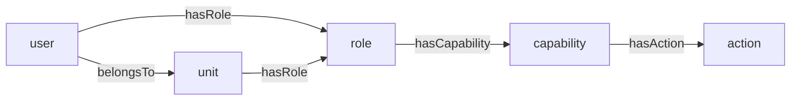

# @feasibleone/blong-access

RBAC access control realm — user profiles, credentials, actions, capabilities, roles, policies,
access flows, sessions, and audit logging. Authentication and authorization are built on top of the
resource graph from `@feasibleone/blong-core`: named entities (user, role, capability, action, …)
are resources, relationships are `core.triple` edges, and effective permissions are materialized
into `core.path`.

## Data model

| Table               | PK                                          | Notes                                                                                                                                      |
| ------------------- | ------------------------------------------- | ------------------------------------------------------------------------------------------------------------------------------------------ |
| `access.user`       | `userId` → `core.resource.resourceId`       | emailAddress, isActive                                                                                                                     |
| `access.credential` | `credentialId` (increment)                  | FK userId; credentialType (`password`/`clientSecret`), secret hash + salt, `credentialParamsJSON` (function + params), isActive, expiresAt |
| `access.role`       | `roleId` → `core.resource.resourceId`       | roleBit (0–1023, unique; **allocated**, never reused), description                                                                         |
| `access.capability` | `capabilityId` → `core.resource.resourceId` | bundles actions into a "what"                                                                                                              |
| `access.action`     | `actionId` → `core.resource.resourceId`     | name = the semantic triple / RPC method                                                                                                    |
| `access.policy`     | `policyId` → `core.resource.resourceId`     | credential complexity/lifecycle rules + `credentialParamsJSON` (dictated credential-function params; the `password` policy is seeded)      |
| `access.flow`       | `flowId` → `core.resource.resourceId`       | MFA step definitions, e.g. `["password","totp"]` (schema-only)                                                                             |
| `access.access`     | `accessId` → `core.resource.resourceId`     | time/IP/geo rule configuration (schema-only)                                                                                               |
| `access.session`    | `sessionId` (uid)                           | active sessions — created on login, refreshed on renewal, revoked on logout                                                                |
| `access.audit`      | `auditId` (ulid)                            | append-only access-control + auth event log                                                                                                |

Access tables are registered with order numbers 200–210. `user`/`role`/`capability`/`action` are
fully wired end-to-end; `policy` is wired for credential params (a seeded `password` policy dictates
hashing params); `flow`/`access` exist as schema entities; `session` and `audit` are fully wired,
and the record-level ACL lives in `access.acl` (held by an `aclId` ULID; principal + action +
target + effect) — see [Record-level ACL](#record-level-acl) and
[Sessions, refresh tokens & audit](#sessions-refresh-tokens--audit).

## The RBAC model

Authorization is a chain stored in the graph:



Two SQL views (`access_effectiveRolePath`, `access_effectiveActionPath`) and one stored procedure
(`access_pathRefresh`) materialize reachability into `core.path` for the path types
`access.effectiveRole` and `access.effectiveAction`. Authorization queries read the materialized
`core.path` (a single indexed lookup on `originId` + `pathType`), never recursive `core.triple`
traversal. After any RBAC graph mutation, run `CALL access_pathRefresh()` (the
`accessAuthorizationMerge` handler does this automatically).

## Record-level ACL

RBAC decides _which methods_ a caller may invoke; the ACL narrows **which records** those methods
may act on. It is opt-in per table:

```ts
// realm/<realm>/meta/db/db.ts
'party.person': {
    order: 300,
    resource: {nameColumn: 'lastName'},
    acl: {mode: 'scoped', scopes: ['belongsTo'], addScope: {predicate: 'belongsTo'}},
},
```

`mode` is `none` (the default — nothing changes), `scoped` (grants may target a scope) or `explicit`
(only per-record grants count). `access_acl` holds one rule per row:

- **`principalId`** — a user, role, unit or capability resource, so a rule can sit at any level of
  the hierarchy
- **`actionId`** — the `access_action` resource, i.e. the guarded method
- **`targetKind`** — `record` (one row) or `scope` (every record linked to that scope)
- **`targetId`** — the guarded record, or the scope node
- **`effect`** — `allow` / `deny`; **a deny always wins**

Two halves make up the effective ACL:

- **implicit** — a `<principal> --hasScope--> <scope>` graph edge: the organizational grant. It
  covers every action the principal holds and every record linked to the scope through the table's
  declared `scopes` predicates, **including the records of descendant scopes** (a grant on a parent
  unit covers its branches through the materialized `access.effectiveScope` path).
- **explicit** — `access_acl` rules targeting a scope or a single record. This is also how an
  implicitly enabled record is explicitly forbidden (`effect: 'deny'`).

The effective ACL is evaluated in SQL at query time — there is no materialized effective table, so a
change takes effect immediately. A record that participates in **no** scope has nothing to be
narrowed against and falls back to RBAC alone, which is what makes opting a table in safe for
existing data.

Two scope shapes are supported. The usual one follows a predicate **from the record**
(`party.person --belongsTo--> unit`), so a grant on a parent unit covers the record through the
materialized `access.effectiveScope` path. When the hierarchy points the other way —
`party.unit --belongsTo--> party.organization`, so an organization owns units but carries no scope
edge of its own — the table declares `selfScope: true`: the record **is** its own scope, admitted by
a grant naming the organization (or a parent organization), with no RBAC fallback, so an
organization no grant covers is invisible. That is how the organization level of the authorization
hierarchy is enforced.

### Enforcement

- **`get`** — refused as `acl.notFound` (404), so a denied record does not leak existence
- **`edit` / `remove`** — refused as `acl.denied` (403)
- **`find`** — filtered **before paging**, so the total only counts readable records
- **`add`** — checked against the scope named by `addScope` → `acl.scopeDenied` (403)
- **`{subject}.dropdown.list`** — filtered for guarded tables (a dropdown is a read path)
- **`access.session.verify`** — the action is re-validated live and the record (or scope) is
  required for guarded entities

Realm handlers reach the same SQL through the port (`await this.aclCheck({recordId}, $meta)`) or use
`access.acl.assert`, which throws the realm error family. Critical writes pass the record to the
session gate:

```typescript
await handler.accessSessionVerify(
    {action: 'party.person.edit', record: {entity: 'party.person', recordId}},
    $meta,
); // throws acl.notPermitted / acl.denied / acl.notFound
```

The refusals are `acl.denied` (403), `acl.scopeDenied` (403), `acl.notFound` (404) and
`acl.notPermitted` (403, with `reason: 'actionNotPermitted' | 'recordRequired' | 'scopeRequired'`).

### Managing the ACL

- **ACL Rules** (`access.acl` model) — the explicit rules: principal, action, target kind, target,
  effect, active. `access.acl.find` / `.get` join the names for display; the write handlers drop
  them again so they never reach the table.
- **Role / User → Access tab** — a read-only _Effective Access_ table fed by `access.acl.list`:
  every applicable rule with its `source` (`explicit` / `implicit`) and the principal it came from,
  so an administrator sees _why_ something is allowed.
- **Seeds** — `accessAuthorizationMerge` accepts `scope:` (implicit `hasScope` grants: `role`,
  `user`, `scope`, `scopeType`) and `acl:` (explicit rules: `principal`, `principalType`, `action`,
  `target`, `targetType`, `targetKind`, `effect`) alongside its RBAC blocks.

## Authentication flow

1. `login.token.create` (from `@feasibleone/blong-login`) → `access.credential.check`
2. `accessCredentialCheck` looks up the user by `core_resource.resourceName` +
   `typeAlias = 'access.user'`, verifies the secret using the credential's **stored parameters** —
   `credentialParamsJSON` (a `*JSON` column auto-parsed by the knex adapter) holds the function and
   its params, e.g.
   `{"function":"hash","algorithm":"pbkdf2","iterations":100000,"keyLength":64,"digest":"sha512"}`
   (falling back to the `config.password` defaults declared in the realm's `server.ts` when not
   stored) — and reads effective role bits + action names from `core.path`
3. Role bits (0–1023) are packed into a base64 `permissionMap` bitmask carried in the JWT `per`
   claim
4. The gateway `authorize` hook (`access.authorization.list`) decodes `per`, maps role bits →
   capabilities → actions, and returns allowed methodIds (lowercase, dots stripped). A `preHandler`
   compares the requested method's methodId against the list — missing → **403**, no/invalid token →
   **401**.

### Google identity exchange (OIDC & OAuth)

The Google login (`access.identity.check`, via `login.token.exchange`) supports **both** flows
**simultaneously**, selected per call with the `flow` parameter of `login.token.exchange` (omit it
for the default):

- **`oidc` (default)** — fetches the provider's `.well-known/openid-configuration` to resolve the
  real `token_endpoint`, `jwks_uri`, and `userinfo_endpoint`, then enriches the profile from the
  UserInfo endpoint. Falls back to the raw endpoints if discovery is unavailable.
- **`oauth`** — plain OAuth: uses `${baseUrl}/token` + `${baseUrl}/certs` directly (no discovery, no
  UserInfo).

```ts
// OIDC flow (default)
await loginTokenExchange({provider: 'google', code}, $meta);
// plain OAuth flow
await loginTokenExchange({provider: 'google', code, flow: 'oauth'}, $meta);
```

Configure the discovery location with `google.discoveryUrl` (defaults to
`${baseUrl}/.well-known/openid-configuration`). The helpers live in `adapter/db/oidc.ts`; the mock
(`sim/google/mockServer.ts`) serves both the OIDC and OAuth endpoints.

The browser does **not** need front-end google configuration: at "Continue with Google" click it
fetches the client-safe subset from `access.google.get` (a public `auth: false` endpoint — provider
base URL, resolved authorization endpoint, and client id; the client secret never leaves the server)
and uses that to build the authorize URL. The returned `authorizationEndpoint` is resolved from OIDC
discovery when not configured explicitly, so both the mock (`http://localhost:9082/authorize`) and
real Google (`https://accounts.google.com/o/oauth2/v2/auth`) work with zero front-end setup.

## Sessions, refresh tokens & audit

Access tokens are **stateless JWTs** verified at the gateway without a DB hit — the fast path for
every request. On top of that, a **DB-backed session** adds revocation, inactivity enforcement,
renewal and audit.

- **Session lifecycle** — `login.token.create` records a session (`access.session.create`); the JWT
  `ses` claim carries its real id; `tokenHash` = SHA-256 of the current refresh token. Renewal
  (`login.token.refresh`) validates the session (not revoked / expired / inactive), **updates the
  inactivity timer**, re-resolves the **current** permission set, and rotates both the refresh token
  and its hash. Logout (`login.token.revoke`) revokes the session and clears the restore cookie.
- **Inactivity & deletion** — sessions idle past `login.expire.inactivity` (default 30 m) are
  refused renewal; `access.session.cleanup` purges stale/revoked/expired rows after
  `login.expire.deleteAfter` (default 24 h). Cleanup is dialect-neutral knex (no stored procedures).
- **Standard method for critical operations** — normal operations use the JWT fast path; operations
  that must not run on a closed/inactive session (e.g. DB writes) call `access.session.verify`,
  which **throws** an `access.session.*` (401) error when the session is not live:

    ```typescript
    const {userId} = await handler.accessSessionVerify({}, $meta); // sessionId = $meta.auth.sessionId; throws on invalid
    ```

    The failing reason (`notFound` / `revoked` / `expired` / `inactive`) is on
    `error.params.reason`; pass `touch: true` to reset the inactivity timer.

- **Login eligibility (who may hold a session)** — a user may establish/renew a session only while
  still allowed to log in. Enforced at the session-lifecycle operations (`login.token.create` /
  `refresh` / `restore`):
    - **Per-user**: `user.isActive` must be true — deactivating a user refuses login **and**
      renewal, so the disable takes effect within one access-token lifetime.
    - **Per-role** (unconditional): the user's effective actions must include the well-known
      `accessLogin` action (granted via role → capability → action, e.g. seed
      `capability: loginCapability: accessLogin` and grant it to roles that may log in). Removing it
      from a role disables logins for that role.
    - Failed gates throw `login.userInactive` / `login.loginNotAllowed` (401) and are audited.
- **Audit** — with `gateway.audit: {handler: 'access.audit.record', exclude?: string[]}` every
  access-control decision (allow/deny) is recorded at the access check, plus login success/failure
  and sanitised DML context for access-table writes. Best-effort and non-blocking; per-route opt-out
  via `audit: false`, or by methodId pattern in `exclude`.
- **Restore cookie (skip login on reload)** — login sets an opaque `HttpOnly` + `Secure` +
  `SameSite=Lax` cookie **Path-scoped to `/rpc/login/token/restore` only** (only its SHA-256 digest
  is stored on the session, rotated on use). On reload the UI calls `login.token.restore` to
  exchange it for fresh tokens and skip the login screen. Logout clears it.

See `docs/blong/docs/concepts/sessions.md` for the full model and security rationale.

## Key handlers

| Handler                    | Wire method                  | Purpose                                                                                                                                                                                            |
| -------------------------- | ---------------------------- | -------------------------------------------------------------------------------------------------------------------------------------------------------------------------------------------------- |
| `accessCredentialCheck`    | `access.credential.check`    | verify credentials; return userId + permissionMap + actions                                                                                                                                        |
| `accessSessionVerify`      | `access.session.verify`      | standard method for critical ops — throws `access.session.*` (401) if the session is not live (notFound / revoked / expired / inactive) or the user is ineligible (userInactive / loginNotAllowed) |
| `accessSessionCreate`      | `access.session.create`      | record a session after successful login                                                                                                                                                            |
| `accessSessionClose`       | `access.session.close`       | revoke a session (logout / Close Session)                                                                                                                                                          |
| `accessSessionRestore`     | `access.session.restore`     | validate an opaque restore-cookie handle                                                                                                                                                           |
| `accessSessionCleanup`     | `access.session.cleanup`     | purge stale/revoked/expired sessions (dialect-neutral)                                                                                                                                             |
| `accessAuditRecord`        | `access.audit.record`        | append audit entries (gateway access-check hook + login flow)                                                                                                                                      |
| `accessAuthorizationList`  | `access.authorization.list`  | permissionMap → allowed action methodIds (TTL-cached); used by the gateway `authorize` hook                                                                                                        |
| `accessAuthorizationMerge` | `access.authorization.merge` | idempotent upsert of users/roles/capabilities/actions + `CALL access_pathRefresh()`                                                                                                                |
| `accessGoogleGet`          | `access.google.get`          | public (`auth: false`) client-safe Google OAuth config (base URL, resolved authorization endpoint, client id — never the secret)                                                                   |
| `accessTestPrivate`        | `access.test.private`        | protected reference endpoint (`{success: true}`)                                                                                                                                                   |
| `accessTestPublic`         | `access.test.public`         | public reference endpoint (`auth: false`)                                                                                                                                                          |

## Usage

Include the realm as a child in your suite's server entry and turn the RBAC gate on:

```ts
// index.ts / server.ts
children: [
    async function srv() {
        return import('@feasibleone/blong-server/server.ts');
    },
    async function login() {
        return import('@feasibleone/blong-login/server.ts');
    },
    async function core() {
        return import('@feasibleone/blong-core/server.ts');
    },
    async function access() {
        return import('@feasibleone/blong-access/server.ts');
    },
    // ... your realms
],
config: {
    default: {
        srv: {},
        gateway: {authorize: 'access.authorization.list'}, // ← turns RBAC on
    },
    // ...
},
```

Realm-owned defaults live in `server.ts` (`config.<intent>.db.*`) and are reused in every suite that
includes the realm:

- `db.password` (default) — fallback credential hashing params, consumed by the `password.ts`
  library.
- `db.google` (dev) — the local Google OIDC/OAuth mock, consumed by `accessIdentityCheck` via the
  `google.ts` library. Both flows are supported (`flow: 'oidc'` default, `flow: 'oauth'`). A suite
  that needs different Google settings can still override them with `srv.db.google` in its own
  config (the suite override wins over the realm default).

Browser-side, `browser.ts` auto-discovers the `meta/` schema definitions; `browser-test.ts` is the
test client entry that proxies the `access` and `login` namespaces to the server.

## Extending

- **New action**: seed with `resourceType: access.action` + `name` (the semantic triple) in
  `meta/db/` or `meta/dbTest/`; add a gateway `validation` wrapper to expose it as RPC; grant it to
  a capability via `hasAction`.
- **New capability / role / user**: seed with `resourceType` + `name`, or use
  `accessAuthorizationMerge` (reference entities by **name**, never raw IDs). A role needs **no**
  bit in the seed: `access.role.merge` → `access.role.ensure` allocates `MAX(roleBit) + 1` when the
  role is first created and never reuses a freed one, so seed files list roles by name only. A
  declared bit is honoured or refused (`role.bitTaken`) — never silently skipped — and an existing
  role always keeps the bit it has (`role.bitImmutable` on a change attempt).
- **Bulk RBAC setup** (test data): `meta/dbTest/accessAuthorizationMerge.yaml` —
  `user: {name: {password, roles}}`, `role: {name: capability}`, `capability: {name: action}`. The
  blong-access merge file seeds the access realm's own users/roles/capabilities (testAdmin, Admin,
  accessModelAdmin, loginCapability, ...). **Realm-specific grants belong in the owning realm's own
  merge file** — e.g. the commander capabilities live in
  `realm/blong-commander/meta/dbTest/commander-accessAuthorizationMerge.yaml` (same handler, same
  format; filename's last `-`-segment maps to `access.authorization.merge`). Both files are
  additive/idempotent, so they run in any order.
- **New policy/flow** (password rules, MFA steps): policies can now dictate credential-function
  params — seed a `policy:` block with a `credentialParams:` object (function + params) in
  `meta/db/accessAuthorizationMerge.yaml` (the `password` policy is already seeded). Flow/access/
  session/audit tables exist — wire handlers to consume them.
- **Credential hashing params**: resolved as **policy → `config.password` → built-in literals** and
  stored on the credential row as `credentialParamsJSON`. Config defaults live in the realm's
  `server.ts` (`config.default.db.password`), so they are reused in every suite that includes the
  realm; the helpers live in `adapter/db/password.ts`.

## Testing

```bash
npm run ci-test    # waits for MySQL, then runs blong-dev test (tap)
```

The suite runs `test.login.flow` and `test.authorization.flow` in both the server and browser
platforms, asserting the 401/403/200 authorization gate.

## References

- [blong-core skill](../../.github/skills/blong-core/SKILL.md) — extending/utilizing the core,
  party, and access realms
- [blong-schema skill](../../.github/skills/blong-schema/SKILL.md) — declarative schema management
- [blong-validation skill](../../.github/skills/blong-validation/SKILL.md) — gateway validation
  wrappers
