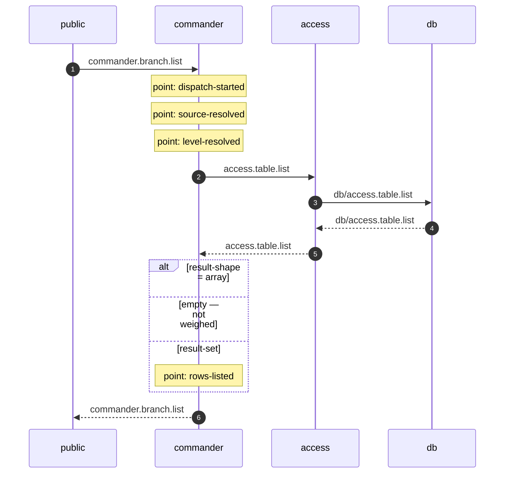

# Sequence Diagrams

```mermaid
sequenceDiagram
    autonumber
    participant public
    participant commander
    participant access
    participant db
    public->>commander: commander.branch.list
    Note over commander: point: dispatch-started
    Note over commander: point: source-resolved
    Note over commander: point: level-resolved
    commander->>access: access.table.list
    access->>db: db/access.table.list
    db-->>access: db/access.table.list
    access-->>commander: access.table.list
    alt result-shape = array
    else empty — not weighed
    else result-set
    Note over commander: point: rows-listed
    end
    commander-->>public: commander.branch.list
```
