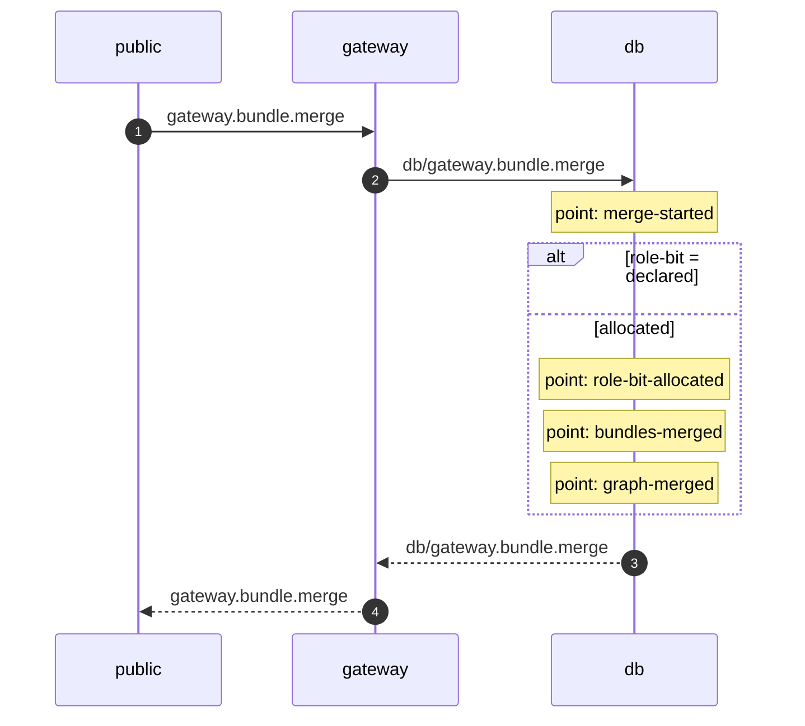

# Sequence Diagrams

```mermaid
sequenceDiagram
    autonumber
    participant public
    participant gateway
    participant db
    public->>gateway: gateway.bundle.merge
    gateway->>db: db/gateway.bundle.merge
    Note over db: point: merge-started
    alt role-bit = declared
    else allocated
    Note over db: point: role-bit-allocated
    Note over db: point: bundles-merged
    Note over db: point: graph-merged
    end
    db-->>gateway: db/gateway.bundle.merge
    gateway-->>public: gateway.bundle.merge
```
